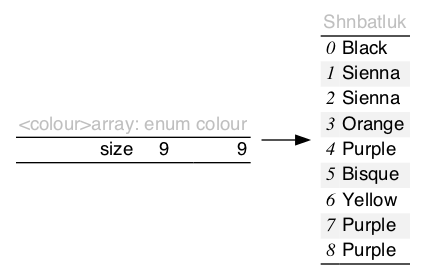

# array\.h #

Stand\-alone header [\.\./src/array\.h](../src/array.h); examples [\.\./test/test\_array\.c](../test/test_array.c)\.

## Contiguous dynamic array ##

 * [Description](#user-content-preamble)
 * [Typedef Aliases](#user-content-typedef): [&lt;PA&gt;type](#user-content-typedef-a8a4b08a), [&lt;PITR&gt;action_fn](#user-content-typedef-49d9168b), [&lt;PITR&gt;predicate_fn](#user-content-typedef-c5016dba), [&lt;PSTR&gt;to_string_fn](#user-content-typedef-8a8349ca), [&lt;PCMP&gt;bipredicate_fn](#user-content-typedef-82edbc04), [&lt;PCMP&gt;compare_fn](#user-content-typedef-2c6ed2db), [&lt;PCMP&gt;biaction_fn](#user-content-typedef-f8efb17d)
 * [Struct, Union, and Enum Definitions](#user-content-tag): [&lt;A&gt;array](#user-content-tag-8049be0d), [&lt;A&gt;array_iterator](#user-content-tag-a590eb6c)
 * [Function Summary](#user-content-summary)
 * [Function Definitions](#user-content-fn)
 * [License](#user-content-license)

## <a id = "user-content-preamble" name = "user-content-preamble">Description</a> ##

[&lt;A&gt;array](#user-content-tag-8049be0d) is a dynamic array that stores contiguous [&lt;PA&gt;type](#user-content-typedef-a8a4b08a)\. Resizing may be necessary when increasing the size of the array; this incurs amortised cost, and any pointers to this memory may become stale\.

\* [src/iterate\.h](src/iterate.h): defining `HAVE_ITERATE_H` supplies `<ITR>` functions\.

 * Parameter: ARRAY\_NAME, ARRAY\_TYPE  
   `<A>` that satisfies `C` naming conventions when mangled and a valid tag\-type, [&lt;PA&gt;type](#user-content-typedef-a8a4b08a), associated therewith; required\. `<PA>` is private, whose names are prefixed in a manner to avoid collisions\.
 * Parameter: ARRAY\_COMPARE, ARRAY\_IS\_EQUAL  
   Compare `<CMP>` trait contained in [src/compare\.h](src/compare.h)\. Requires `<name>[<trait>]compare` to be declared as [&lt;PCMP&gt;compare_fn](#user-content-typedef-2c6ed2db) or `<name>[<trait>]is_equal` to be declared as [&lt;PCMP&gt;bipredicate_fn](#user-content-typedef-82edbc04), respectfully, \(but not both\.\)
 * Parameter: ARRAY\_TO\_STRING  
   To string `<STR>` trait contained in [src/to\_string\.h](src/to_string.h)\. Requires `<name>[<trait>]to_string` be declared as [&lt;PSTR&gt;to_string_fn](#user-content-typedef-8a8349ca)\.
 * Parameter: ARRAY\_EXPECT\_TRAIT, ARRAY\_TRAIT  
   Named traits are obtained by including `array.h` multiple times with `ARRAY_EXPECT_TRAIT` and then subsequently including the name in `ARRAY_TRAIT`\.
 * Standard:  
   C89

## <a id = "user-content-typedef" name = "user-content-typedef">Typedef Aliases</a> ##

### <a id = "user-content-typedef-a8a4b08a" name = "user-content-typedef-a8a4b08a">&lt;PA&gt;type</a> ###

<code>typedef ARRAY_TYPE <strong>&lt;PA&gt;type</strong>;</code>

A valid tag type set by `ARRAY_TYPE`\.

### <a id = "user-content-typedef-49d9168b" name = "user-content-typedef-49d9168b">&lt;PITR&gt;action_fn</a> ###

<code>typedef void(*<strong>&lt;PITR&gt;action_fn</strong>)(&lt;PITR&gt;element *);</code>

[src/iterate\.h](src/iterate.h): Operates by side\-effects\.

### <a id = "user-content-typedef-c5016dba" name = "user-content-typedef-c5016dba">&lt;PITR&gt;predicate_fn</a> ###

<code>typedef int(*<strong>&lt;PITR&gt;predicate_fn</strong>)(const &lt;PITR&gt;element *);</code>

[src/iterate\.h](src/iterate.h): Returns a boolean given read\-only\.

### <a id = "user-content-typedef-8a8349ca" name = "user-content-typedef-8a8349ca">&lt;PSTR&gt;to_string_fn</a> ###

<code>typedef void(*<strong>&lt;PSTR&gt;to_string_fn</strong>)(const &lt;PSTR&gt;element *, char(*)[12]);</code>

[src/to\_string\.h](src/to_string.h): responsible for turning the read\-only argument into a 12\-`char` null\-terminated output string, passed as a pointer in the last argument\. This function can have 2 or 3 arguments, where `<PSTR>element` might be a map with a key\-value pair\.

### <a id = "user-content-typedef-82edbc04" name = "user-content-typedef-82edbc04">&lt;PCMP&gt;bipredicate_fn</a> ###

<code>typedef int(*<strong>&lt;PCMP&gt;bipredicate_fn</strong>)(&lt;PCMP&gt;element *restrict, &lt;PCMP&gt;element *restrict);</code>

[src/compare\.h](src/compare.h): Returns a boolean given two read\-only elements\.

### <a id = "user-content-typedef-2c6ed2db" name = "user-content-typedef-2c6ed2db">&lt;PCMP&gt;compare_fn</a> ###

<code>typedef int(*<strong>&lt;PCMP&gt;compare_fn</strong>)(const &lt;PCMP&gt;element *restrict a, const &lt;PCMP&gt;element *restrict b);</code>

[src/compare\.h](src/compare.h): Three\-way comparison on a totally order set; returns an integer value less than, equal to, greater than zero, if `a < b`, `a == b`, `a > b`, respectively\.

### <a id = "user-content-typedef-f8efb17d" name = "user-content-typedef-f8efb17d">&lt;PCMP&gt;biaction_fn</a> ###

<code>typedef int(*<strong>&lt;PCMP&gt;biaction_fn</strong>)(&lt;PCMP&gt;element *restrict, &lt;PCMP&gt;element *restrict);</code>

[src/compare\.h](src/compare.h): Returns a boolean given two modifiable arguments\.

## <a id = "user-content-tag" name = "user-content-tag">Struct, Union, and Enum Definitions</a> ##

### <a id = "user-content-tag-8049be0d" name = "user-content-tag-8049be0d">&lt;A&gt;array</a> ###

<code>struct <strong>&lt;A&gt;array</strong> { &lt;PA&gt;type *data; size_t size, capacity; };</code>

Manages the array field `data` which has `size` elements\. The space is indexed up to `capacity`, which is at least `size`\.

### <a id = "user-content-tag-a590eb6c" name = "user-content-tag-a590eb6c">&lt;A&gt;array_iterator</a> ###

<code>struct <strong>&lt;A&gt;array_iterator</strong>;</code>

May become invalid after a topological change to any items previous\.

## <a id = "user-content-summary" name = "user-content-summary">Function Summary</a> ##

<table>

<tr><th>Modifiers</th><th>Function Name</th><th>Argument List</th></tr>

<tr><td align = right>static struct &lt;A&gt;array</td><td><a href = "#user-content-fn-8049be0d">&lt;A&gt;array</a></td><td></td></tr>

<tr><td align = right>static void</td><td><a href = "#user-content-fn-46169b16">&lt;A&gt;array_</a></td><td>a</td></tr>

<tr><td align = right>static int</td><td><a href = "#user-content-fn-fffa504a">&lt;A&gt;array_reserve</a></td><td>a, min</td></tr>

<tr><td align = right>static &lt;PA&gt;type *</td><td><a href = "#user-content-fn-8eb786c0">&lt;A&gt;array_buffer</a></td><td>a, n</td></tr>

<tr><td align = right>static &lt;PA&gt;type *</td><td><a href = "#user-content-fn-c0c02447">&lt;A&gt;array_insert</a></td><td>a, n, at</td></tr>

<tr><td align = right>static &lt;PA&gt;type *</td><td><a href = "#user-content-fn-1b423580">&lt;A&gt;array_new</a></td><td>a</td></tr>

<tr><td align = right>static void</td><td><a href = "#user-content-fn-d5035752">&lt;A&gt;array_remove</a></td><td>a, element</td></tr>

<tr><td align = right>static void</td><td><a href = "#user-content-fn-d2a95b41">&lt;A&gt;array_lazy_remove</a></td><td>a, datum</td></tr>

<tr><td align = right>static void</td><td><a href = "#user-content-fn-e3f5267">&lt;A&gt;array_clear</a></td><td>a</td></tr>

<tr><td align = right>static &lt;PA&gt;type *</td><td><a href = "#user-content-fn-8af01fa1">&lt;A&gt;array_peek</a></td><td>a</td></tr>

<tr><td align = right>static &lt;PA&gt;type *</td><td><a href = "#user-content-fn-7bf4e995">&lt;A&gt;array_pop</a></td><td>a</td></tr>

<tr><td align = right>static &lt;PA&gt;type *</td><td><a href = "#user-content-fn-2d92b62">&lt;A&gt;array_append</a></td><td>a, n</td></tr>

<tr><td align = right>static int</td><td><a href = "#user-content-fn-bce1c326">&lt;A&gt;array_splice</a></td><td>a, b, i0, i1</td></tr>

<tr><td align = right>static &lt;PITR&gt;element *</td><td><a href = "#user-content-fn-73c52918">&lt;ITR&gt;any</a></td><td>box, predicate</td></tr>

<tr><td align = right>static void</td><td><a href = "#user-content-fn-96abfbdb">&lt;ITR&gt;each</a></td><td>box, action</td></tr>

<tr><td align = right>static void</td><td><a href = "#user-content-fn-6e4cf157">&lt;ITR&gt;if_each</a></td><td>box, predicate, action</td></tr>

<tr><td align = right>static int</td><td><a href = "#user-content-fn-4b2c205b">&lt;ITR&gt;copy_if</a></td><td>dst, src, copy</td></tr>

<tr><td align = right>static void</td><td><a href = "#user-content-fn-d816173b">&lt;ITR&gt;keep_if</a></td><td>box, keep, destruct</td></tr>

<tr><td align = right>static void</td><td><a href = "#user-content-fn-108e9df6">&lt;ITR&gt;trim</a></td><td>box, predicate</td></tr>

<tr><td align = right>static const char *</td><td><a href = "#user-content-fn-751c6337">&lt;STR&gt;to_string</a></td><td>box</td></tr>

<tr><td align = right>static int</td><td><a href = "#user-content-fn-c2fff878">&lt;CMP&gt;compare</a></td><td>a, b</td></tr>

<tr><td align = right>static size_t</td><td><a href = "#user-content-fn-620cbec1">&lt;CMP&gt;lower_bound</a></td><td>box, element</td></tr>

<tr><td align = right>static size_t</td><td><a href = "#user-content-fn-b6f29e84">&lt;CMP&gt;upper_bound</a></td><td>box, element</td></tr>

<tr><td align = right>static int</td><td><a href = "#user-content-fn-c57ffcf5">&lt;CMP&gt;insert_after</a></td><td>box, element</td></tr>

<tr><td align = right>static void</td><td><a href = "#user-content-fn-a7c44d35">&lt;CMP&gt;sort</a></td><td>box</td></tr>

<tr><td align = right>static void</td><td><a href = "#user-content-fn-f184f491">&lt;CMP&gt;reverse</a></td><td>box</td></tr>

<tr><td align = right>static int</td><td><a href = "#user-content-fn-82b7806">&lt;CMP&gt;is_equal</a></td><td>a, b</td></tr>

<tr><td align = right>static void</td><td><a href = "#user-content-fn-a9b0c375">&lt;CMP&gt;unique_merge</a></td><td>box, merge</td></tr>

<tr><td align = right>static void</td><td><a href = "#user-content-fn-52f3957a">&lt;CMP&gt;unique</a></td><td>box</td></tr>

</table>

## <a id = "user-content-fn" name = "user-content-fn">Function Definitions</a> ##

### <a id = "user-content-fn-8049be0d" name = "user-content-fn-8049be0d">&lt;A&gt;array</a> ###

<code>static struct &lt;A&gt;array <strong>&lt;A&gt;array</strong>(void)</code>

Zeroed data \(not all\-bits\-zero\) is initialized\.

 * Return:  
   An idle array\.
 * Order:  
   &#920;\(1\)

### <a id = "user-content-fn-46169b16" name = "user-content-fn-46169b16">&lt;A&gt;array_</a> ###

<code>static void <strong>&lt;A&gt;array_</strong>(struct &lt;A&gt;array *const <em>a</em>)</code>

If `a` is not null, destroys and returns it to idle\.

### <a id = "user-content-fn-fffa504a" name = "user-content-fn-fffa504a">&lt;A&gt;array_reserve</a> ###

<code>static int <strong>&lt;A&gt;array_reserve</strong>(struct &lt;A&gt;array *const <em>a</em>, const size_t <em>min</em>)</code>

Ensures `min` capacity of `a`\. Invalidates pointers in `a`\.

 * Parameter: _min_  
   If zero, does nothing\.
 * Return:  
   Success; otherwise, `errno` will be set\.
 * Exceptional return: ERANGE  
   Tried allocating more then can fit in `size_t` or `realloc` doesn't follow POSIX\.
 * Exceptional return: realloc  

### <a id = "user-content-fn-8eb786c0" name = "user-content-fn-8eb786c0">&lt;A&gt;array_buffer</a> ###

<code>static &lt;PA&gt;type *<strong>&lt;A&gt;array_buffer</strong>(struct &lt;A&gt;array *const <em>a</em>, const size_t <em>n</em>)</code>

The capacity of `a` will be increased to at least `n` elements beyond the size\. Invalidates any pointers in `a`\.

 * Return:  
   The start of the buffered space at the back of the array\. If `a` is idle and `buffer` is zero, a null pointer is returned, otherwise null indicates an error\.
 * Exceptional return: realloc  

### <a id = "user-content-fn-c0c02447" name = "user-content-fn-c0c02447">&lt;A&gt;array_insert</a> ###

<code>static &lt;PA&gt;type *<strong>&lt;A&gt;array_insert</strong>(struct &lt;A&gt;array *const <em>a</em>, const size_t <em>n</em>, const size_t <em>at</em>)</code>

Adds `n` un\-initialised elements at position `at` in `a`\. It will invalidate any pointers in `a` if the buffer holds too few elements\.

 * Parameter: _at_  
   A number smaller than or equal to `a.size`; if `a.size`, this function behaves as [&lt;A&gt;array_append](#user-content-fn-2d92b62)\.
 * Return:  
   A pointer to the start of the new region, where there are `n` elements\.
 * Exceptional return: realloc, ERANGE  

### <a id = "user-content-fn-1b423580" name = "user-content-fn-1b423580">&lt;A&gt;array_new</a> ###

<code>static &lt;PA&gt;type *<strong>&lt;A&gt;array_new</strong>(struct &lt;A&gt;array *const <em>a</em>)</code>

 * Return:  
   Adds \(push back\) one new element of `a`\. The buffer space holds at least one element, or it may invalidate pointers in `a`\.
 * Exceptional return: realloc, ERANGE  
 * Order:  
   amortised &#927;\(1\)

### <a id = "user-content-fn-d5035752" name = "user-content-fn-d5035752">&lt;A&gt;array_remove</a> ###

<code>static void <strong>&lt;A&gt;array_remove</strong>(struct &lt;A&gt;array *const <em>a</em>, &lt;PA&gt;type *const <em>element</em>)</code>

Removes `element` from `a`\. Do not attempt to remove an element that is not in `a`\.

 * Order:  
   &#927;\(`a.size`\)\.

### <a id = "user-content-fn-d2a95b41" name = "user-content-fn-d2a95b41">&lt;A&gt;array_lazy_remove</a> ###

<code>static void <strong>&lt;A&gt;array_lazy_remove</strong>(struct &lt;A&gt;array *const <em>a</em>, &lt;PA&gt;type *const <em>datum</em>)</code>

Removes `datum` from `a` and replaces it with the tail\. Do not attempt to remove an element that is not in `a`\.

 * Order:  
   &#927;\(1\)\.

### <a id = "user-content-fn-e3f5267" name = "user-content-fn-e3f5267">&lt;A&gt;array_clear</a> ###

<code>static void <strong>&lt;A&gt;array_clear</strong>(struct &lt;A&gt;array *const <em>a</em>)</code>

Sets `a` to be empty\. That is, the size of `a` will be zero, but if it was previously in an active non\-idle state, it continues to be\.

 * Order:  
   &#920;\(1\)

### <a id = "user-content-fn-8af01fa1" name = "user-content-fn-8af01fa1">&lt;A&gt;array_peek</a> ###

<code>static &lt;PA&gt;type *<strong>&lt;A&gt;array_peek</strong>(const struct &lt;A&gt;array *const <em>a</em>)</code>

 * Return:  
   The last element or null if `a` is empty\.
 * Order:  
   &#920;\(1\)

### <a id = "user-content-fn-7bf4e995" name = "user-content-fn-7bf4e995">&lt;A&gt;array_pop</a> ###

<code>static &lt;PA&gt;type *<strong>&lt;A&gt;array_pop</strong>(struct &lt;A&gt;array *const <em>a</em>)</code>

 * Return:  
   Value from the the top of `a` that is removed or null if the array is empty\.
 * Order:  
   &#920;\(1\)

### <a id = "user-content-fn-2d92b62" name = "user-content-fn-2d92b62">&lt;A&gt;array_append</a> ###

<code>static &lt;PA&gt;type *<strong>&lt;A&gt;array_append</strong>(struct &lt;A&gt;array *const <em>a</em>, const size_t <em>n</em>)</code>

Adds `n` elements to the back of `a`\. It will invalidate pointers in `a` if `n` is greater than the buffer space\.

 * Return:  
   A pointer to the elements\. If `a` is idle and `n` is zero, a null pointer will be returned, otherwise null indicates an error\.
 * Exceptional return: realloc, ERANGE  

### <a id = "user-content-fn-bce1c326" name = "user-content-fn-bce1c326">&lt;A&gt;array_splice</a> ###

<code>static int <strong>&lt;A&gt;array_splice</strong>(struct &lt;A&gt;array *restrict const <em>a</em>, const struct &lt;A&gt;array *restrict const <em>b</em>, const size_t <em>i0</em>, const size_t <em>i1</em>)</code>

Indices \[`i0`, `i1`\) of `a` will be replaced with a copy of `b`\.

 * Parameter: _b_  
   Can be null, which acts as empty, but cannot overlap with `a`\.
 * Return:  
   Success\.
 * Exceptional return: realloc, ERANGE  

### <a id = "user-content-fn-73c52918" name = "user-content-fn-73c52918">&lt;ITR&gt;any</a> ###

<code>static &lt;PITR&gt;element *<strong>&lt;ITR&gt;any</strong>(const &lt;PITR&gt;box *const <em>box</em>, const &lt;PITR&gt;predicate_fn <em>predicate</em>)</code>

[src/iterate\.h](src/iterate.h): Iterates through `box` and calls `predicate` until it returns true\.

 * Return:  
   The first `predicate` that returned true, or, if the statement is false on all, null\.
 * Order:  
   &#927;\(`box.size`\) &#215; &#927;\(`predicate`\)

### <a id = "user-content-fn-96abfbdb" name = "user-content-fn-96abfbdb">&lt;ITR&gt;each</a> ###

<code>static void <strong>&lt;ITR&gt;each</strong>(&lt;PITR&gt;box *const <em>box</em>, const &lt;PITR&gt;action_fn <em>action</em>)</code>

[src/iterate\.h](src/iterate.h): Iterates through `box` and calls `action` on all the elements\. Differs calling `action` until the iterator is one\-ahead, so can delete elements as long as it doesn't affect the next, \(specifically, a linked\-list\.\)

 * Order:  
   &#927;\(|`box`|\) &#215; &#927;\(`action`\)

### <a id = "user-content-fn-6e4cf157" name = "user-content-fn-6e4cf157">&lt;ITR&gt;if_each</a> ###

<code>static void <strong>&lt;ITR&gt;if_each</strong>(&lt;PITR&gt;box *const <em>box</em>, const &lt;PITR&gt;predicate_fn <em>predicate</em>, const &lt;PITR&gt;action_fn <em>action</em>)</code>

[src/iterate\.h](src/iterate.h): Iterates through `box` and calls `action` on all the elements for which `predicate` returns true\.

 * Order:  
   &#927;\(`box.size`\) &#215; \(&#927;\(`predicate`\) \+ &#927;\(`action`\)\)

### <a id = "user-content-fn-4b2c205b" name = "user-content-fn-4b2c205b">&lt;ITR&gt;copy_if</a> ###

<code>static int <strong>&lt;ITR&gt;copy_if</strong>(&lt;PITR&gt;box *restrict const <em>dst</em>, const &lt;PITR&gt;box *restrict const <em>src</em>, const &lt;PITR&gt;predicate_fn <em>copy</em>)</code>

[src/iterate\.h](src/iterate.h), `BOX_CONTIGUOUS`: For all elements of `src`, calls `copy`, and if true, lazily copies the elements to `dst`\. `dst` and `src` can not be the same but `src` can be null, \(in which case, it does nothing\.\)

 * Exceptional return: realloc  
 * Order:  
   &#927;\(|`src`|\) &#215; &#927;\(`copy`\)

### <a id = "user-content-fn-d816173b" name = "user-content-fn-d816173b">&lt;ITR&gt;keep_if</a> ###

<code>static void <strong>&lt;ITR&gt;keep_if</strong>(&lt;PITR&gt;box *const <em>box</em>, const &lt;PITR&gt;predicate_fn <em>keep</em>, const &lt;PITR&gt;action_fn <em>destruct</em>)</code>

[src/iterate\.h](src/iterate.h): For all elements of `box`, calls `keep`, and if false, if contiguous, lazy deletes that item, if not, eagerly\. Calls `destruct` if not\-null before deleting\.

 * Order:  
   &#927;\(|`box`|\) \(&#215; O\(`keep`\) \+ O\(`destruct`\)\)

### <a id = "user-content-fn-108e9df6" name = "user-content-fn-108e9df6">&lt;ITR&gt;trim</a> ###

<code>static void <strong>&lt;ITR&gt;trim</strong>(&lt;PITR&gt;box *const <em>box</em>, const &lt;PITR&gt;predicate_fn <em>predicate</em>)</code>

[src/iterate\.h](src/iterate.h), `BOX_CONTIGUOUS`: Removes at either end of `box` the things that `predicate`, if it exists, returns true\.

 * Order:  
   &#927;\(`box.size`\) &#215; &#927;\(`predicate`\)

### <a id = "user-content-fn-751c6337" name = "user-content-fn-751c6337">&lt;STR&gt;to_string</a> ###

<code>static const char *<strong>&lt;STR&gt;to_string</strong>(const &lt;PSTR&gt;box *const <em>box</em>)</code>

[src/to\_string\.h](src/to_string.h): print the contents of `box` in a static string buffer of 256 bytes, with limitations of only printing 4 things in a single sequence point\.

 * Return:  
   Address of the static buffer\.
 * Order:  
   &#920;\(1\)

### <a id = "user-content-fn-c2fff878" name = "user-content-fn-c2fff878">&lt;CMP&gt;compare</a> ###

<code>static int <strong>&lt;CMP&gt;compare</strong>(const &lt;PCMP&gt;box *restrict const <em>a</em>, const &lt;PCMP&gt;box *restrict const <em>b</em>)</code>

[src/compare\.h](src/compare.h), `COMPARE`: Lexicographically compares `a` to `b`\. Both can be null, with null values before everything\.

 * Return:  
   `a < b`: negative; `a == b`: zero; `a > b`: positive\.
 * Order:  
   &#927;\(`|a|` & `|b|`\)

### <a id = "user-content-fn-620cbec1" name = "user-content-fn-620cbec1">&lt;CMP&gt;lower_bound</a> ###

<code>static size_t <strong>&lt;CMP&gt;lower_bound</strong>(const &lt;PCMP&gt;box *const <em>box</em>, const &lt;PCMP&gt;element *const <em>element</em>)</code>

[src/compare\.h](src/compare.h), `COMPARE`, `BOX_ACCESS`: `box` should be partitioned true/false with less\-then `element`\.

 * Return:  
   The first index of `a` that is not less than `cursor`\.
 * Order:  
   &#927;\(log `a.size`\)

### <a id = "user-content-fn-b6f29e84" name = "user-content-fn-b6f29e84">&lt;CMP&gt;upper_bound</a> ###

<code>static size_t <strong>&lt;CMP&gt;upper_bound</strong>(const &lt;PCMP&gt;box *const <em>box</em>, const &lt;PCMP&gt;element *const <em>element</em>)</code>

[src/compare\.h](src/compare.h), `COMPARE`, `BOX_ACCESS`: `box` should be partitioned false/true with greater\-than or equal\-to `element`\.

 * Return:  
   The first index of `box` that is greater than `element`\.
 * Order:  
   &#927;\(log |`box`|\)

### <a id = "user-content-fn-c57ffcf5" name = "user-content-fn-c57ffcf5">&lt;CMP&gt;insert_after</a> ###

<code>static int <strong>&lt;CMP&gt;insert_after</strong>(&lt;PCMP&gt;box *const <em>box</em>, const &lt;PCMP&gt;element *const <em>element</em>)</code>

[src/compare\.h](src/compare.h), `COMPARE`, `BOX_CONTIGUOUS`: Copies `element` at the upper bound of a sorted `box`\.

 * Return:  
   Success\.
 * Exceptional return: realloc, ERANGE  
 * Order:  
   &#927;\(`a.size`\)

### <a id = "user-content-fn-a7c44d35" name = "user-content-fn-a7c44d35">&lt;CMP&gt;sort</a> ###

<code>static void <strong>&lt;CMP&gt;sort</strong>(&lt;PCMP&gt;box *const <em>box</em>)</code>

[src/compare\.h](src/compare.h), `COMPARE`, `BOX_CONTIGUOUS`: Sorts `box` by `qsort`, \(which has a high\-context\-switching cost, but is easy\.\)

 * Order:  
   &#927;\(|`box`| log |`box`|\)

### <a id = "user-content-fn-f184f491" name = "user-content-fn-f184f491">&lt;CMP&gt;reverse</a> ###

<code>static void <strong>&lt;CMP&gt;reverse</strong>(&lt;PCMP&gt;box *const <em>box</em>)</code>

[src/compare\.h](src/compare.h), `COMPARE`, `BOX_CONTIGUOUS`: Sorts `box` in reverse by `qsort`\.

 * Order:  
   &#927;\(|`box`| log |`box`|\)

### <a id = "user-content-fn-82b7806" name = "user-content-fn-82b7806">&lt;CMP&gt;is_equal</a> ###

<code>static int <strong>&lt;CMP&gt;is_equal</strong>(const &lt;PCMP&gt;box *restrict const <em>a</em>, const &lt;PCMP&gt;box *restrict const <em>b</em>)</code>

[src/compare\.h](src/compare.h)

 * Return:  
   If `a` piecewise equals `b`, which both can be null\.
 * Order:  
   &#927;\(|`a`| & |`b`|\)

### <a id = "user-content-fn-a9b0c375" name = "user-content-fn-a9b0c375">&lt;CMP&gt;unique_merge</a> ###

<code>static void <strong>&lt;CMP&gt;unique_merge</strong>(&lt;PCMP&gt;box *const <em>box</em>, const &lt;PCMP&gt;biaction_fn <em>merge</em>)</code>

[src/compare\.h](src/compare.h), `BOX_CONTIGUOUS`: Removes consecutive duplicate elements in `box` lazily\.

 * Parameter: _merge_  
   Controls surjection\. Called with duplicate elements, if false `(x, y)->(x)`, if true `(x,y)->(y)`\. More complex functions, `(x, y)->(x+y)` can be simulated by mixing the two in the value returned\. Can be null: behaves like false, always deleting the second element\.
 * Order:  
   &#927;\(|`box`|\) &#215; &#927;\(`merge`\)

### <a id = "user-content-fn-52f3957a" name = "user-content-fn-52f3957a">&lt;CMP&gt;unique</a> ###

<code>static void <strong>&lt;CMP&gt;unique</strong>(&lt;PCMP&gt;box *const <em>box</em>)</code>

[src/compare\.h](src/compare.h), `BOX_CONTIGUOUS`: Removes consecutive duplicate elements in `box`\.

 * Order:  
   &#927;\(|`box`|\)

## <a id = "user-content-license" name = "user-content-license">License</a> ##

2016 Neil Edelman, distributed under the terms of the [MIT License](https://opensource.org/licenses/MIT)\.

