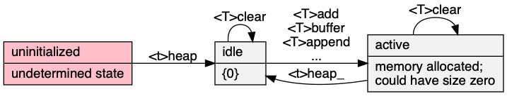

# heap\.h #

Header [\.\./\.\./src/heap\.h](../../src/heap.h) depends on [\.\./\.\./src/array\.h](../../src/array.h); examples [\.\./\.\./test/test\_heap\.c](../../test/test_heap.c)\.

## Priority\-queue ##

 * [Description](#user-content-preamble)
 * [Typedef Aliases](#user-content-typedef): [<pT>priority](#user-content-typedef-d8673cbb), [<pT>less_fn](#user-content-typedef-ca992ecb), [<pT>to_string_fn](#user-content-typedef-4442127b)
 * [Struct, Union, and Enum Definitions](#user-content-tag): [<t>heap](#user-content-tag-65a3115b), [table_stats](#user-content-tag-89e31bf3)
 * [Function Summary](#user-content-summary)
 * [Function Definitions](#user-content-fn)
 * [License](#user-content-license)

## <a id = "user-content-preamble" name = "user-content-preamble">Description</a> ##

A [&lt;t&gt;heap](#user-content-tag-65a3115b) is a binary heap, proposed by [Williams, 1964, Heapsort, p\. 347](https://scholar.google.ca/scholar?q=Williams%2C+1964%2C+Heapsort%2C+p.+347) using terminology of [Knuth, 1973, Sorting](https://scholar.google.ca/scholar?q=Knuth%2C+1973%2C+Sorting)\. It is an array implementation of a priority queue\. It is not stable\.

A function satisfying [&lt;pT&gt;less_fn](#user-content-typedef-ca992ecb) called `<t>less` must be declared\. For example, a maximum heap, `(a, b) -> a < b`\.

 * Parameter: HEAP\_NAME, HEAP\_TYPE  
   `<t>` that satisfies `C` naming conventions when mangled\. `HEAP_NAME` is required; `HEAP_TYPE` defaults to `unsigned int`\.
 * Parameter: HEAP\_TO\_STRING  
   To string trait contained in [\.\./\.\./src/to\_string\.h](../../src/to_string.h)\. See [&lt;pT&gt;to_string_fn](#user-content-typedef-4442127b)\.
 * Parameter: HEAP\_EXPECT\_TRAIT, HEAP\_TRAIT  
   Named traits are obtained by including `heap.h` multiple times with `HEAP_EXPECT_TRAIT` and then subsequently including the name in `HEAP_TRAIT`\.
 * Parameter: HEAP\_DECLARE\_ONLY  
   For headers in different compilation units\.
 * Standard:  
   C89
 * Dependancies:  
   [array](../../src/array.h), [box](../../src/box.h)

## <a id = "user-content-typedef" name = "user-content-typedef">Typedef Aliases</a> ##

### <a id = "user-content-typedef-d8673cbb" name = "user-content-typedef-d8673cbb">&lt;pT&gt;priority</a> ###

<code>typedef HEAP_TYPE <strong>&lt;pT&gt;priority</strong>;</code>

Valid assignable type used for priority\. Defaults to `unsigned int` if not set by `HEAP_TYPE`\.

### <a id = "user-content-typedef-ca992ecb" name = "user-content-typedef-ca992ecb">&lt;pT&gt;less_fn</a> ###

<code>typedef int(*<strong>&lt;pT&gt;less_fn</strong>)(const &lt;pT&gt;priority a, const &lt;pT&gt;priority b);</code>

Inducing a strict weak order by returning a positive result if `a` is out\-of\-order with respect to `b`\. It only needs to divide entries into two instead of three categories\. Compatible, but less strict then the comparators from `bsearch` and `qsort`\. For example, `return a > b` or `return strcmp(a, b)` would give a minimum\-hash\.

### <a id = "user-content-typedef-4442127b" name = "user-content-typedef-4442127b">&lt;pT&gt;to_string_fn</a> ###

<code>typedef void(*<strong>&lt;pT&gt;to_string_fn</strong>)(const &lt;pT&gt;priority *, char(*)[12]);</code>

The type of the required `<tr>to_string`\. Responsible for turning the read\-only argument into a 12\-max\-`char` output string\.

## <a id = "user-content-tag" name = "user-content-tag">Struct, Union, and Enum Definitions</a> ##

### <a id = "user-content-tag-65a3115b" name = "user-content-tag-65a3115b">&lt;t&gt;heap</a> ###

<code>struct <strong>&lt;t&gt;heap</strong> { struct &lt;pT&gt;priority_array as_array; };</code>

Stores the heap as an array—implicit binary tree in an array called `a`\. See [&lt;t&gt;heap](#user-content-fn-65a3115b)\.

### <a id = "user-content-tag-89e31bf3" name = "user-content-tag-89e31bf3">table_stats</a> ###

<code>struct <strong>table_stats</strong> { size_t n, max; double mean, ssdm; };</code>

[Welford1962Note](https://scholar.google.ca/scholar?q=Welford1962Note): population variance: `ssdm/n`, sample variance: `ssdm/(n-1)`\.

## <a id = "user-content-summary" name = "user-content-summary">Function Summary</a> ##

<table>

<tr><th>Modifiers</th><th>Function Name</th><th>Argument List</th></tr>

<tr><td align = right>struct &lt;T&gt;cursor</td><td><a href = "#user-content-fn-80df50b2">&lt;T&gt;begin</a></td><td>&lt;t&gt;heap</td></tr>

<tr><td align = right>int</td><td><a href = "#user-content-fn-dd6c86e1">&lt;T&gt;exists</a></td><td>&lt;T&gt;cursor</td></tr>

<tr><td align = right>&lt;pT&gt;priority *</td><td><a href = "#user-content-fn-1d176e37">&lt;T&gt;entry</a></td><td>&lt;T&gt;cursor</td></tr>

<tr><td align = right>void</td><td><a href = "#user-content-fn-d0790d04">&lt;T&gt;next</a></td><td>&lt;T&gt;cursor</td></tr>

<tr><td align = right>struct &lt;t&gt;heap</td><td><a href = "#user-content-fn-65a3115b">&lt;t&gt;heap</a></td><td></td></tr>

<tr><td align = right>void</td><td><a href = "#user-content-fn-3b3c94c">&lt;t&gt;heap_</a></td><td>&lt;t&gt;heap</td></tr>

<tr><td align = right>void</td><td><a href = "#user-content-fn-7f4a964e">&lt;T&gt;clear</a></td><td>&lt;t&gt;heap</td></tr>

<tr><td align = right>size_t</td><td><a href = "#user-content-fn-93717268">&lt;T&gt;size</a></td><td>&lt;t&gt;heap</td></tr>

<tr><td align = right>int</td><td><a href = "#user-content-fn-7b8ec2e0">&lt;T&gt;add</a></td><td>&lt;t&gt;heap, &lt;pT&gt;priority</td></tr>

<tr><td align = right>&lt;pT&gt;priority *</td><td><a href = "#user-content-fn-1900dfa2">&lt;T&gt;peek</a></td><td>&lt;t&gt;heap</td></tr>

<tr><td align = right>&lt;pT&gt;priority</td><td><a href = "#user-content-fn-3e8e8234">&lt;T&gt;pop</a></td><td>&lt;t&gt;heap</td></tr>

<tr><td align = right>&lt;pT&gt;priority *</td><td><a href = "#user-content-fn-c6b6f48f">&lt;T&gt;buffer</a></td><td>&lt;t&gt;heap, size_t</td></tr>

<tr><td align = right>void</td><td><a href = "#user-content-fn-faa8ce4d">&lt;T&gt;append</a></td><td>&lt;t&gt;heap, size_t</td></tr>

<tr><td align = right>int</td><td><a href = "#user-content-fn-89684f9d">&lt;T&gt;affix</a></td><td>restrict, restrict</td></tr>

<tr><td align = right>static struct &lt;t&gt;heap</td><td><a href = "#user-content-fn-65a3115b">&lt;t&gt;heap</a></td><td></td></tr>

<tr><td align = right>static void</td><td><a href = "#user-content-fn-3b3c94c">&lt;t&gt;heap_</a></td><td>heap</td></tr>

<tr><td align = right>static void</td><td><a href = "#user-content-fn-7f4a964e">&lt;T&gt;clear</a></td><td>heap</td></tr>

<tr><td align = right>static size_t</td><td><a href = "#user-content-fn-93717268">&lt;T&gt;size</a></td><td>heap</td></tr>

<tr><td align = right>static int</td><td><a href = "#user-content-fn-7b8ec2e0">&lt;T&gt;add</a></td><td>heap, n</td></tr>

<tr><td align = right>static &lt;pT&gt;priority *</td><td><a href = "#user-content-fn-1900dfa2">&lt;T&gt;peek</a></td><td>heap</td></tr>

<tr><td align = right>static &lt;pT&gt;priority</td><td><a href = "#user-content-fn-3e8e8234">&lt;T&gt;pop</a></td><td>heap</td></tr>

<tr><td align = right>static &lt;pT&gt;priority *</td><td><a href = "#user-content-fn-c6b6f48f">&lt;T&gt;buffer</a></td><td>heap, n</td></tr>

<tr><td align = right>static void</td><td><a href = "#user-content-fn-faa8ce4d">&lt;T&gt;append</a></td><td>heap, n</td></tr>

<tr><td align = right>static int</td><td><a href = "#user-content-fn-89684f9d">&lt;T&gt;affix</a></td><td>heap, master</td></tr>

<tr><td align = right>const char *</td><td><a href = "#user-content-fn-260f8348">&lt;TR&gt;to_string</a></td><td>box</td></tr>

<tr><td align = right>static const char *</td><td><a href = "#user-content-fn-260f8348">&lt;TR&gt;to_string</a></td><td>box</td></tr>

<tr><td align = right>void</td><td><a href = "#user-content-fn-4e047ffb">&lt;T&gt;graph</a></td><td>&lt;pT&gt;box</td></tr>

<tr><td align = right>int</td><td><a href = "#user-content-fn-6c32bc30">&lt;T&gt;graph_fn</a></td><td>&lt;pT&gt;box, char</td></tr>

</table>

## <a id = "user-content-fn" name = "user-content-fn">Function Definitions</a> ##

### <a id = "user-content-fn-80df50b2" name = "user-content-fn-80df50b2">&lt;T&gt;begin</a> ###

<code>struct &lt;T&gt;cursor <strong>&lt;T&gt;begin</strong>(const struct <em>&lt;t&gt;heap</em> *);</code>

### <a id = "user-content-fn-dd6c86e1" name = "user-content-fn-dd6c86e1">&lt;T&gt;exists</a> ###

<code>int <strong>&lt;T&gt;exists</strong>(const struct <em>&lt;T&gt;cursor</em> *);</code>

### <a id = "user-content-fn-1d176e37" name = "user-content-fn-1d176e37">&lt;T&gt;entry</a> ###

<code>&lt;pT&gt;priority *<strong>&lt;T&gt;entry</strong>(struct <em>&lt;T&gt;cursor</em> *);</code>

### <a id = "user-content-fn-d0790d04" name = "user-content-fn-d0790d04">&lt;T&gt;next</a> ###

<code>void <strong>&lt;T&gt;next</strong>(struct <em>&lt;T&gt;cursor</em> *);</code>

### <a id = "user-content-fn-65a3115b" name = "user-content-fn-65a3115b">&lt;t&gt;heap</a> ###

<code>struct &lt;t&gt;heap <strong>&lt;t&gt;heap</strong>(void);</code>

### <a id = "user-content-fn-3b3c94c" name = "user-content-fn-3b3c94c">&lt;t&gt;heap_</a> ###

<code>void <strong>&lt;t&gt;heap_</strong>(struct <em>&lt;t&gt;heap</em> *);</code>

### <a id = "user-content-fn-7f4a964e" name = "user-content-fn-7f4a964e">&lt;T&gt;clear</a> ###

<code>void <strong>&lt;T&gt;clear</strong>(struct <em>&lt;t&gt;heap</em> *);</code>

### <a id = "user-content-fn-93717268" name = "user-content-fn-93717268">&lt;T&gt;size</a> ###

<code>size_t <strong>&lt;T&gt;size</strong>(const struct <em>&lt;t&gt;heap</em> *);</code>

### <a id = "user-content-fn-7b8ec2e0" name = "user-content-fn-7b8ec2e0">&lt;T&gt;add</a> ###

<code>int <strong>&lt;T&gt;add</strong>(struct <em>&lt;t&gt;heap</em> *, <em>&lt;pT&gt;priority</em>);</code>

### <a id = "user-content-fn-1900dfa2" name = "user-content-fn-1900dfa2">&lt;T&gt;peek</a> ###

<code>&lt;pT&gt;priority *<strong>&lt;T&gt;peek</strong>(const struct <em>&lt;t&gt;heap</em> *);</code>

### <a id = "user-content-fn-3e8e8234" name = "user-content-fn-3e8e8234">&lt;T&gt;pop</a> ###

<code>&lt;pT&gt;priority <strong>&lt;T&gt;pop</strong>(struct <em>&lt;t&gt;heap</em> *);</code>

### <a id = "user-content-fn-c6b6f48f" name = "user-content-fn-c6b6f48f">&lt;T&gt;buffer</a> ###

<code>&lt;pT&gt;priority *<strong>&lt;T&gt;buffer</strong>(struct <em>&lt;t&gt;heap</em> *, <em>size_t</em>);</code>

### <a id = "user-content-fn-faa8ce4d" name = "user-content-fn-faa8ce4d">&lt;T&gt;append</a> ###

<code>void <strong>&lt;T&gt;append</strong>(struct <em>&lt;t&gt;heap</em> *, <em>size_t</em>);</code>

### <a id = "user-content-fn-89684f9d" name = "user-content-fn-89684f9d">&lt;T&gt;affix</a> ###

<code>int <strong>&lt;T&gt;affix</strong>(struct &lt;t&gt;heap *<em>restrict</em>, const struct &lt;t&gt;heap *<em>restrict</em>);</code>

### <a id = "user-content-fn-65a3115b" name = "user-content-fn-65a3115b">&lt;t&gt;heap</a> ###

<code>static struct &lt;t&gt;heap <strong>&lt;t&gt;heap</strong>(void)</code>

Zeroed data \(not all\-bits\-zero\) is initialised, as well\.

 * Return:  
   An idle heap\.
 * Order:  
   &#920;\(1\)

### <a id = "user-content-fn-3b3c94c" name = "user-content-fn-3b3c94c">&lt;t&gt;heap_</a> ###

<code>static void <strong>&lt;t&gt;heap_</strong>(struct &lt;t&gt;heap *const <em>heap</em>)</code>

If `heap` is not null, returns the idle zeroed state where it takes no dynamic memory\.

 * Order:  
   &#920;\(1\)

### <a id = "user-content-fn-7f4a964e" name = "user-content-fn-7f4a964e">&lt;T&gt;clear</a> ###

<code>static void <strong>&lt;T&gt;clear</strong>(struct &lt;t&gt;heap *const <em>heap</em>)</code>

Sets `heap` to be empty\. That is, the size of `heap` will be zero, but if it was previously in an active non\-idle state, it continues to be\.

 * Parameter: _heap_  
   If null, does nothing\.
 * Order:  
   &#920;\(1\)

### <a id = "user-content-fn-93717268" name = "user-content-fn-93717268">&lt;T&gt;size</a> ###

<code>static size_t <strong>&lt;T&gt;size</strong>(const struct &lt;t&gt;heap *const <em>heap</em>)</code>

 * Return:  
   If the `heap` is not null, returns it's size\.
 * Order:  
   &#920;\(1\)

### <a id = "user-content-fn-7b8ec2e0" name = "user-content-fn-7b8ec2e0">&lt;T&gt;add</a> ###

<code>static int <strong>&lt;T&gt;add</strong>(struct &lt;t&gt;heap *const <em>heap</em>, const &lt;pT&gt;priority <em>n</em>)</code>

Copies `n` into `heap`\.

 * Return:  
   Success\.
 * Exceptional return: ERANGE, realloc  
 * Order:  
   &#927;\(log `heap.size`\)

### <a id = "user-content-fn-1900dfa2" name = "user-content-fn-1900dfa2">&lt;T&gt;peek</a> ###

<code>static &lt;pT&gt;priority *<strong>&lt;T&gt;peek</strong>(const struct &lt;t&gt;heap *const <em>heap</em>)</code>

 * Return:  
   Pointer to the lowest element in `heap` or null when the heap is empty\.
 * Order:  
   &#927;\(1\)

### <a id = "user-content-fn-3e8e8234" name = "user-content-fn-3e8e8234">&lt;T&gt;pop</a> ###

<code>static &lt;pT&gt;priority <strong>&lt;T&gt;pop</strong>(struct &lt;t&gt;heap *const <em>heap</em>)</code>

Only defined when [&lt;T&gt;size](#user-content-fn-93717268) returns true\. Removes the lowest element\.

 * Return:  
   The value of the lowest element in `heap`\.
 * Order:  
   &#927;\(log `size`\)

### <a id = "user-content-fn-c6b6f48f" name = "user-content-fn-c6b6f48f">&lt;T&gt;buffer</a> ###

<code>static &lt;pT&gt;priority *<strong>&lt;T&gt;buffer</strong>(struct &lt;t&gt;heap *const <em>heap</em>, const size_t <em>n</em>)</code>

The capacity of `heap` will be increased to at least `n` elements beyond the size\. Invalidates pointers in `heap`\. All the elements `heap.as_array.size` <= `index` < `heap.as_array.capacity` can be used to construct new elements without immediately making them part of the heap, then [&lt;T&gt;append](#user-content-fn-faa8ce4d)\.

 * Return:  
   The start of the buffered space\. If `a` is idle and `buffer` is zero, a null pointer is returned, otherwise null indicates an error\.
 * Exceptional return: realloc, ERANGE  

### <a id = "user-content-fn-faa8ce4d" name = "user-content-fn-faa8ce4d">&lt;T&gt;append</a> ###

<code>static void <strong>&lt;T&gt;append</strong>(struct &lt;t&gt;heap *const <em>heap</em>, const size_t <em>n</em>)</code>

Adds and heapifies `n` more entries in `heap`\. Uses [Floyd, 1964, Treesort](https://scholar.google.ca/scholar?q=Floyd%2C+1964%2C+Treesort) to sift\-down all the internal nodes of heap\. The heap elements must exist, see [&lt;T&gt;buffer](#user-content-fn-c6b6f48f)\.

 * Parameter: _n_  
   If zero, returns true without heapifying\.
 * Return:  
   Success\.
 * Order:  
   &#927;\(`heap.size` \+ `n`\) [Doberkat, 1984, Floyd](https://scholar.google.ca/scholar?q=Doberkat%2C+1984%2C+Floyd)

### <a id = "user-content-fn-89684f9d" name = "user-content-fn-89684f9d">&lt;T&gt;affix</a> ###

<code>static int <strong>&lt;T&gt;affix</strong>(struct &lt;t&gt;heap *restrict const <em>heap</em>, const struct &lt;t&gt;heap *restrict const <em>master</em>)</code>

Shallow\-copies and heapifies `master` into `heap`\.

 * Parameter: _master_  
   If null, does nothing\.
 * Return:  
   Success\.
 * Exceptional return: ERANGE, realloc  
 * Order:  
   &#927;\(`heap.size` \+ `copy.size`\)

### <a id = "user-content-fn-260f8348" name = "user-content-fn-260f8348">&lt;TR&gt;to_string</a> ###

<code>const char *<strong>&lt;TR&gt;to_string</strong>(const &lt;pT&gt;box *const <em>box</em>);</code>

### <a id = "user-content-fn-260f8348" name = "user-content-fn-260f8348">&lt;TR&gt;to_string</a> ###

<code>static const char *<strong>&lt;TR&gt;to_string</strong>(const &lt;pT&gt;box *const <em>box</em>)</code>

[\.\./\.\./src/to\_string\.h](../../src/to_string.h): print the contents of `box` in a static string buffer of 256 bytes, with limitations of only printing 4 things in a single sequence point\.

 * Return:  
   Address of the static buffer\.
 * Order:  
   &#920;\(1\)

### <a id = "user-content-fn-4e047ffb" name = "user-content-fn-4e047ffb">&lt;T&gt;graph</a> ###

<code>void <strong>&lt;T&gt;graph</strong>(const <em>&lt;pT&gt;box</em> *, FILE *);</code>

### <a id = "user-content-fn-6c32bc30" name = "user-content-fn-6c32bc30">&lt;T&gt;graph_fn</a> ###

<code>int <strong>&lt;T&gt;graph_fn</strong>(const <em>&lt;pT&gt;box</em> *, const <em>char</em> *);</code>

## <a id = "user-content-license" name = "user-content-license">License</a> ##

2020 Neil Edelman, distributed under the terms of the [MIT License](https://opensource.org/licenses/MIT)\.

