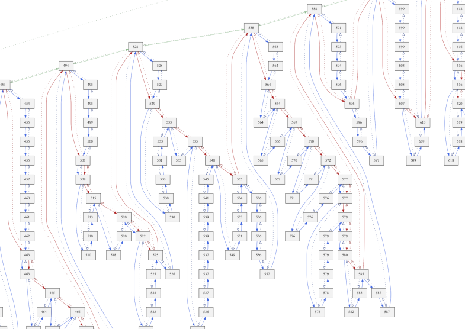
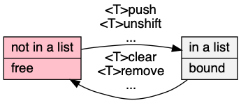
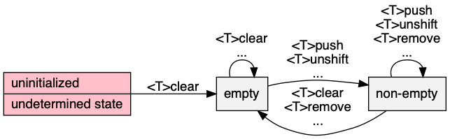

# list\.h #

Header [\.\./\.\./src/list\.h](../../src/list.h); examples [\.\./\.\./test/test\_list\.c](../../test/test_list.c)\.

## Doubly\-linked component ##

 * [Description](#user-content-preamble)
 * [Typedef Aliases](#user-content-typedef): [&lt;pT&gt;action_fn](#user-content-typedef-348726ce), [&lt;pT&gt;predicate_fn](#user-content-typedef-ad32e23d), [&lt;pT&gt;to_string_fn](#user-content-typedef-4442127b), [&lt;pT&gt;compare_fn](#user-content-typedef-223b1937), [&lt;pT&gt;bipredicate_fn](#user-content-typedef-4ab43b88), [&lt;pT&gt;biaction_fn](#user-content-typedef-5082f141)
 * [Struct, Union, and Enum Definitions](#user-content-tag): [&lt;t&gt;listlink](#user-content-tag-1252dd09), [&lt;t&gt;list](#user-content-tag-9fee1d65)
 * [Function Summary](#user-content-summary)
 * [Function Definitions](#user-content-fn)
 * [License](#user-content-license)

## <a id = "user-content-preamble" name = "user-content-preamble">Description</a> ##

In parlance of [Thareja 2014, Structures](https://scholar.google.ca/scholar?q=Thareja+2014%2C+Structures), [&lt;t&gt;list](#user-content-tag-9fee1d65) is a circular header, or sentinel, to a doubly\-linked list of [&lt;t&gt;listlink](#user-content-tag-1252dd09)\. This is a closed structure, such that with with a pointer to any element, it is possible to extract the entire list\. The links will be generally in a larger container type\.

\* [\.\./\.\./src/iterate\.h](../../src/iterate.h): defining `HAVE_ITERATE_H` supplies functions\.

 * Parameter: LIST\_NAME  
   `<t>` that satisfies `C` naming conventions when mangled; required\.
 * Parameter: LIST\_COMPARE, LIST\_IS\_EQUAL  
   Compare trait contained in [\.\./\.\./src/compare\.h](../../src/compare.h)\. See [&lt;pT&gt;compare_fn](#user-content-typedef-223b1937) or [&lt;pT&gt;bipredicate_fn](#user-content-typedef-4ab43b88), \(but not both\.\)
 * Parameter: LIST\_TO\_STRING  
   To string trait contained in [\.\./\.\./src/to\_string\.h](../../src/to_string.h)\. See [&lt;pT&gt;to_string_fn](#user-content-typedef-4442127b)\.
 * Parameter: LIST\_EXPECT\_TRAIT, LIST\_TRAIT  
   Named traits are obtained by including `array.h` multiple times with `LIST_EXPECT_TRAIT` and then subsequently including the name in `LIST_TRAIT`\.
 * Standard:  
   C89
 * Dependancies:  
   [box](../../src/box.h)

## <a id = "user-content-typedef" name = "user-content-typedef">Typedef Aliases</a> ##

### <a id = "user-content-typedef-348726ce" name = "user-content-typedef-348726ce">&lt;pT&gt;action_fn</a> ###

<code>typedef void(*<strong>&lt;pT&gt;action_fn</strong>)(&lt;pT&gt;type *);</code>

[\.\./\.\./src/iterate\.h](../../src/iterate.h): Operates by side\-effects\.

### <a id = "user-content-typedef-ad32e23d" name = "user-content-typedef-ad32e23d">&lt;pT&gt;predicate_fn</a> ###

<code>typedef int(*<strong>&lt;pT&gt;predicate_fn</strong>)(const &lt;pT&gt;type *);</code>

[\.\./\.\./src/iterate\.h](../../src/iterate.h): Returns a boolean given read\-only\.

### <a id = "user-content-typedef-4442127b" name = "user-content-typedef-4442127b">&lt;pT&gt;to_string_fn</a> ###

<code>typedef void(*<strong>&lt;pT&gt;to_string_fn</strong>)(const struct &lt;t&gt;listlink *, char(*)[12]);</code>

The type of the required `<tr>to_string`\. Responsible for turning the read\-only argument into a 12\-max\-`char` output string\.

### <a id = "user-content-typedef-223b1937" name = "user-content-typedef-223b1937">&lt;pT&gt;compare_fn</a> ###

<code>typedef int(*<strong>&lt;pT&gt;compare_fn</strong>)(const &lt;pT&gt;type *restrict a, const &lt;pT&gt;type *restrict b);</code>

[\.\./\.\./src/compare\.h](../../src/compare.h): The type of the required `<tr>compare`\. Three\-way comparison on a totally order set; returns an integer value less than, equal to, greater than zero, if `a < b`, `a == b`, `a > b`, respectively\.

### <a id = "user-content-typedef-4ab43b88" name = "user-content-typedef-4ab43b88">&lt;pT&gt;bipredicate_fn</a> ###

<code>typedef int(*<strong>&lt;pT&gt;bipredicate_fn</strong>)(&lt;pT&gt;type *restrict, &lt;pT&gt;type *restrict);</code>

[\.\./\.\./src/compare\.h](../../src/compare.h): The type of the required `<tr>is_equal`\. Returns a symmetric boolean given two read\-only elements\.

### <a id = "user-content-typedef-5082f141" name = "user-content-typedef-5082f141">&lt;pT&gt;biaction_fn</a> ###

<code>typedef int(*<strong>&lt;pT&gt;biaction_fn</strong>)(&lt;pT&gt;type *restrict, &lt;pT&gt;type *restrict);</code>

[\.\./\.\./src/compare\.h](../../src/compare.h): Returns a boolean given two modifiable arguments\.

## <a id = "user-content-tag" name = "user-content-tag">Struct, Union, and Enum Definitions</a> ##

### <a id = "user-content-tag-1252dd09" name = "user-content-tag-1252dd09">&lt;t&gt;listlink</a> ###

<code>struct <strong>&lt;t&gt;listlink</strong> { struct &lt;t&gt;listlink *next, *prev; };</code>

Storage of this structure is the responsibility of the caller, who must provide a stable pointer while in a list\. Generally, one encloses this in a host `struct` or `union`\.

### <a id = "user-content-tag-9fee1d65" name = "user-content-tag-9fee1d65">&lt;t&gt;list</a> ###

<code>struct <strong>&lt;t&gt;list</strong>;</code>

Serves as head and tail sentinel for a linked\-list of [&lt;t&gt;listlink](#user-content-tag-1252dd09)\.

## <a id = "user-content-summary" name = "user-content-summary">Function Summary</a> ##

<table>

<tr><th>Modifiers</th><th>Function Name</th><th>Argument List</th></tr>

<tr><td align = right>static void</td><td><a href = "#user-content-fn-7f4a964e">&lt;T&gt;clear</a></td><td>list</td></tr>

<tr><td align = right>static void</td><td><a href = "#user-content-fn-33fa7416">&lt;T&gt;add_before</a></td><td>anchor, add</td></tr>

<tr><td align = right>static void</td><td><a href = "#user-content-fn-a8942261">&lt;T&gt;add_after</a></td><td>anchor, add</td></tr>

<tr><td align = right>static void</td><td><a href = "#user-content-fn-c197bcf9">&lt;T&gt;push</a></td><td>list, add</td></tr>

<tr><td align = right>static void</td><td><a href = "#user-content-fn-bdcef27e">&lt;T&gt;unshift</a></td><td>list, add</td></tr>

<tr><td align = right>static void</td><td><a href = "#user-content-fn-56806709">&lt;T&gt;remove</a></td><td>node</td></tr>

<tr><td align = right>static struct &lt;t&gt;listlink *</td><td><a href = "#user-content-fn-cfcde1b3">&lt;T&gt;shift</a></td><td>list</td></tr>

<tr><td align = right>static struct &lt;t&gt;listlink *</td><td><a href = "#user-content-fn-3e8e8234">&lt;T&gt;pop</a></td><td>list</td></tr>

<tr><td align = right>static void</td><td><a href = "#user-content-fn-f697d1c8">&lt;T&gt;to</a></td><td>from, to</td></tr>

<tr><td align = right>static void</td><td><a href = "#user-content-fn-2e9879ce">&lt;T&gt;to_before</a></td><td>from, anchor</td></tr>

<tr><td align = right>static void</td><td><a href = "#user-content-fn-10586642">&lt;T&gt;self_correct</a></td><td>list</td></tr>

<tr><td align = right>static &lt;pT&gt;type *</td><td><a href = "#user-content-fn-443f2b31">&lt;TR&gt;any</a></td><td>box, predicate</td></tr>

<tr><td align = right>static void</td><td><a href = "#user-content-fn-51d87ca4">&lt;TR&gt;each</a></td><td>box, action</td></tr>

<tr><td align = right>static void</td><td><a href = "#user-content-fn-21ef106e">&lt;TR&gt;if_each</a></td><td>box, predicate, action</td></tr>

<tr><td align = right>static int</td><td><a href = "#user-content-fn-f61ec8de">&lt;TR&gt;copy_if</a></td><td>dst, src, copy</td></tr>

<tr><td align = right>static void</td><td><a href = "#user-content-fn-8bb1c0a2">&lt;TR&gt;keep_if</a></td><td>box, keep, destruct</td></tr>

<tr><td align = right>static void</td><td><a href = "#user-content-fn-a76df7bd">&lt;TR&gt;trim</a></td><td>box, predicate</td></tr>

<tr><td align = right>static void</td><td><a href = "#user-content-fn-ee116cb6">&lt;T&gt;to_if</a></td><td>from, to, predicate</td></tr>

<tr><td align = right>static const char *</td><td><a href = "#user-content-fn-260f8348">&lt;TR&gt;to_string</a></td><td>box</td></tr>

<tr><td align = right>static int</td><td><a href = "#user-content-fn-aa7d8478">&lt;TR&gt;compare</a></td><td>a, b</td></tr>

<tr><td align = right>static size_t</td><td><a href = "#user-content-fn-b6d70ac1">&lt;TR&gt;lower_bound</a></td><td>box, element</td></tr>

<tr><td align = right>static size_t</td><td><a href = "#user-content-fn-bbcea84">&lt;TR&gt;upper_bound</a></td><td>box, element</td></tr>

<tr><td align = right>static int</td><td><a href = "#user-content-fn-3ff5a0f5">&lt;TR&gt;insert_after</a></td><td>box, element</td></tr>

<tr><td align = right>static void</td><td><a href = "#user-content-fn-17397135">&lt;TR&gt;sort</a></td><td>box</td></tr>

<tr><td align = right>static void</td><td><a href = "#user-content-fn-d9028091">&lt;TR&gt;reverse</a></td><td>box</td></tr>

<tr><td align = right>static int</td><td><a href = "#user-content-fn-72cedc06">&lt;TR&gt;is_equal</a></td><td>a, b</td></tr>

<tr><td align = right>static void</td><td><a href = "#user-content-fn-24266775">&lt;TR&gt;unique_merge</a></td><td>box, merge</td></tr>

<tr><td align = right>static void</td><td><a href = "#user-content-fn-2527597a">&lt;TR&gt;unique</a></td><td>box</td></tr>

<tr><td align = right>static void</td><td><a href = "#user-content-fn-4f0e2eb3">&lt;TR&gt;merge</a></td><td>to, from</td></tr>

<tr><td align = right>static void</td><td><a href = "#user-content-fn-17397135">&lt;TR&gt;sort</a></td><td>list</td></tr>

<tr><td align = right>static void</td><td><a href = "#user-content-fn-fb5b983">&lt;TR&gt;subtraction_to</a></td><td>a, b, result</td></tr>

<tr><td align = right>static void</td><td><a href = "#user-content-fn-bf7e9e7c">&lt;TR&gt;union_to</a></td><td>a, b, result</td></tr>

<tr><td align = right>static void</td><td><a href = "#user-content-fn-487914a0">&lt;TR&gt;intersection_to</a></td><td>a, b, result</td></tr>

<tr><td align = right>static void</td><td><a href = "#user-content-fn-5971702">&lt;TR&gt;xor_to</a></td><td>a, b, result</td></tr>

<tr><td align = right>static void</td><td><a href = "#user-content-fn-5724e555">&lt;TR&gt;duplicates_to</a></td><td>from, to</td></tr>

</table>

## <a id = "user-content-fn" name = "user-content-fn">Function Definitions</a> ##

### <a id = "user-content-fn-7f4a964e" name = "user-content-fn-7f4a964e">&lt;T&gt;clear</a> ###

<code>static void <strong>&lt;T&gt;clear</strong>(struct &lt;t&gt;list *const <em>list</em>)</code>

Clears and initializes `list`\.

 * Order:  
   &#920;\(1\)

### <a id = "user-content-fn-33fa7416" name = "user-content-fn-33fa7416">&lt;T&gt;add_before</a> ###

<code>static void <strong>&lt;T&gt;add_before</strong>(struct &lt;t&gt;listlink *restrict const <em>anchor</em>, struct &lt;t&gt;listlink *restrict const <em>add</em>)</code>

`add` before `anchor`\.

 * Order:  
   &#920;\(1\)

### <a id = "user-content-fn-a8942261" name = "user-content-fn-a8942261">&lt;T&gt;add_after</a> ###

<code>static void <strong>&lt;T&gt;add_after</strong>(struct &lt;t&gt;listlink *const <em>anchor</em>, struct &lt;t&gt;listlink *const <em>add</em>)</code>

`add` after `anchor`\.

 * Order:  
   &#920;\(1\)

### <a id = "user-content-fn-c197bcf9" name = "user-content-fn-c197bcf9">&lt;T&gt;push</a> ###

<code>static void <strong>&lt;T&gt;push</strong>(struct &lt;t&gt;list *const <em>list</em>, struct &lt;t&gt;listlink *const <em>add</em>)</code>

Adds `add` to the end of `list`\.

 * Order:  
   &#920;\(1\)

### <a id = "user-content-fn-bdcef27e" name = "user-content-fn-bdcef27e">&lt;T&gt;unshift</a> ###

<code>static void <strong>&lt;T&gt;unshift</strong>(struct &lt;t&gt;list *const <em>list</em>, struct &lt;t&gt;listlink *const <em>add</em>)</code>

Adds `add` to the beginning of `list`\.

 * Order:  
   &#920;\(1\)

### <a id = "user-content-fn-56806709" name = "user-content-fn-56806709">&lt;T&gt;remove</a> ###

<code>static void <strong>&lt;T&gt;remove</strong>(struct &lt;t&gt;listlink *const <em>node</em>)</code>

Remove `node`\.

 * Order:  
   &#920;\(1\)

### <a id = "user-content-fn-cfcde1b3" name = "user-content-fn-cfcde1b3">&lt;T&gt;shift</a> ###

<code>static struct &lt;t&gt;listlink *<strong>&lt;T&gt;shift</strong>(struct &lt;t&gt;list *const <em>list</em>)</code>

Removes the first element of `list` and returns it, if any\.

 * Order:  
   &#920;\(1\)

### <a id = "user-content-fn-3e8e8234" name = "user-content-fn-3e8e8234">&lt;T&gt;pop</a> ###

<code>static struct &lt;t&gt;listlink *<strong>&lt;T&gt;pop</strong>(struct &lt;t&gt;list *const <em>list</em>)</code>

Removes the last element of `list` and returns it, if any\.

 * Order:  
   &#920;\(1\)

### <a id = "user-content-fn-f697d1c8" name = "user-content-fn-f697d1c8">&lt;T&gt;to</a> ###

<code>static void <strong>&lt;T&gt;to</strong>(struct &lt;t&gt;list *restrict const <em>from</em>, struct &lt;t&gt;list *restrict const <em>to</em>)</code>

Moves the elements `from` onto `to` at the end\.

 * Parameter: _to_  
   If null, then it removes elements from `from`\.
 * Order:  
   &#920;\(1\)

### <a id = "user-content-fn-2e9879ce" name = "user-content-fn-2e9879ce">&lt;T&gt;to_before</a> ###

<code>static void <strong>&lt;T&gt;to_before</strong>(struct &lt;t&gt;list *restrict const <em>from</em>, struct &lt;t&gt;listlink *restrict const <em>anchor</em>)</code>

Moves the elements `from` immediately before `anchor`, which can not be in the same list\.

 * Order:  
   &#920;\(1\)

### <a id = "user-content-fn-10586642" name = "user-content-fn-10586642">&lt;T&gt;self_correct</a> ###

<code>static void <strong>&lt;T&gt;self_correct</strong>(struct &lt;t&gt;list *const <em>list</em>)</code>

Corrects `list` ends to compensate for memory relocation of the list head itself\. \(Can only have one copy of the list, this will invalidate all other copies\.\)

 * Order:  
   &#920;\(1\)

### <a id = "user-content-fn-443f2b31" name = "user-content-fn-443f2b31">&lt;TR&gt;any</a> ###

<code>static &lt;pT&gt;type *<strong>&lt;TR&gt;any</strong>(const &lt;pT&gt;box *const <em>box</em>, const &lt;pTR&gt;predicate_fn <em>predicate</em>)</code>

[\.\./\.\./src/iterate\.h](../../src/iterate.h): Iterates through `box` and calls `predicate` until it returns true\.

 * Return:  
   The first `predicate` that returned true, or, if the statement is false on all, null\.
 * Order:  
   &#927;\(`box.size`\) &#215; &#927;\(`predicate`\)

### <a id = "user-content-fn-51d87ca4" name = "user-content-fn-51d87ca4">&lt;TR&gt;each</a> ###

<code>static void <strong>&lt;TR&gt;each</strong>(&lt;pT&gt;box *const <em>box</em>, const &lt;pTR&gt;action_fn <em>action</em>)</code>

[\.\./\.\./src/iterate\.h](../../src/iterate.h): Iterates through `box` and calls `action` on all the elements\. Differs calling `action` until the iterator is one\-ahead, so can delete elements as long as it doesn't affect the next, \(specifically, a linked\-list\.\)

 * Order:  
   &#927;\(|`box`|\) &#215; &#927;\(`action`\)

### <a id = "user-content-fn-21ef106e" name = "user-content-fn-21ef106e">&lt;TR&gt;if_each</a> ###

<code>static void <strong>&lt;TR&gt;if_each</strong>(&lt;pT&gt;box *const <em>box</em>, const &lt;pTR&gt;predicate_fn <em>predicate</em>, const &lt;pTR&gt;action_fn <em>action</em>)</code>

[\.\./\.\./src/iterate\.h](../../src/iterate.h): Iterates through `box` and calls `action` on all the elements for which `predicate` returns true\.

 * Order:  
   &#927;\(`box.size`\) &#215; \(&#927;\(`predicate`\) \+ &#927;\(`action`\)\)

### <a id = "user-content-fn-f61ec8de" name = "user-content-fn-f61ec8de">&lt;TR&gt;copy_if</a> ###

<code>static int <strong>&lt;TR&gt;copy_if</strong>(&lt;pT&gt;box *restrict const <em>dst</em>, const &lt;pTR&gt;box *restrict const <em>src</em>, const &lt;pTR&gt;predicate_fn <em>copy</em>)</code>

[\.\./\.\./src/iterate\.h](../../src/iterate.h), `pT_CONTIGUOUS`: For all elements of `src`, calls `copy`, and if true, lazily copies the elements to `dst`\. `dst` and `src` can not be the same but `src` can be null, \(in which case, it does nothing\.\)

 * Exceptional return: realloc  
 * Order:  
   &#927;\(|`src`|\) &#215; &#927;\(`copy`\)

### <a id = "user-content-fn-8bb1c0a2" name = "user-content-fn-8bb1c0a2">&lt;TR&gt;keep_if</a> ###

<code>static void <strong>&lt;TR&gt;keep_if</strong>(&lt;pT&gt;box *const <em>box</em>, const &lt;pTR&gt;predicate_fn <em>keep</em>, const &lt;pTR&gt;action_fn <em>destruct</em>)</code>

[\.\./\.\./src/iterate\.h](../../src/iterate.h): For all elements of `box`, calls `keep`, and if false, if contiguous, lazy deletes that item, if not, eagerly\. Calls `destruct` if not\-null before deleting\.

 * Order:  
   &#927;\(|`box`|\) \(&#215; O\(`keep`\) \+ O\(`destruct`\)\)

### <a id = "user-content-fn-a76df7bd" name = "user-content-fn-a76df7bd">&lt;TR&gt;trim</a> ###

<code>static void <strong>&lt;TR&gt;trim</strong>(&lt;pT&gt;box *const <em>box</em>, const &lt;pTR&gt;predicate_fn <em>predicate</em>)</code>

[\.\./\.\./src/iterate\.h](../../src/iterate.h), `pT_CONTIGUOUS`: Removes at either end of `box` the things that `predicate`, if it exists, returns true\.

 * Order:  
   &#927;\(`box.size`\) &#215; &#927;\(`predicate`\)

### <a id = "user-content-fn-ee116cb6" name = "user-content-fn-ee116cb6">&lt;T&gt;to_if</a> ###

<code>static void <strong>&lt;T&gt;to_if</strong>(struct &lt;t&gt;list *restrict const <em>from</em>, struct &lt;t&gt;list *restrict const <em>to</em>, const &lt;pT&gt;predicate_fn <em>predicate</em>)</code>

HAVE_ITERATE_H: Moves all elements `from` onto the tail of `to` if `predicate` is true\.

 * Parameter: _to_  
   If null, then it removes elements\.
 * Order:  
   &#920;\(|`from`|\) &#215; &#927;\(`predicate`\)

### <a id = "user-content-fn-260f8348" name = "user-content-fn-260f8348">&lt;TR&gt;to_string</a> ###

<code>static const char *<strong>&lt;TR&gt;to_string</strong>(const &lt;pT&gt;box *const <em>box</em>)</code>

[\.\./\.\./src/to\_string\.h](../../src/to_string.h): print the contents of `box` in a static string buffer of 256 bytes, with limitations of only printing 4 things in a single sequence point\.

 * Return:  
   Address of the static buffer\.
 * Order:  
   &#920;\(1\)

### <a id = "user-content-fn-aa7d8478" name = "user-content-fn-aa7d8478">&lt;TR&gt;compare</a> ###

<code>static int <strong>&lt;TR&gt;compare</strong>(const &lt;pT&gt;box *restrict const <em>a</em>, const &lt;pT&gt;box *restrict const <em>b</em>)</code>

[\.\./\.\./src/compare\.h](../../src/compare.h), `COMPARE`: Lexicographically compares `a` to `b`\. Both can be null, with null values before everything\.

 * Return:  
   `a < b`: negative; `a == b`: zero; `a > b`: positive\.
 * Order:  
   &#927;\(`|a|` & `|b|`\)

### <a id = "user-content-fn-b6d70ac1" name = "user-content-fn-b6d70ac1">&lt;TR&gt;lower_bound</a> ###

<code>static size_t <strong>&lt;TR&gt;lower_bound</strong>(const &lt;pT&gt;box *const <em>box</em>, const &lt;pT&gt;type *const <em>element</em>)</code>

[\.\./\.\./src/compare\.h](../../src/compare.h), `COMPARE`, `BOX_ACCESS`: `box` should be partitioned true/false with less\-then `element`\.

 * Return:  
   The first index of `a` that is not less than `cursor`\.
 * Order:  
   &#927;\(log `a.size`\)

### <a id = "user-content-fn-bbcea84" name = "user-content-fn-bbcea84">&lt;TR&gt;upper_bound</a> ###

<code>static size_t <strong>&lt;TR&gt;upper_bound</strong>(const &lt;pT&gt;box *const <em>box</em>, const &lt;pT&gt;type *const <em>element</em>)</code>

[\.\./\.\./src/compare\.h](../../src/compare.h), `COMPARE`, `BOX_ACCESS`: `box` should be partitioned false/true with greater\-than or equal\-to `element`\.

 * Return:  
   The first index of `box` that is greater than `element`\.
 * Order:  
   &#927;\(log |`box`|\)

### <a id = "user-content-fn-3ff5a0f5" name = "user-content-fn-3ff5a0f5">&lt;TR&gt;insert_after</a> ###

<code>static int <strong>&lt;TR&gt;insert_after</strong>(&lt;pT&gt;box *const <em>box</em>, const &lt;pT&gt;type *const <em>element</em>)</code>

[\.\./\.\./src/compare\.h](../../src/compare.h), `COMPARE`, `BOX_CONTIGUOUS`: Copies `element` at the upper bound of a sorted `box`\.

 * Return:  
   Success\.
 * Exceptional return: realloc, ERANGE  
 * Order:  
   &#927;\(`a.size`\)

### <a id = "user-content-fn-17397135" name = "user-content-fn-17397135">&lt;TR&gt;sort</a> ###

<code>static void <strong>&lt;TR&gt;sort</strong>(&lt;pT&gt;box *const <em>box</em>)</code>

[\.\./\.\./src/compare\.h](../../src/compare.h), `COMPARE`, `BOX_CONTIGUOUS`: Sorts `box` by `qsort`, \(which has a high\-context\-switching cost, but is easy\.\)

 * Order:  
   &#927;\(|`box`| log |`box`|\)

### <a id = "user-content-fn-d9028091" name = "user-content-fn-d9028091">&lt;TR&gt;reverse</a> ###

<code>static void <strong>&lt;TR&gt;reverse</strong>(&lt;pT&gt;box *const <em>box</em>)</code>

[\.\./\.\./src/compare\.h](../../src/compare.h), `COMPARE`, `BOX_CONTIGUOUS`: Sorts `box` in reverse by `qsort`\.

 * Order:  
   &#927;\(|`box`| log |`box`|\)

### <a id = "user-content-fn-72cedc06" name = "user-content-fn-72cedc06">&lt;TR&gt;is_equal</a> ###

<code>static int <strong>&lt;TR&gt;is_equal</strong>(const &lt;pT&gt;box *restrict const <em>a</em>, const &lt;pT&gt;box *restrict const <em>b</em>)</code>

[\.\./\.\./src/compare\.h](../../src/compare.h)

 * Return:  
   If `a` piecewise equals `b`, which both can be null\.
 * Order:  
   &#927;\(|`a`| & |`b`|\)

### <a id = "user-content-fn-24266775" name = "user-content-fn-24266775">&lt;TR&gt;unique_merge</a> ###

<code>static void <strong>&lt;TR&gt;unique_merge</strong>(&lt;pT&gt;box *const <em>box</em>, const &lt;pT&gt;biaction_fn <em>merge</em>)</code>

[\.\./\.\./src/compare\.h](../../src/compare.h), `BOX_CONTIGUOUS`: Removes consecutive duplicate elements in `box` lazily\.

 * Parameter: _merge_  
   Controls surjection\. Called with duplicate elements, if false `(x, y)->(x)`, if true `(x,y)->(y)`\. More complex functions, `(x, y)->(x+y)` can be simulated by mixing the two in the value returned\. Can be null: behaves like false, always deleting the second element\.
 * Order:  
   &#927;\(|`box`|\) &#215; &#927;\(`merge`\)

### <a id = "user-content-fn-2527597a" name = "user-content-fn-2527597a">&lt;TR&gt;unique</a> ###

<code>static void <strong>&lt;TR&gt;unique</strong>(&lt;pT&gt;box *const <em>box</em>)</code>

[\.\./\.\./src/compare\.h](../../src/compare.h), `BOX_CONTIGUOUS`: Removes consecutive duplicate elements in `box`\.

 * Order:  
   &#927;\(|`box`|\)

### <a id = "user-content-fn-4f0e2eb3" name = "user-content-fn-4f0e2eb3">&lt;TR&gt;merge</a> ###

<code>static void <strong>&lt;TR&gt;merge</strong>(struct &lt;t&gt;list *restrict const <em>to</em>, struct &lt;t&gt;list *restrict const <em>from</em>)</code>

Merges `from` into `to`, preferring elements from `to` go in the front\.

 * Order:  
   &#927;\(|`from`| \+ |`to`|\)\.

### <a id = "user-content-fn-17397135" name = "user-content-fn-17397135">&lt;TR&gt;sort</a> ###

<code>static void <strong>&lt;TR&gt;sort</strong>(struct &lt;t&gt;list *const <em>list</em>)</code>

`LIST_COMPARE`: Natural merge sort `list`, a stable, adaptive sort, according to `compare`\. This list\-only version is slower then `qsort`\.

 * Order:  
   &#937;\(|`list`|\), &#927;\(|`list`| log |`list`|\)

### <a id = "user-content-fn-fb5b983" name = "user-content-fn-fb5b983">&lt;TR&gt;subtraction_to</a> ###

<code>static void <strong>&lt;TR&gt;subtraction_to</strong>(struct &lt;t&gt;list *restrict const <em>a</em>, struct &lt;t&gt;list *restrict const <em>b</em>, struct &lt;t&gt;list *restrict const <em>result</em>)</code>

Subtracts `a` from `b`, as sequential sorted individual elements, and moves it to `result`\. All elements are removed from `a`\. All parameters must be unique or can be null\.

For example, if `a` contains `(A, B, D)` and `b` contains `(B, C)` then `(a:A, a:D)` would be moved to `result`\.

 * Order:  
   &#927;\(|`a`| \+ |`b`|\)

### <a id = "user-content-fn-bf7e9e7c" name = "user-content-fn-bf7e9e7c">&lt;TR&gt;union_to</a> ###

<code>static void <strong>&lt;TR&gt;union_to</strong>(struct &lt;t&gt;list *restrict const <em>a</em>, struct &lt;t&gt;list *restrict const <em>b</em>, struct &lt;t&gt;list *restrict const <em>result</em>)</code>

Moves the union of `a` and `b` as sequential sorted individual elements to `result`\. Equal elements are moved from `a`\. All parameters must be unique or can be null\.

For example, if `a` contains `(A, B, D)` and `b` contains `(B, C)` then `(a:A, a:B, b:C, a:D)` would be moved to `result`\.

 * Order:  
   &#927;\(|`a`| \+ |`b`|\)

### <a id = "user-content-fn-487914a0" name = "user-content-fn-487914a0">&lt;TR&gt;intersection_to</a> ###

<code>static void <strong>&lt;TR&gt;intersection_to</strong>(struct &lt;t&gt;list *restrict const <em>a</em>, struct &lt;t&gt;list *restrict const <em>b</em>, struct &lt;t&gt;list *restrict const <em>result</em>)</code>

Moves the intersection of `a` and `b` as sequential sorted individual elements to `result`\. Equal elements are moved from `a`\. All parameters must be unique or can be null\.

For example, if `a` contains `(A, B, D)` and `b` contains `(B, C)` then `(a:B)` would be moved to `result`\.

 * Order:  
   &#927;\(|`a`| \+ |`b`|\)

### <a id = "user-content-fn-5971702" name = "user-content-fn-5971702">&lt;TR&gt;xor_to</a> ###

<code>static void <strong>&lt;TR&gt;xor_to</strong>(struct &lt;t&gt;list *restrict const <em>a</em>, struct &lt;t&gt;list *restrict const <em>b</em>, struct &lt;t&gt;list *restrict const <em>result</em>)</code>

Moves `a` exclusive\-or `b` as sequential sorted individual elements to `result`\. Equal elements are moved from `a`\. All parameters must be unique or can be null\.

For example, if `a` contains `(A, B, D)` and `b` contains `(B, C)` then `(a:A, b:C, a:D)` would be moved to `result`\.

 * Order:  
   O\(|`a`| \+ |`b`|\)

### <a id = "user-content-fn-5724e555" name = "user-content-fn-5724e555">&lt;TR&gt;duplicates_to</a> ###

<code>static void <strong>&lt;TR&gt;duplicates_to</strong>(struct &lt;t&gt;list *restrict const <em>from</em>, struct &lt;t&gt;list *restrict const <em>to</em>)</code>

Moves all local\-duplicates of `from` to the end of `to`\.

For example, if `from` is `(A, B, B, A)`, it would concatenate the second `(B)` to `to` and leave `(A, B, A)` in `from`\. If one [&lt;TR&gt;sort](#user-content-fn-17397135) `from` first, `(A, A, B, B)`, the global duplicates will be transferred, `(A, B)`\.

 * Order:  
   &#927;\(|`from`|\)

## <a id = "user-content-license" name = "user-content-license">License</a> ##

2017 Neil Edelman, distributed under the terms of the [MIT License](https://opensource.org/licenses/MIT)\.

