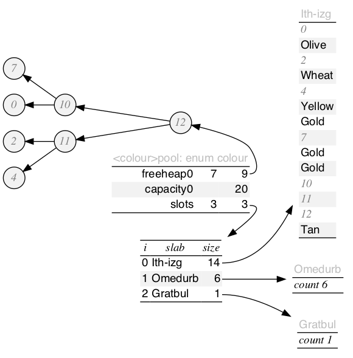
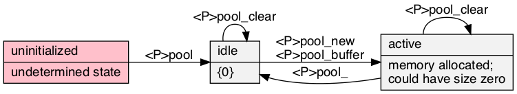

# pool\.h #

Header [\.\./\.\./src/pool\.h](../../src/pool.h) depends on [\.\./\.\./src/heap\.h](../../src/heap.h) and [\.\./\.\./src/array\.h](../../src/array.h); examples [\.\./\.\./test/test\_pool\.c](../../test/test_pool.c); article [\.\./pool/pool\.pdf](../pool/pool.pdf)\.

## Stable pool ##

 * [Description](#user-content-preamble)
 * [Typedef Aliases](#user-content-typedef): [&lt;pT&gt;type](#user-content-typedef-9b5be28b), [&lt;pT&gt;to_string_fn](#user-content-typedef-4442127b)
 * [Struct, Union, and Enum Definitions](#user-content-tag): [&lt;t&gt;pool](#user-content-tag-9a0f378f), [table_stats](#user-content-tag-89e31bf3)
 * [Function Summary](#user-content-summary)
 * [Function Definitions](#user-content-fn)
 * [License](#user-content-license)

## <a id = "user-content-preamble" name = "user-content-preamble">Description</a> ##

[&lt;t&gt;pool](#user-content-tag-9a0f378f) is a memory pool that stores only one size—[&lt;pT&gt;type](#user-content-typedef-9b5be28b)—using [slab allocation](https://en.wikipedia.org/wiki/Slab_allocation)\. As [Bonwick, 1994, Slab](https://scholar.google.ca/scholar?q=Bonwick%2C+1994%2C+Slab), it helps reduce internal fragmentation from repeated allocation and destruction by caching contiguous blocks\. Pointers to valid items in the pool are stable\. Instead of freeing memory, a free\-heap in the active\-slab allows lazily reusing the same space\. If removal is ongoing and uniformly sampled while reaching a steady\-state size, it will eventually settle in one contiguous region\.

 * Parameter: POOL\_NAME, POOL\_TYPE  
   `<t>` that satisfies `C` naming conventions when mangled and a valid tag type, [&lt;pT&gt;type](#user-content-typedef-9b5be28b), associated therewith; required\.
 * Parameter: POOL\_DECLARE\_ONLY  
   For headers in different compilation units\.
 * Standard:  
   C89\. However, when compiling for segmented memory models, C99 with `uintptr_t` is recommended because of it's implementation\-defined instead of undefined\-behaviour when comparing pointers from different objects in the heap of memory addresses\. Still, this is not guaranteed to produce meaningful results on all systems\.
 * Dependancies:  
   [array](../../src/array.h), [heap](../../src/heap.h), [box](../../src/box.h)

## <a id = "user-content-typedef" name = "user-content-typedef">Typedef Aliases</a> ##

### <a id = "user-content-typedef-9b5be28b" name = "user-content-typedef-9b5be28b">&lt;pT&gt;type</a> ###

<code>typedef POOL_TYPE <strong>&lt;pT&gt;type</strong>;</code>

A valid tag type set by `POOL_TYPE`\.

### <a id = "user-content-typedef-4442127b" name = "user-content-typedef-4442127b">&lt;pT&gt;to_string_fn</a> ###

<code>typedef void(*<strong>&lt;pT&gt;to_string_fn</strong>)(const &lt;pT&gt;type *, char(*)[12]);</code>

Type of the required `<tr>to_string`\. Responsible for turning the read\-only argument into a 12\-max\-`char` output string\.

## <a id = "user-content-tag" name = "user-content-tag">Struct, Union, and Enum Definitions</a> ##

### <a id = "user-content-tag-9a0f378f" name = "user-content-tag-9a0f378f">&lt;t&gt;pool</a> ###

<code>struct <strong>&lt;t&gt;pool</strong> { struct &lt;pT&gt;slot_array slots; struct poolfree_heap free0; size_t capacity0; };</code>

A zeroed pool is a valid state\. See [&lt;t&gt;pool](#user-content-fn-9a0f378f)\.

### <a id = "user-content-tag-89e31bf3" name = "user-content-tag-89e31bf3">table_stats</a> ###

<code>struct <strong>table_stats</strong> { size_t n, max; double mean, ssdm; };</code>

[Welford1962Note](https://scholar.google.ca/scholar?q=Welford1962Note): population variance: `ssdm/n`, sample variance: `ssdm/(n-1)`\.

## <a id = "user-content-summary" name = "user-content-summary">Function Summary</a> ##

<table>

<tr><th>Modifiers</th><th>Function Name</th><th>Argument List</th></tr>

<tr><td align = right>struct &lt;T&gt;cursor</td><td><a href = "#user-content-fn-80df50b2">&lt;T&gt;begin</a></td><td>&lt;t&gt;pool</td></tr>

<tr><td align = right>int</td><td><a href = "#user-content-fn-dd6c86e1">&lt;T&gt;exists</a></td><td>&lt;T&gt;cursor</td></tr>

<tr><td align = right>&lt;pT&gt;type *</td><td><a href = "#user-content-fn-1d176e37">&lt;T&gt;entry</a></td><td>&lt;T&gt;cursor</td></tr>

<tr><td align = right>void</td><td><a href = "#user-content-fn-d0790d04">&lt;T&gt;next</a></td><td>&lt;T&gt;cursor</td></tr>

<tr><td align = right>struct &lt;t&gt;pool</td><td><a href = "#user-content-fn-9a0f378f">&lt;t&gt;pool</a></td><td></td></tr>

<tr><td align = right>void</td><td><a href = "#user-content-fn-55f4dc70">&lt;t&gt;pool_</a></td><td>&lt;t&gt;pool</td></tr>

<tr><td align = right>int</td><td><a href = "#user-content-fn-c6b6f48f">&lt;T&gt;buffer</a></td><td>&lt;t&gt;pool, size_t</td></tr>

<tr><td align = right>&lt;pT&gt;type *</td><td><a href = "#user-content-fn-222fef85">&lt;T&gt;new</a></td><td>&lt;t&gt;pool</td></tr>

<tr><td align = right>int</td><td><a href = "#user-content-fn-56806709">&lt;T&gt;remove</a></td><td>&lt;t&gt;pool, &lt;pT&gt;type</td></tr>

<tr><td align = right>void</td><td><a href = "#user-content-fn-7f4a964e">&lt;T&gt;clear</a></td><td>&lt;t&gt;pool</td></tr>

<tr><td align = right>static struct &lt;t&gt;pool</td><td><a href = "#user-content-fn-9a0f378f">&lt;t&gt;pool</a></td><td></td></tr>

<tr><td align = right>static void</td><td><a href = "#user-content-fn-55f4dc70">&lt;t&gt;pool_</a></td><td>pool</td></tr>

<tr><td align = right>static int</td><td><a href = "#user-content-fn-c6b6f48f">&lt;T&gt;buffer</a></td><td>pool, n</td></tr>

<tr><td align = right>static &lt;pT&gt;type *</td><td><a href = "#user-content-fn-222fef85">&lt;T&gt;new</a></td><td>pool</td></tr>

<tr><td align = right>static int</td><td><a href = "#user-content-fn-56806709">&lt;T&gt;remove</a></td><td>pool, data</td></tr>

<tr><td align = right>static void</td><td><a href = "#user-content-fn-7f4a964e">&lt;T&gt;clear</a></td><td>pool</td></tr>

<tr><td align = right>void</td><td><a href = "#user-content-fn-4e047ffb">&lt;T&gt;graph</a></td><td>&lt;pT&gt;box</td></tr>

<tr><td align = right>int</td><td><a href = "#user-content-fn-6c32bc30">&lt;T&gt;graph_fn</a></td><td>&lt;pT&gt;box, char</td></tr>

</table>

## <a id = "user-content-fn" name = "user-content-fn">Function Definitions</a> ##

### <a id = "user-content-fn-80df50b2" name = "user-content-fn-80df50b2">&lt;T&gt;begin</a> ###

<code>struct &lt;T&gt;cursor <strong>&lt;T&gt;begin</strong>(const struct <em>&lt;t&gt;pool</em> *);</code>

### <a id = "user-content-fn-dd6c86e1" name = "user-content-fn-dd6c86e1">&lt;T&gt;exists</a> ###

<code>int <strong>&lt;T&gt;exists</strong>(const struct <em>&lt;T&gt;cursor</em> *);</code>

### <a id = "user-content-fn-1d176e37" name = "user-content-fn-1d176e37">&lt;T&gt;entry</a> ###

<code>&lt;pT&gt;type *<strong>&lt;T&gt;entry</strong>(struct <em>&lt;T&gt;cursor</em> *);</code>

### <a id = "user-content-fn-d0790d04" name = "user-content-fn-d0790d04">&lt;T&gt;next</a> ###

<code>void <strong>&lt;T&gt;next</strong>(struct <em>&lt;T&gt;cursor</em> *);</code>

### <a id = "user-content-fn-9a0f378f" name = "user-content-fn-9a0f378f">&lt;t&gt;pool</a> ###

<code>struct &lt;t&gt;pool <strong>&lt;t&gt;pool</strong>(void);</code>

### <a id = "user-content-fn-55f4dc70" name = "user-content-fn-55f4dc70">&lt;t&gt;pool_</a> ###

<code>void <strong>&lt;t&gt;pool_</strong>(struct <em>&lt;t&gt;pool</em> *);</code>

### <a id = "user-content-fn-c6b6f48f" name = "user-content-fn-c6b6f48f">&lt;T&gt;buffer</a> ###

<code>int <strong>&lt;T&gt;buffer</strong>(struct <em>&lt;t&gt;pool</em> *, <em>size_t</em>);</code>

### <a id = "user-content-fn-222fef85" name = "user-content-fn-222fef85">&lt;T&gt;new</a> ###

<code>&lt;pT&gt;type *<strong>&lt;T&gt;new</strong>(struct <em>&lt;t&gt;pool</em> *);</code>

### <a id = "user-content-fn-56806709" name = "user-content-fn-56806709">&lt;T&gt;remove</a> ###

<code>int <strong>&lt;T&gt;remove</strong>(struct <em>&lt;t&gt;pool</em> *, <em>&lt;pT&gt;type</em> *);</code>

### <a id = "user-content-fn-7f4a964e" name = "user-content-fn-7f4a964e">&lt;T&gt;clear</a> ###

<code>void <strong>&lt;T&gt;clear</strong>(struct <em>&lt;t&gt;pool</em> *);</code>

### <a id = "user-content-fn-9a0f378f" name = "user-content-fn-9a0f378f">&lt;t&gt;pool</a> ###

<code>static struct &lt;t&gt;pool <strong>&lt;t&gt;pool</strong>(void)</code>

 * Return:  
   An idle pool is zeroed\.
 * Order:  
   &#920;\(1\)

### <a id = "user-content-fn-55f4dc70" name = "user-content-fn-55f4dc70">&lt;t&gt;pool_</a> ###

<code>static void <strong>&lt;t&gt;pool_</strong>(struct &lt;t&gt;pool *const <em>pool</em>)</code>

Destroys `pool` and returns it to idle\.

 * Order:  
   &#927;\(log `data`\)

### <a id = "user-content-fn-c6b6f48f" name = "user-content-fn-c6b6f48f">&lt;T&gt;buffer</a> ###

<code>static int <strong>&lt;T&gt;buffer</strong>(struct &lt;t&gt;pool *const <em>pool</em>, const size_t <em>n</em>)</code>

Ensure capacity of at least `n` further items in `pool`\. Pre\-sizing is better for contiguous blocks, but takes up that memory\.

 * Return:  
   Success\.
 * Exceptional return: ERANGE, malloc  

### <a id = "user-content-fn-222fef85" name = "user-content-fn-222fef85">&lt;T&gt;new</a> ###

<code>static &lt;pT&gt;type *<strong>&lt;T&gt;new</strong>(struct &lt;t&gt;pool *const <em>pool</em>)</code>

This pointer is constant until it gets [&lt;T&gt;remove](#user-content-fn-56806709)\.

 * Return:  
   A pointer to a new uninitialized element from `pool`\.
 * Exceptional return: ERANGE, malloc  
 * Order:  
   amortised O\(1\)

### <a id = "user-content-fn-56806709" name = "user-content-fn-56806709">&lt;T&gt;remove</a> ###

<code>static int <strong>&lt;T&gt;remove</strong>(struct &lt;t&gt;pool *const <em>pool</em>, &lt;pT&gt;type *const <em>data</em>)</code>

Deletes `data` from `pool`\. \(Do not remove data that is not in `pool`\.\)

 * Return:  
   Success\.
 * Exceptional return: malloc  
   Because of lazy deletion, remove can actually demand memory when `data` requires adding to the free\-heap\.
 * Order:  
   &#927;\(log \(`slab0-free-heap` | `slabs`\)\)

### <a id = "user-content-fn-7f4a964e" name = "user-content-fn-7f4a964e">&lt;T&gt;clear</a> ###

<code>static void <strong>&lt;T&gt;clear</strong>(struct &lt;t&gt;pool *const <em>pool</em>)</code>

Removes all from `pool`, but keeps it's active state, only freeing the smaller blocks\.

 * Order:  
   &#927;\(log `items`\)

### <a id = "user-content-fn-4e047ffb" name = "user-content-fn-4e047ffb">&lt;T&gt;graph</a> ###

<code>void <strong>&lt;T&gt;graph</strong>(const <em>&lt;pT&gt;box</em> *, FILE *);</code>

### <a id = "user-content-fn-6c32bc30" name = "user-content-fn-6c32bc30">&lt;T&gt;graph_fn</a> ###

<code>int <strong>&lt;T&gt;graph_fn</strong>(const <em>&lt;pT&gt;box</em> *, const <em>char</em> *);</code>

## <a id = "user-content-license" name = "user-content-license">License</a> ##

2021 Neil Edelman, distributed under the terms of the [MIT License](https://opensource.org/licenses/MIT)\.

