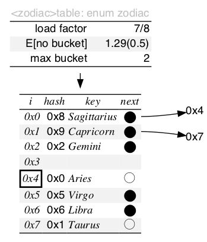
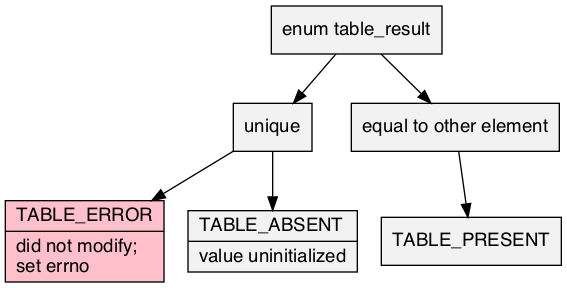
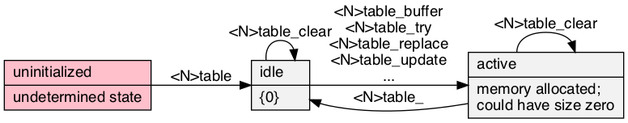
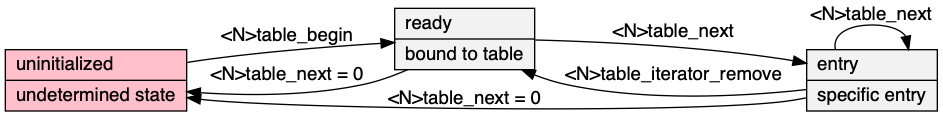

# table\.h #

Header [\.\./src/table\.h](../src/table.h); examples [\.\./test/test\_table\.c](../test/test_table.c); article [\.\./doc/table/table\.pdf](../doc/table/table.pdf)\.

## Hash table ##

 * [Description](#user-content-preamble)
 * [Typedef Aliases](#user-content-typedef): [&lt;pT&gt;uint](#user-content-typedef-38271b2b), [&lt;pT&gt;key](#user-content-typedef-95e6d0aa), [&lt;pT&gt;hash_fn](#user-content-typedef-896a1418), [&lt;pT&gt;unhash_fn](#user-content-typedef-25e8a1a1), [&lt;pT&gt;is_equal_fn](#user-content-typedef-f238d00d), [&lt;pT&gt;value](#user-content-typedef-3a465e90), [&lt;pT&gt;entry](#user-content-typedef-9be2614d), [&lt;pT&gt;policy_fn](#user-content-typedef-aafffb12), [&lt;pT&gt;action_fn](#user-content-typedef-348726ce), [&lt;pT&gt;predicate_fn](#user-content-typedef-ad32e23d), [&lt;pT&gt;to_string_fn](#user-content-typedef-4442127b)
 * [Struct, Union, and Enum Definitions](#user-content-tag): [table_result](#user-content-tag-4f1ea759), [&lt;T&gt;entry](#user-content-tag-1d176e37), [&lt;t&gt;table](#user-content-tag-2283b713), [&lt;T&gt;cursor](#user-content-tag-43a11ad3)
 * [Function Summary](#user-content-summary)
 * [Function Definitions](#user-content-fn)
 * [License](#user-content-license)

## <a id = "user-content-preamble" name = "user-content-preamble">Description</a> ##

[&lt;t&gt;table](#user-content-tag-2283b713) implements a set or map of [&lt;pT&gt;entry](#user-content-typedef-9be2614d) as an inline\-chined hash\-table\. It must be supplied [&lt;pT&gt;hash_fn](#user-content-typedef-896a1418) `<t>hash` and, [&lt;pT&gt;is_equal_fn](#user-content-typedef-f238d00d) `<t>is_equal` or [&lt;pT&gt;unhash_fn](#user-content-typedef-25e8a1a1) `<t>unhash`\. It is contiguous and not stable, and may rearrange elements\.

\* [src/iterate\.h](src/iterate.h): defining `HAVE_ITERATE_H` supplies functions\.

 * Parameter: TABLE\_NAME, TABLE\_KEY  
   `<t>` that satisfies `C` naming conventions when mangled and a valid [&lt;pT&gt;key](#user-content-typedef-95e6d0aa) associated therewith; required\.
 * Parameter: TABLE\_UNHASH  
   By default it assumes that `<N>is_equal` is supplied; with this, instead requires `<t>unhash` satisfying [&lt;pT&gt;unhash_fn](#user-content-typedef-25e8a1a1)\.
 * Parameter: TABLE\_VALUE  
   An optional type that is the payload of the key, thus making this a map or associative array\.
 * Parameter: TABLE\_UINT  
   This is [&lt;pT&gt;uint](#user-content-typedef-38271b2b), the unsigned type of hash of the key given by [&lt;pT&gt;hash_fn](#user-content-typedef-896a1418); defaults to `size_t`\. Usually this can be set to the more sensible value `uint32_t` \(or smaller\) in C99's `stdint.h`\.
 * Parameter: TABLE\_DEFAULT  
   Default trait; a [&lt;pT&gt;value](#user-content-typedef-3a465e90) used in [&lt;T&gt;table&lt;R&gt;get](#user-content-fn-529ef21b)\.
 * Parameter: TABLE\_TO\_STRING  
   To string trait contained in [src/to\_string\.h](src/to_string.h)\. See [&lt;pT&gt;to_string_fn](#user-content-typedef-4442127b)\.
 * Parameter: TABLE\_EXPECT\_TRAIT, TABLE\_TRAIT  
   Named traits are obtained by including `table.h` multiple times with `TABLE_EXPECT_TRAIT` and then subsequently including the name in `TABLE_TRAIT`\.
 * Parameter: TABLE\_DECLARE\_ONLY  
   For headers in different compilation units\.
 * Standard:  
   C89
 * Dependancies:  
   [box](../../src/box.h)

## <a id = "user-content-typedef" name = "user-content-typedef">Typedef Aliases</a> ##

### <a id = "user-content-typedef-38271b2b" name = "user-content-typedef-38271b2b">&lt;pT&gt;uint</a> ###

<code>typedef TABLE_UINT <strong>&lt;pT&gt;uint</strong>;</code>

[&lt;pT&gt;hash_fn](#user-content-typedef-896a1418) returns this hash type by `TABLE_UINT`, which must be be an unsigned integer\. Places a simplifying limit on the maximum number of elements of half the cardinality\.

### <a id = "user-content-typedef-95e6d0aa" name = "user-content-typedef-95e6d0aa">&lt;pT&gt;key</a> ###

<code>typedef TABLE_KEY <strong>&lt;pT&gt;key</strong>;</code>

Valid tag type defined by `TABLE_KEY` used for keys\. If `TABLE_UNHASH` is not defined, a copy of this value will be stored in the internal buckets\.

### <a id = "user-content-typedef-896a1418" name = "user-content-typedef-896a1418">&lt;pT&gt;hash_fn</a> ###

<code>typedef &lt;pT&gt;uint(*<strong>&lt;pT&gt;hash_fn</strong>)(const &lt;pT&gt;key);</code>

A map from [&lt;pT&gt;key](#user-content-typedef-95e6d0aa) onto [&lt;pT&gt;uint](#user-content-typedef-38271b2b), called `<t>hash`, that, ideally, should be easy to compute while minimizing duplicate addresses\. Must be consistent for each value while in the table\. If [&lt;pT&gt;key](#user-content-typedef-95e6d0aa) is a pointer, one is permitted to have null in the domain\.

### <a id = "user-content-typedef-25e8a1a1" name = "user-content-typedef-25e8a1a1">&lt;pT&gt;unhash_fn</a> ###

<code>typedef &lt;pT&gt;key(*<strong>&lt;pT&gt;unhash_fn</strong>)(&lt;pT&gt;uint);</code>

Defining `TABLE_UNHASH` says [&lt;pT&gt;hash_fn](#user-content-typedef-896a1418) forms a bijection between the range in [&lt;pT&gt;key](#user-content-typedef-95e6d0aa) and the image in [&lt;pT&gt;uint](#user-content-typedef-38271b2b), and the inverse is called `<t>unhash`\. In this case, keys are not stored in the hash table, rather they are generated using this inverse\-mapping\.

### <a id = "user-content-typedef-f238d00d" name = "user-content-typedef-f238d00d">&lt;pT&gt;is_equal_fn</a> ###

<code>typedef int(*<strong>&lt;pT&gt;is_equal_fn</strong>)(const &lt;pT&gt;key a, const &lt;pT&gt;key b);</code>

Equivalence relation between [&lt;pT&gt;key](#user-content-typedef-95e6d0aa) that satisfies `<t>is_equal_fn(a, b) -> <t>hash(a) == <t>hash(b)`, called `<t>is_equal`\. If `TABLE_UNHASH` is set, there is no need for this function because the comparison is done directly in hash space\.

### <a id = "user-content-typedef-3a465e90" name = "user-content-typedef-3a465e90">&lt;pT&gt;value</a> ###

<code>typedef TABLE_VALUE <strong>&lt;pT&gt;value</strong>;</code>

Defining `TABLE_VALUE` produces an associative map, otherwise it is the same as [&lt;pT&gt;key](#user-content-typedef-95e6d0aa)\.

### <a id = "user-content-typedef-9be2614d" name = "user-content-typedef-9be2614d">&lt;pT&gt;entry</a> ###

<code>typedef struct &lt;T&gt;entry <strong>&lt;pT&gt;entry</strong>;</code>

If `TABLE_VALUE`, this is [&lt;T&gt;entry](#user-content-tag-1d176e37); otherwise, it's the same as [&lt;pT&gt;key](#user-content-typedef-95e6d0aa)\.

### <a id = "user-content-typedef-aafffb12" name = "user-content-typedef-aafffb12">&lt;pT&gt;policy_fn</a> ###

<code>typedef int(*<strong>&lt;pT&gt;policy_fn</strong>)(&lt;pT&gt;key original, &lt;pT&gt;key replace);</code>

Returns true if the `replace` replaces the `original`\. \(fixme: Shouldn't it be entry?\)

### <a id = "user-content-typedef-348726ce" name = "user-content-typedef-348726ce">&lt;pT&gt;action_fn</a> ###

<code>typedef void(*<strong>&lt;pT&gt;action_fn</strong>)(&lt;pT&gt;type *);</code>

[src/iterate\.h](src/iterate.h): Operates by side\-effects\.

### <a id = "user-content-typedef-ad32e23d" name = "user-content-typedef-ad32e23d">&lt;pT&gt;predicate_fn</a> ###

<code>typedef int(*<strong>&lt;pT&gt;predicate_fn</strong>)(const &lt;pT&gt;type *);</code>

[src/iterate\.h](src/iterate.h): Returns a boolean given read\-only\.

### <a id = "user-content-typedef-4442127b" name = "user-content-typedef-4442127b">&lt;pT&gt;to_string_fn</a> ###

<code>typedef void(*<strong>&lt;pT&gt;to_string_fn</strong>)(const &lt;pT&gt;key, const &lt;pT&gt;value *, char(*)[12]);</code>

The type of the required `<tr>to_string`\. Responsible for turning the read\-only argument into a 12\-max\-`char` output string\. `<pT>value` is omitted when it's a set\.

## <a id = "user-content-tag" name = "user-content-tag">Struct, Union, and Enum Definitions</a> ##

### <a id = "user-content-tag-4f1ea759" name = "user-content-tag-4f1ea759">table_result</a> ###

<code>enum <strong>table_result</strong> { TABLE_RESULT };</code>

A result of modifying the table, of which `TABLE_ERROR` is false\.

### <a id = "user-content-tag-1d176e37" name = "user-content-tag-1d176e37">&lt;T&gt;entry</a> ###

<code>struct <strong>&lt;T&gt;entry</strong> { &lt;pT&gt;key key; &lt;pT&gt;value value; };</code>

Defining `TABLE_VALUE` creates this map from [&lt;pT&gt;key](#user-content-typedef-95e6d0aa) to [&lt;pT&gt;value](#user-content-typedef-3a465e90), as an interface with table\.

### <a id = "user-content-tag-2283b713" name = "user-content-tag-2283b713">&lt;t&gt;table</a> ###

<code>struct <strong>&lt;t&gt;table</strong> { struct &lt;pT&gt;bucket *buckets; &lt;pT&gt;uint log_capacity, size, top; };</code>

To initialize, see [&lt;t&gt;table](#user-content-fn-2283b713), `TABLE_IDLE`, `{0}` \(`C99`,\) or being `static`\. The fields should be treated as read\-only; any modification is liable to cause the table to go into an invalid state\.

### <a id = "user-content-tag-43a11ad3" name = "user-content-tag-43a11ad3">&lt;T&gt;cursor</a> ###

<code>struct <strong>&lt;T&gt;cursor</strong> { struct &lt;t&gt;table *table; &lt;pT&gt;uint i; };</code>

Adding, deleting, successfully looking up entries, or any modification of the table's topology invalidates the iterator\. Iteration usually not in any particular order, but deterministic up to topology changes\. The asymptotic runtime of iterating though the whole table is proportional to the capacity\.

## <a id = "user-content-summary" name = "user-content-summary">Function Summary</a> ##

<table>

<tr><th>Modifiers</th><th>Function Name</th><th>Argument List</th></tr>

<tr><td align = right>static &lt;pT&gt;key</td><td><a href = "#user-content-fn-3154790">&lt;T&gt;key</a></td><td>cur</td></tr>

<tr><td align = right>static &lt;pT&gt;value *</td><td><a href = "#user-content-fn-70919a06">&lt;T&gt;value</a></td><td>cur</td></tr>

<tr><td align = right>static int</td><td><a href = "#user-content-fn-95ac3394">&lt;T&gt;cursor_remove</a></td><td>cur</td></tr>

<tr><td align = right>static struct &lt;t&gt;table</td><td><a href = "#user-content-fn-2283b713">&lt;t&gt;table</a></td><td></td></tr>

<tr><td align = right>static void</td><td><a href = "#user-content-fn-a1598ca4">&lt;t&gt;table_</a></td><td>table</td></tr>

<tr><td align = right>static int</td><td><a href = "#user-content-fn-c6b6f48f">&lt;T&gt;buffer</a></td><td>table, n</td></tr>

<tr><td align = right>static void</td><td><a href = "#user-content-fn-7f4a964e">&lt;T&gt;clear</a></td><td>table</td></tr>

<tr><td align = right>static int</td><td><a href = "#user-content-fn-988bbaac">&lt;T&gt;contains</a></td><td>table, key</td></tr>

<tr><td align = right>static int</td><td><a href = "#user-content-fn-a598536f">&lt;T&gt;query</a></td><td>table, key, result, value</td></tr>

<tr><td align = right>static &lt;pT&gt;value</td><td><a href = "#user-content-fn-e9879d51">&lt;T&gt;get_or</a></td><td>table, key, default_value</td></tr>

<tr><td align = right>static enum table_result</td><td><a href = "#user-content-fn-edcfce52">&lt;T&gt;try</a></td><td>table, key</td></tr>

<tr><td align = right>static enum table_result</td><td><a href = "#user-content-fn-40416930">&lt;T&gt;assign</a></td><td>table, key, content</td></tr>

<tr><td align = right>static enum table_result</td><td><a href = "#user-content-fn-5772e298">&lt;T&gt;update</a></td><td>table, key, eject</td></tr>

<tr><td align = right>static enum table_result</td><td><a href = "#user-content-fn-6fa96eb3">&lt;T&gt;policy</a></td><td>table, key, eject, policy</td></tr>

<tr><td align = right>static int</td><td><a href = "#user-content-fn-56806709">&lt;T&gt;remove</a></td><td>table, key</td></tr>

<tr><td align = right>static &lt;pT&gt;type *</td><td><a href = "#user-content-fn-443f2b31">&lt;TR&gt;any</a></td><td>box, predicate</td></tr>

<tr><td align = right>static void</td><td><a href = "#user-content-fn-51d87ca4">&lt;TR&gt;each</a></td><td>box, action</td></tr>

<tr><td align = right>static void</td><td><a href = "#user-content-fn-21ef106e">&lt;TR&gt;if_each</a></td><td>box, predicate, action</td></tr>

<tr><td align = right>static int</td><td><a href = "#user-content-fn-f61ec8de">&lt;TR&gt;copy_if</a></td><td>dst, src, copy</td></tr>

<tr><td align = right>static void</td><td><a href = "#user-content-fn-8bb1c0a2">&lt;TR&gt;keep_if</a></td><td>box, keep, destruct</td></tr>

<tr><td align = right>static void</td><td><a href = "#user-content-fn-a76df7bd">&lt;TR&gt;trim</a></td><td>box, predicate</td></tr>

<tr><td align = right>static const char *</td><td><a href = "#user-content-fn-260f8348">&lt;TR&gt;to_string</a></td><td>box</td></tr>

<tr><td align = right>static &lt;pT&gt;value</td><td><a href = "#user-content-fn-529ef21b">&lt;T&gt;table&lt;R&gt;get</a></td><td>table, key</td></tr>

</table>

## <a id = "user-content-fn" name = "user-content-fn">Function Definitions</a> ##

### <a id = "user-content-fn-3154790" name = "user-content-fn-3154790">&lt;T&gt;key</a> ###

<code>static &lt;pT&gt;key <strong>&lt;T&gt;key</strong>(const struct &lt;T&gt;cursor *const <em>cur</em>)</code>

 * Return:  
   If `cur` has an element, returns it's key\.

### <a id = "user-content-fn-70919a06" name = "user-content-fn-70919a06">&lt;T&gt;value</a> ###

<code>static &lt;pT&gt;value *<strong>&lt;T&gt;value</strong>(const struct &lt;T&gt;cursor *const <em>cur</em>)</code>

 * Return:  
   If `cur` has an element, returns it's value, if `TABLE_VALUE`\.

### <a id = "user-content-fn-95ac3394" name = "user-content-fn-95ac3394">&lt;T&gt;cursor_remove</a> ###

<code>static int <strong>&lt;T&gt;cursor_remove</strong>(struct &lt;T&gt;cursor *const <em>cur</em>)</code>

Removes the entry at `cur`\. Whereas [&lt;T&gt;remove](#user-content-fn-56806709) invalidates the cursor, this corrects `cur` so [&lt;T&gt;next](#user-content-fn-d0790d04) is the next entry\. To use the cursor after this, one must move to the next\.

 * Return:  
   Success, or there was no entry at the iterator's position, \(anymore\.\)

### <a id = "user-content-fn-2283b713" name = "user-content-fn-2283b713">&lt;t&gt;table</a> ###

<code>static struct &lt;t&gt;table <strong>&lt;t&gt;table</strong>(void)</code>

Zeroed data \(not all\-bits\-zero\) is initialized\.

 * Return:  
   An idle array\.
 * Order:  
   &#920;\(1\)

### <a id = "user-content-fn-a1598ca4" name = "user-content-fn-a1598ca4">&lt;t&gt;table_</a> ###

<code>static void <strong>&lt;t&gt;table_</strong>(struct &lt;t&gt;table *const <em>table</em>)</code>

If `table` is not null, destroys and returns it to idle\.

### <a id = "user-content-fn-c6b6f48f" name = "user-content-fn-c6b6f48f">&lt;T&gt;buffer</a> ###

<code>static int <strong>&lt;T&gt;buffer</strong>(struct &lt;t&gt;table *const <em>table</em>, const &lt;pT&gt;uint <em>n</em>)</code>

Reserve at least `n` more empty buckets in `table`\. This may cause the capacity to increase and invalidates any pointers to data in the table\.

 * Return:  
   Success\.
 * Exceptional return: ERANGE  
   The request was unsatisfiable\.
 * Exceptional return: realloc  

### <a id = "user-content-fn-7f4a964e" name = "user-content-fn-7f4a964e">&lt;T&gt;clear</a> ###

<code>static void <strong>&lt;T&gt;clear</strong>(struct &lt;t&gt;table *const <em>table</em>)</code>

Clears and removes all buckets from `table`\. The capacity and memory of the `table` is preserved, but all previous values are un\-associated\. \(The load factor will be less until it reaches it's previous size\.\)

 * Order:  
   &#920;\(`table.capacity`\)

### <a id = "user-content-fn-988bbaac" name = "user-content-fn-988bbaac">&lt;T&gt;contains</a> ###

<code>static int <strong>&lt;T&gt;contains</strong>(struct &lt;t&gt;table *const <em>table</em>, const &lt;pT&gt;key <em>key</em>)</code>

 * Return:  
   Whether `key` is in `table` \(which can be null\.\)

### <a id = "user-content-fn-a598536f" name = "user-content-fn-a598536f">&lt;T&gt;query</a> ###

<code>static int <strong>&lt;T&gt;query</strong>(struct &lt;t&gt;table *const <em>table</em>, const &lt;pT&gt;key <em>key</em>, &lt;pT&gt;key *<em>result</em>, &lt;pT&gt;value *<em>value</em>)</code>

If can be no default key, use this to separate a null—returns false—from a result\. Otherwise, a more convenient function is [&lt;T&gt;get_or](#user-content-fn-e9879d51)\.

 * Parameter: _result_  
   If null, behaves like [&lt;T&gt;contains](#user-content-fn-988bbaac), otherwise, a [&lt;pT&gt;key](#user-content-typedef-95e6d0aa) which gets filled on true\.
 * Parameter: _value_  
   Only on a map with `TABLE_VALUE`\. If not\-null, stores the value\.
 * Return:  
   Whether `key` is in `table` \(which can be null\.\)

### <a id = "user-content-fn-e9879d51" name = "user-content-fn-e9879d51">&lt;T&gt;get_or</a> ###

<code>static &lt;pT&gt;value <strong>&lt;T&gt;get_or</strong>(struct &lt;t&gt;table *const <em>table</em>, const &lt;pT&gt;key <em>key</em>, &lt;pT&gt;value <em>default_value</em>)</code>

 * Return:  
   The value associated with `key` in `table`, \(which can be null\.\) If no such value exists, `default_value` is returned\.
 * Order:  
   Average &#927;\(1\); worst &#927;\(n\)\.

### <a id = "user-content-fn-edcfce52" name = "user-content-fn-edcfce52">&lt;T&gt;try</a> ###

<code>static enum table_result <strong>&lt;T&gt;try</strong>(struct &lt;t&gt;table *const <em>table</em>, &lt;pT&gt;key <em>key</em>)</code>

Only if `TABLE_VALUE` is not set; see [&lt;T&gt;assign](#user-content-fn-40416930) for a map\. Puts `key` in set `table` only if absent\.

 * Return:  
   One of: `TABLE_ERROR`, tried putting the entry in the table but failed, the table is not modified; `TABLE_PRESENT`, does nothing if there is another entry with the same key; `TABLE_ABSENT`, put an entry in the table\.
 * Exceptional return: realloc, ERANGE  
   On `TABLE_ERROR`\.
 * Order:  
   Average amortised &#927;\(1\); worst &#927;\(n\)\.

### <a id = "user-content-fn-40416930" name = "user-content-fn-40416930">&lt;T&gt;assign</a> ###

<code>static enum table_result <strong>&lt;T&gt;assign</strong>(struct &lt;t&gt;table *const <em>table</em>, &lt;pT&gt;key <em>key</em>, &lt;pT&gt;value **const <em>content</em>)</code>

Only if `TABLE_VALUE` is set; see [&lt;T&gt;try](#user-content-fn-edcfce52) for a set\. Puts `key` in the map `table` and store the associated value in `content`\.

 * Return:  
   `TABLE_ERROR` does not set `content`; `TABLE_ABSENT`, the `content` will be a pointer to uninitialized memory; `TABLE_PRESENT`, gets the current `content`, \(does not alter the keys, if they are distinguishable\.\)
 * Exceptional return: malloc, ERANGE  
   On `TABLE_ERROR`\.

### <a id = "user-content-fn-5772e298" name = "user-content-fn-5772e298">&lt;T&gt;update</a> ###

<code>static enum table_result <strong>&lt;T&gt;update</strong>(struct &lt;t&gt;table *const <em>table</em>, &lt;pT&gt;key <em>key</em>, &lt;pT&gt;key *<em>eject</em>)</code>

Puts `key` in `table`, replacing an equal\-valued key\. \(If keys are indistinguishable, this function is not very useful, see [&lt;T&gt;try](#user-content-fn-edcfce52) or [&lt;T&gt;assign](#user-content-fn-40416930)\.\)

 * Return:  
   One of: `TABLE_ERROR`, the table is not modified; `TABLE_ABSENT`, the `key` is new; `TABLE_PRESENT`, the `key` displaces another, and if non\-null, `eject` will be filled with the previous entry\.
 * Exceptional return: realloc, ERANGE  
   On `TABLE_ERROR`\.
 * Order:  
   Average amortised &#927;\(1\); worst &#927;\(n\)\.

### <a id = "user-content-fn-6fa96eb3" name = "user-content-fn-6fa96eb3">&lt;T&gt;policy</a> ###

<code>static enum table_result <strong>&lt;T&gt;policy</strong>(struct &lt;t&gt;table *const <em>table</em>, &lt;pT&gt;key <em>key</em>, &lt;pT&gt;key *<em>eject</em>, const &lt;pT&gt;policy_fn <em>policy</em>)</code>

Puts `key` in `table` only if absent or if calling `policy` returns true\.

 * Return:  
   One of: `TABLE_ERROR`, the table is not modified; `TABLE_ABSENT`, the `key` is new; `TABLE_PRESENT`, `key` collides, if `policy` returns true, `eject`, if non\-null, will be filled;
 * Exceptional return: realloc, ERANGE  
   On `TABLE_ERROR`\.
 * Order:  
   Average amortised &#927;\(1\); worst &#927;\(n\)\.

### <a id = "user-content-fn-56806709" name = "user-content-fn-56806709">&lt;T&gt;remove</a> ###

<code>static int <strong>&lt;T&gt;remove</strong>(struct &lt;t&gt;table *const <em>table</em>, const &lt;pT&gt;key <em>key</em>)</code>

Removes `key` from `table` \(which could be null\.\)

 * Return:  
   Whether that `key` was in `table`\.
 * Order:  
   Average &#927;\(1\), \(hash distributes elements uniformly\); worst &#927;\(n\)\.

### <a id = "user-content-fn-443f2b31" name = "user-content-fn-443f2b31">&lt;TR&gt;any</a> ###

<code>static &lt;pT&gt;type *<strong>&lt;TR&gt;any</strong>(const &lt;pT&gt;box *const <em>box</em>, const &lt;pTR&gt;predicate_fn <em>predicate</em>)</code>

[src/iterate\.h](src/iterate.h): Iterates through `box` and calls `predicate` until it returns true\.

 * Return:  
   The first `predicate` that returned true, or, if the statement is false on all, null\.
 * Order:  
   &#927;\(`box.size`\) &#215; &#927;\(`predicate`\)

### <a id = "user-content-fn-51d87ca4" name = "user-content-fn-51d87ca4">&lt;TR&gt;each</a> ###

<code>static void <strong>&lt;TR&gt;each</strong>(&lt;pT&gt;box *const <em>box</em>, const &lt;pTR&gt;action_fn <em>action</em>)</code>

[src/iterate\.h](src/iterate.h): Iterates through `box` and calls `action` on all the elements\. Differs calling `action` until the iterator is one\-ahead, so can delete elements as long as it doesn't affect the next, \(specifically, a linked\-list\.\)

 * Order:  
   &#927;\(|`box`|\) &#215; &#927;\(`action`\)

### <a id = "user-content-fn-21ef106e" name = "user-content-fn-21ef106e">&lt;TR&gt;if_each</a> ###

<code>static void <strong>&lt;TR&gt;if_each</strong>(&lt;pT&gt;box *const <em>box</em>, const &lt;pTR&gt;predicate_fn <em>predicate</em>, const &lt;pTR&gt;action_fn <em>action</em>)</code>

[src/iterate\.h](src/iterate.h): Iterates through `box` and calls `action` on all the elements for which `predicate` returns true\.

 * Order:  
   &#927;\(`box.size`\) &#215; \(&#927;\(`predicate`\) \+ &#927;\(`action`\)\)

### <a id = "user-content-fn-f61ec8de" name = "user-content-fn-f61ec8de">&lt;TR&gt;copy_if</a> ###

<code>static int <strong>&lt;TR&gt;copy_if</strong>(&lt;pT&gt;box *restrict const <em>dst</em>, const &lt;pTR&gt;box *restrict const <em>src</em>, const &lt;pTR&gt;predicate_fn <em>copy</em>)</code>

[src/iterate\.h](src/iterate.h), `pT_CONTIGUOUS`: For all elements of `src`, calls `copy`, and if true, lazily copies the elements to `dst`\. `dst` and `src` can not be the same but `src` can be null, \(in which case, it does nothing\.\)

 * Exceptional return: realloc  
 * Order:  
   &#927;\(|`src`|\) &#215; &#927;\(`copy`\)

### <a id = "user-content-fn-8bb1c0a2" name = "user-content-fn-8bb1c0a2">&lt;TR&gt;keep_if</a> ###

<code>static void <strong>&lt;TR&gt;keep_if</strong>(&lt;pT&gt;box *const <em>box</em>, const &lt;pTR&gt;predicate_fn <em>keep</em>, const &lt;pTR&gt;action_fn <em>destruct</em>)</code>

[src/iterate\.h](src/iterate.h): For all elements of `box`, calls `keep`, and if false, if contiguous, lazy deletes that item, if not, eagerly\. Calls `destruct` if not\-null before deleting\.

 * Order:  
   &#927;\(|`box`|\) \(&#215; O\(`keep`\) \+ O\(`destruct`\)\)

### <a id = "user-content-fn-a76df7bd" name = "user-content-fn-a76df7bd">&lt;TR&gt;trim</a> ###

<code>static void <strong>&lt;TR&gt;trim</strong>(&lt;pT&gt;box *const <em>box</em>, const &lt;pTR&gt;predicate_fn <em>predicate</em>)</code>

[src/iterate\.h](src/iterate.h), `pT_CONTIGUOUS`: Removes at either end of `box` the things that `predicate`, if it exists, returns true\.

 * Order:  
   &#927;\(`box.size`\) &#215; &#927;\(`predicate`\)

### <a id = "user-content-fn-260f8348" name = "user-content-fn-260f8348">&lt;TR&gt;to_string</a> ###

<code>static const char *<strong>&lt;TR&gt;to_string</strong>(const &lt;pT&gt;box *const <em>box</em>)</code>

[src/to\_string\.h](src/to_string.h): print the contents of `box` in a static string buffer of 256 bytes, with limitations of only printing 4 things in a single sequence point\.

 * Return:  
   Address of the static buffer\.
 * Order:  
   &#920;\(1\)

### <a id = "user-content-fn-529ef21b" name = "user-content-fn-529ef21b">&lt;T&gt;table&lt;R&gt;get</a> ###

<code>static &lt;pT&gt;value <strong>&lt;T&gt;table&lt;R&gt;get</strong>(struct &lt;t&gt;table *const <em>table</em>, const &lt;pT&gt;key <em>key</em>)</code>

This is functionally identical to [&lt;T&gt;get_or](#user-content-fn-e9879d51), but a with a trait specifying a constant default value\. This is the most convenient access method, but it needs to have a `TABLE_DEFAULT`\.

 * Return:  
   The value associated with `key` in `table`, \(which can be null\.\) If no such value exists, the `TABLE_DEFAULT` for this trait is returned\.
 * Order:  
   Average &#927;\(1\); worst &#927;\(n\)\.

## <a id = "user-content-license" name = "user-content-license">License</a> ##

2019 Neil Edelman, distributed under the terms of the [MIT License](https://opensource.org/licenses/MIT)\.

