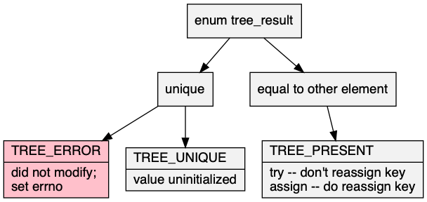

# tree\.h #

Stand\-alone header [src/tree\.h](src/tree.h); examples [test/test\_tree\.c](test/test_tree.c); article [doc/tree\.pdf](doc/tree.pdf)\. On a compatible workstation, `make` creates the test suite of the examples\.

## Ordered tree ##

 * [Description](#user-content-preamble)
 * [Typedef Aliases](#user-content-typedef): [&lt;PB&gt;key](#user-content-typedef-9d1494bc), [&lt;PB&gt;value](#user-content-typedef-1740653a), [&lt;PB&gt;compare_fn](#user-content-typedef-35616b31), [&lt;PSTR&gt;to_string_fn](#user-content-typedef-8a8349ca)
 * [Struct, Union, and Enum Definitions](#user-content-tag): [tree_result](#user-content-tag-9c3f99d7), [&lt;B&gt;tree](#user-content-tag-a36433e3), [&lt;B&gt;tree_iterator](#user-content-tag-18b8c30e)
 * [Function Summary](#user-content-summary)
 * [Function Definitions](#user-content-fn)
 * [License](#user-content-license)

## <a id = "user-content-preamble" name = "user-content-preamble">Description</a> ##

A [&lt;B&gt;tree](#user-content-tag-a36433e3) is an ordered set or map contained in a tree\. For memory locality, this is implemented B\-tree, described in [Bayer, McCreight, 1972, Large](https://scholar.google.ca/scholar?q=Bayer%2C+McCreight%2C+1972%2C+Large)\.

 * Parameter: TREE\_NAME, TREE\_KEY  
   `<B>` that satisfies `C` naming conventions when mangled, required, and `TREE_KEY`, a type, [&lt;PB&gt;key](#user-content-typedef-9d1494bc), whose default is `unsigned int`\. `<PB>` is private, whose names are prefixed in a manner to avoid collisions\.
 * Parameter: TREE\_VALUE  
   Optional payload to go with the type, [&lt;PB&gt;value](#user-content-typedef-1740653a), thus making it a map instead of a set\.
 * Parameter: TREE\_COMPARE  
   This will define [&lt;B&gt;compare](#user-content-fn-7286e7be), a [&lt;PB&gt;compare_fn](#user-content-typedef-35616b31) that compares keys as integer\-types that results in ascending order, `a > b`\. If `TREE_COMPARE` is specified, the user most specify their own [&lt;B&gt;compare](#user-content-fn-7286e7be)\.
 * Parameter: TREE\_ORDER  
   Sets the branching factor, or order as [Knuth, 1998 Art 3](https://scholar.google.ca/scholar?q=Knuth%2C+1998+Art+3), to the range `[3, UINT_MAX+1]`\. Default 65 is tuned to an integer to pointer map, and should be okay for most variations\. 4 is isomorphic to left\-leaning red\-black tree, [Sedgewick, 2008, LLRB](https://scholar.google.ca/scholar?q=Sedgewick%2C+2008%2C+LLRB)\. The above illustration is 5\.
 * Parameter: TREE\_DEFAULT  
   Default trait; a name that satisfies `C` naming conventions when mangled and a [&lt;PB&gt;value](#user-content-typedef-1740653a) used in [&lt;B&gt;tree&lt;D&gt;get](#user-content-fn-16ee74a9)\.
 * Parameter: TREE\_TO\_STRING  
   To string trait `<STR>` contained in [src/to\_string\.h](src/to_string.h)\. Require `<name>[<trait>]to_string` be declared as [&lt;PSTR&gt;to_string_fn](#user-content-typedef-8a8349ca)\.
 * Parameter: TREE\_EXPECT\_TRAIT, TREE\_TRAIT  
   Named traits are obtained by including `tree.h` multiple times with `TREE_EXPECT_TRAIT` and then subsequently including the name in `TREE_TRAIT`\.
 * Standard:  
   C89
 * Caveat:  
   merge, difference

## <a id = "user-content-typedef" name = "user-content-typedef">Typedef Aliases</a> ##

### <a id = "user-content-typedef-9d1494bc" name = "user-content-typedef-9d1494bc">&lt;PB&gt;key</a> ###

<code>typedef TREE_KEY <strong>&lt;PB&gt;key</strong>;</code>

Ordered type used by [&lt;PB&gt;compare_fn](#user-content-typedef-35616b31); defaults to `unsigned`\.

### <a id = "user-content-typedef-1740653a" name = "user-content-typedef-1740653a">&lt;PB&gt;value</a> ###

<code>typedef TREE_VALUE <strong>&lt;PB&gt;value</strong>;</code>

On `TREE_VALUE`, this creates a map, otherwise a set of [&lt;PB&gt;key](#user-content-typedef-9d1494bc)\.

### <a id = "user-content-typedef-35616b31" name = "user-content-typedef-35616b31">&lt;PB&gt;compare_fn</a> ###

<code>typedef int(*<strong>&lt;PB&gt;compare_fn</strong>)(const &lt;PB&gt;key a, const &lt;PB&gt;key b);</code>

Returns a positive result if `a` is out\-of\-order with respect to `b`, inducing a strict weak order\. This is compatible, but less strict then the comparators from `bsearch` and `qsort`; it only needs to divide entries into two instead of three categories\.

### <a id = "user-content-typedef-8a8349ca" name = "user-content-typedef-8a8349ca">&lt;PSTR&gt;to_string_fn</a> ###

<code>typedef void(*<strong>&lt;PSTR&gt;to_string_fn</strong>)(const &lt;PSTR&gt;element *, char(*)[12]);</code>

[src/to\_string\.h](src/to_string.h): responsible for turning the read\-only argument into a 12\-`char` null\-terminated output string, passed as a pointer in the last argument\. This function can have 2 or 3 arguments, where `<PSTR>element` might be a map with a key\-value pair\.

## <a id = "user-content-tag" name = "user-content-tag">Struct, Union, and Enum Definitions</a> ##

### <a id = "user-content-tag-9c3f99d7" name = "user-content-tag-9c3f99d7">tree_result</a> ###

<code>enum <strong>tree_result</strong> { TREE_RESULT };</code>

A result of modifying the tree, of which `TREE_ERROR` is false\.

### <a id = "user-content-tag-a36433e3" name = "user-content-tag-a36433e3">&lt;B&gt;tree</a> ###

<code>struct <strong>&lt;B&gt;tree</strong>;</code>

To initialize it to an idle state, see [&lt;B&gt;tree](#user-content-fn-a36433e3), `{0}` \(`C99`\), or being `static`\.

### <a id = "user-content-tag-18b8c30e" name = "user-content-tag-18b8c30e">&lt;B&gt;tree_iterator</a> ###

<code>struct <strong>&lt;B&gt;tree_iterator</strong>;</code>

Adding, deleting, or changes in the topology of the tree invalidate it\.

## <a id = "user-content-summary" name = "user-content-summary">Function Summary</a> ##

<table>

<tr><th>Modifiers</th><th>Function Name</th><th>Argument List</th></tr>

<tr><td align = right>static struct &lt;B&gt;tree</td><td><a href = "#user-content-fn-a36433e3">&lt;B&gt;tree</a></td><td></td></tr>

<tr><td align = right>static void</td><td><a href = "#user-content-fn-f2bd70f4">&lt;B&gt;tree_</a></td><td>tree</td></tr>

<tr><td align = right>static void</td><td><a href = "#user-content-fn-de2a8ae9">&lt;B&gt;tree_clear</a></td><td>tree</td></tr>

<tr><td align = right>static size_t</td><td><a href = "#user-content-fn-b1ccf3ab">&lt;B&gt;tree_count</a></td><td>tree</td></tr>

<tr><td align = right>static int</td><td><a href = "#user-content-fn-2acb2ed">&lt;B&gt;tree_contains</a></td><td>tree, x</td></tr>

<tr><td align = right>static &lt;PB&gt;value</td><td><a href = "#user-content-fn-e460356c">&lt;B&gt;tree_get_or</a></td><td>tree, key, default_value</td></tr>

<tr><td align = right>static &lt;PB&gt;value</td><td><a href = "#user-content-fn-7bd69fa7">&lt;B&gt;tree_at_or</a></td><td>tree, key, default_value</td></tr>

<tr><td align = right>static enum tree_result</td><td><a href = "#user-content-fn-f0e6123c">&lt;B&gt;tree_bulk_add</a></td><td>tree, key, value</td></tr>

<tr><td align = right>static int</td><td><a href = "#user-content-fn-1a5f2d8a">&lt;B&gt;tree_bulk_finish</a></td><td>tree</td></tr>

<tr><td align = right>static enum tree_result</td><td><a href = "#user-content-fn-2c43561d">&lt;B&gt;tree_try</a></td><td>tree, key, valuep</td></tr>

<tr><td align = right>static enum tree_result</td><td><a href = "#user-content-fn-4b04ca55">&lt;B&gt;tree_assign</a></td><td>tree, key, eject, value</td></tr>

<tr><td align = right>static int</td><td><a href = "#user-content-fn-4df69824">&lt;B&gt;tree_remove</a></td><td>tree, key</td></tr>

<tr><td align = right>static int</td><td><a href = "#user-content-fn-b3495ae9">&lt;B&gt;tree_clone</a></td><td>tree, source</td></tr>

<tr><td align = right>static struct &lt;B&gt;tree_iterator</td><td><a href = "#user-content-fn-903f4e29">&lt;B&gt;tree_begin</a></td><td>tree</td></tr>

<tr><td align = right>static struct &lt;B&gt;tree_iterator</td><td><a href = "#user-content-fn-6b449fc9">&lt;B&gt;tree_end</a></td><td>tree</td></tr>

<tr><td align = right>static struct &lt;B&gt;tree_iterator</td><td><a href = "#user-content-fn-52203017">&lt;B&gt;tree_begin_at</a></td><td>tree, x</td></tr>

<tr><td align = right>static int</td><td><a href = "#user-content-fn-6828a06d">&lt;B&gt;tree_next</a></td><td>it, k, v</td></tr>

<tr><td align = right>static int</td><td><a href = "#user-content-fn-30771909">&lt;B&gt;tree_previous</a></td><td>it, k, v</td></tr>

<tr><td align = right>static const char *</td><td><a href = "#user-content-fn-751c6337">&lt;STR&gt;to_string</a></td><td>box</td></tr>

<tr><td align = right>static &lt;PB&gt;value</td><td><a href = "#user-content-fn-16ee74a9">&lt;B&gt;tree&lt;D&gt;get</a></td><td>tree, key</td></tr>

<tr><td align = right>static &lt;PB&gt;value</td><td><a href = "#user-content-fn-40687c3a">&lt;B&gt;tree&lt;D&gt;at</a></td><td>tree, key</td></tr>

</table>

## <a id = "user-content-fn" name = "user-content-fn">Function Definitions</a> ##

### <a id = "user-content-fn-a36433e3" name = "user-content-fn-a36433e3">&lt;B&gt;tree</a> ###

<code>static struct &lt;B&gt;tree <strong>&lt;B&gt;tree</strong>(void)</code>

Zeroed data \(not all\-bits\-zero\) is initialized\.

 * Return:  
   An idle tree\.
 * Order:  
   &#920;\(1\)

### <a id = "user-content-fn-f2bd70f4" name = "user-content-fn-f2bd70f4">&lt;B&gt;tree_</a> ###

<code>static void <strong>&lt;B&gt;tree_</strong>(struct &lt;B&gt;tree *const <em>tree</em>)</code>

Returns an initialized `tree` to idle, `tree` can be null\.

 * Order:  
   &#927;\(|`tree`|\)

### <a id = "user-content-fn-de2a8ae9" name = "user-content-fn-de2a8ae9">&lt;B&gt;tree_clear</a> ###

<code>static void <strong>&lt;B&gt;tree_clear</strong>(struct &lt;B&gt;tree *const <em>tree</em>)</code>

Clears `tree`, which can be null, idle, empty, or full\. If it is empty or full, it remains active\.

 * Order:  
   &#927;\(|`tree`|\)

### <a id = "user-content-fn-b1ccf3ab" name = "user-content-fn-b1ccf3ab">&lt;B&gt;tree_count</a> ###

<code>static size_t <strong>&lt;B&gt;tree_count</strong>(const struct &lt;B&gt;tree *const <em>tree</em>)</code>

Counts all the keys on `tree`, which can be null\.

 * Order:  
   &#927;\(|`tree`|\)

### <a id = "user-content-fn-2acb2ed" name = "user-content-fn-2acb2ed">&lt;B&gt;tree_contains</a> ###

<code>static int <strong>&lt;B&gt;tree_contains</strong>(const struct &lt;B&gt;tree *const <em>tree</em>, const &lt;PB&gt;key <em>x</em>)</code>

 * Return:  
   Is `x` in `tree`?
 * Order:  
   &#927;\(log |`tree`|\)

### <a id = "user-content-fn-e460356c" name = "user-content-fn-e460356c">&lt;B&gt;tree_get_or</a> ###

<code>static &lt;PB&gt;value <strong>&lt;B&gt;tree_get_or</strong>(const struct &lt;B&gt;tree *const <em>tree</em>, const &lt;PB&gt;key <em>key</em>, const &lt;PB&gt;value <em>default_value</em>)</code>

 * Return:  
   Get the value of `key` in `tree`, or if no key, `default_value`\. The map type is `TREE_VALUE` and the set type is `TREE_KEY`\.
 * Order:  
   &#927;\(log |`tree`|\)

### <a id = "user-content-fn-7bd69fa7" name = "user-content-fn-7bd69fa7">&lt;B&gt;tree_at_or</a> ###

<code>static &lt;PB&gt;value <strong>&lt;B&gt;tree_at_or</strong>(const struct &lt;B&gt;tree *const <em>tree</em>, const &lt;PB&gt;key <em>key</em>, const &lt;PB&gt;value <em>default_value</em>)</code>

For example, `tree = { 10 }`, `x = 5 -> 10`, `x = 10 -> 10`, `x = 11 -> null`\. \(There is no upper value\.\)

 * Return:  
   Lower\-bound value match for `key` in `tree` or `default_value` if `key` is greater than all in `tree`\. The map type is `TREE_VALUE` and the set type is `TREE_KEY`\.
 * Order:  
   &#927;\(log |`tree`|\)

### <a id = "user-content-fn-f0e6123c" name = "user-content-fn-f0e6123c">&lt;B&gt;tree_bulk_add</a> ###

<code>static enum tree_result <strong>&lt;B&gt;tree_bulk_add</strong>(struct &lt;B&gt;tree *const <em>tree</em>, &lt;PB&gt;key <em>key</em>, &lt;PB&gt;value **const <em>value</em>)</code>

Packs `key` on the right side of `tree` without doing the usual restructuring\. All other topology modification functions should be avoided until followed by [&lt;B&gt;tree_bulk_finish](#user-content-fn-1a5f2d8a)\.

 * Parameter: _value_  
   A pointer to the key's value which is set by the function on returning true\. A null pointer in this parameter causes the value to go uninitialized\. This parameter is not there if one didn't specify `TREE_VALUE`\.
 * Return:  
   One of [tree_result](#user-content-tag-9c3f99d7): `TREE_ERROR` and `errno` will be set, `TREE_PRESENT` if the key is already \(the highest\) in the tree, and `TREE_ABSENT`, added, the `value` \(if applicable\) is uninitialized\.
 * Exceptional return: EDOM  
   `x` is smaller than the largest key in `tree`\.
 * Exceptional return: malloc  
 * Order:  
   &#927;\(log |`tree`|\)

### <a id = "user-content-fn-1a5f2d8a" name = "user-content-fn-1a5f2d8a">&lt;B&gt;tree_bulk_finish</a> ###

<code>static int <strong>&lt;B&gt;tree_bulk_finish</strong>(struct &lt;B&gt;tree *const <em>tree</em>)</code>

Distributes `tree` \(can be null\) on the right side so that, after a series of [&lt;B&gt;tree_bulk_add](#user-content-fn-f0e6123c), it will be consistent with the minimum number of keys in a node\.

 * Return:  
   The re\-distribution was a success and all nodes are within rules\. \(Only when intermixing bulk and regular operations, can the function return false\.\)
 * Order:  
   &#927;\(log |`tree`|\)

### <a id = "user-content-fn-2c43561d" name = "user-content-fn-2c43561d">&lt;B&gt;tree_try</a> ###

<code>static enum tree_result <strong>&lt;B&gt;tree_try</strong>(struct &lt;B&gt;tree *const <em>tree</em>, const &lt;PB&gt;key <em>key</em>, &lt;PB&gt;value **const <em>valuep</em>)</code>

Adds or gets `key` in `tree`\. If `key` is already in `tree`, uses the old value, _vs_ [&lt;B&gt;tree_assign](#user-content-fn-4b04ca55)\. \(This is only significant in trees with distinguishable keys\.\)

 * Parameter: _valuep_  
   Only present if `TREE_VALUE` \(map\) was specified\. If this parameter is non\-null and a return value other then `TREE_ERROR`, this receives the address of the value associated with the `key`\. This pointer is only guaranteed to be valid only while the `tree` doesn't undergo structural changes, \(such as calling [&lt;B&gt;tree_try](#user-content-fn-2c43561d) with `TREE_ABSENT` again\.\)
 * Return:  
   Either `TREE_ERROR` \(false\) and doesn't touch `tree`, `TREE_ABSENT` and adds a new key with `key`, or `TREE_PRESENT` there was already an existing key\.
 * Exceptional return: malloc  
 * Order:  
   &#920;\(log |`tree`|\)

### <a id = "user-content-fn-4b04ca55" name = "user-content-fn-4b04ca55">&lt;B&gt;tree_assign</a> ###

<code>static enum tree_result <strong>&lt;B&gt;tree_assign</strong>(struct &lt;B&gt;tree *const <em>tree</em>, const &lt;PB&gt;key <em>key</em>, &lt;PB&gt;key *const <em>eject</em>, &lt;PB&gt;value **const <em>value</em>)</code>

Adds or updates `key` in `tree`\.

 * Parameter: _eject_  
   If this parameter is non\-null and a return value of `TREE_PRESENT`, the old key is stored in `eject`, replaced by `key`\. A null value indicates that on conflict, the new key yields to the old key, as [&lt;B&gt;tree_try](#user-content-fn-2c43561d)\. This is only significant in trees with distinguishable keys\.
 * Parameter: _value_  
   Only present if `TREE_VALUE` \(map\) was specified\. If this parameter is non\-null and a return value other then `TREE_ERROR`, this receives the address of the value associated with the key\.
 * Return:  
   Either `TREE_ERROR` \(false,\) `errno` is set and doesn't touch `tree`; `TREE_ABSENT`, adds a new key; or `TREE_PRESENT`, there was already an existing key\.
 * Exceptional return: malloc  
 * Order:  
   &#920;\(log |`tree`|\)

### <a id = "user-content-fn-4df69824" name = "user-content-fn-4df69824">&lt;B&gt;tree_remove</a> ###

<code>static int <strong>&lt;B&gt;tree_remove</strong>(struct &lt;B&gt;tree *const <em>tree</em>, const &lt;PB&gt;key <em>key</em>)</code>

Tries to remove `key` from `tree`\.

 * Return:  
   Success, otherwise it was not in `tree`\.
 * Order:  
   &#920;\(log |`tree`|\)

### <a id = "user-content-fn-b3495ae9" name = "user-content-fn-b3495ae9">&lt;B&gt;tree_clone</a> ###

<code>static int <strong>&lt;B&gt;tree_clone</strong>(struct &lt;B&gt;tree *const <em>tree</em>, const struct &lt;B&gt;tree *const <em>source</em>)</code>

`source` is copied to, and overwrites, `tree`\.

 * Parameter: _source_  
   In the case where it's null or idle, if `tree` is empty, then it continues to be\.
 * Return:  
   Success, otherwise `tree` is not modified\.
 * Exceptional return: malloc  
 * Exceptional return: EDOM  
   `tree` is null\.
 * Exceptional return: ERANGE  
   The size of `source` nodes doesn't fit into `size_t`\.
 * Order:  
   &#927;\(|`source`| \+ |`tree`|\) time and temporary space\.

### <a id = "user-content-fn-903f4e29" name = "user-content-fn-903f4e29">&lt;B&gt;tree_begin</a> ###

<code>static struct &lt;B&gt;tree_iterator <strong>&lt;B&gt;tree_begin</strong>(struct &lt;B&gt;tree *const <em>tree</em>)</code>

 * Return:  
   Cursor before the first element of `tree`\. Can be null\.
 * Order:  
   &#920;\(log |`tree`|\)

### <a id = "user-content-fn-6b449fc9" name = "user-content-fn-6b449fc9">&lt;B&gt;tree_end</a> ###

<code>static struct &lt;B&gt;tree_iterator <strong>&lt;B&gt;tree_end</strong>(struct &lt;B&gt;tree *const <em>tree</em>)</code>

 * Return:  
   Cursor after the last element of `tree`\. Can be null\.
 * Order:  
   &#920;\(log |`tree`|\)

### <a id = "user-content-fn-52203017" name = "user-content-fn-52203017">&lt;B&gt;tree_begin_at</a> ###

<code>static struct &lt;B&gt;tree_iterator <strong>&lt;B&gt;tree_begin_at</strong>(struct &lt;B&gt;tree *const <em>tree</em>, const &lt;PB&gt;key <em>x</em>)</code>

 * Return:  
   Cursor in `tree` between elements, such that if [&lt;B&gt;tree_next](#user-content-fn-6828a06d) is called, it will be smallest key that is not smaller than `x`, or, [&lt;B&gt;tree_end](#user-content-fn-6b449fc9) if `x` is greater than all in `tree`\.
 * Order:  
   &#920;\(log |`tree`|\)

### <a id = "user-content-fn-6828a06d" name = "user-content-fn-6828a06d">&lt;B&gt;tree_next</a> ###

<code>static int <strong>&lt;B&gt;tree_next</strong>(struct &lt;B&gt;tree_iterator *const <em>it</em>, &lt;PB&gt;key *const <em>k</em>, &lt;PB&gt;value **<em>v</em>)</code>

 * Return:  
   Whether advancing `it` to the next element and filling `k`, \(and `v` if a map, otherwise absent,\) if not\-null\.
 * Order:  
   &#927;\(log |`tree`|\)

### <a id = "user-content-fn-30771909" name = "user-content-fn-30771909">&lt;B&gt;tree_previous</a> ###

<code>static int <strong>&lt;B&gt;tree_previous</strong>(struct &lt;B&gt;tree_iterator *const <em>it</em>, &lt;PB&gt;key *const <em>k</em>, &lt;PB&gt;value **<em>v</em>)</code>

 * Return:  
   Whether reversing `it` to the previous element and filling `k`, \(and `v` if a map, otherwise absent,\) if not\-null\.
 * Order:  
   &#927;\(log |`tree`|\)

### <a id = "user-content-fn-751c6337" name = "user-content-fn-751c6337">&lt;STR&gt;to_string</a> ###

<code>static const char *<strong>&lt;STR&gt;to_string</strong>(const &lt;PSTR&gt;box *const <em>box</em>)</code>

[src/to\_string\.h](src/to_string.h): print the contents of `box` in a static string buffer of 256 bytes, with limitations of only printing 4 things at a time\.

 * Return:  
   Address of the static buffer\.
 * Order:  
   &#920;\(1\)

### <a id = "user-content-fn-16ee74a9" name = "user-content-fn-16ee74a9">&lt;B&gt;tree&lt;D&gt;get</a> ###

<code>static &lt;PB&gt;value <strong>&lt;B&gt;tree&lt;D&gt;get</strong>(const struct &lt;B&gt;tree *const <em>tree</em>, const &lt;PB&gt;key <em>key</em>)</code>

This is functionally identical to [&lt;B&gt;tree_get_or](#user-content-fn-e460356c), but a with a trait specifying a constant default value\.

 * Return:  
   The value associated with `key` in `tree`, \(which can be null\.\) If no such value exists, the `TREE_DEFAULT` is returned\.
 * Order:  
   &#927;\(log |`tree`|\)\.

### <a id = "user-content-fn-40687c3a" name = "user-content-fn-40687c3a">&lt;B&gt;tree&lt;D&gt;at</a> ###

<code>static &lt;PB&gt;value <strong>&lt;B&gt;tree&lt;D&gt;at</strong>(const struct &lt;B&gt;tree *const <em>tree</em>, const &lt;PB&gt;key <em>key</em>)</code>

This is functionally identical to [&lt;B&gt;tree_at_or](#user-content-fn-7bd69fa7), but a with a trait specifying a constant default value\.

 * Return:  
   The value associated with `key` in `tree`, \(which can be null\.\) If no such value exists, the `TREE_DEFAULT` is returned\.
 * Order:  
   &#927;\(log |`tree`|\)\.

## <a id = "user-content-license" name = "user-content-license">License</a> ##

2022 Neil Edelman, distributed under the terms of the [MIT License](https://opensource.org/licenses/MIT)\.

