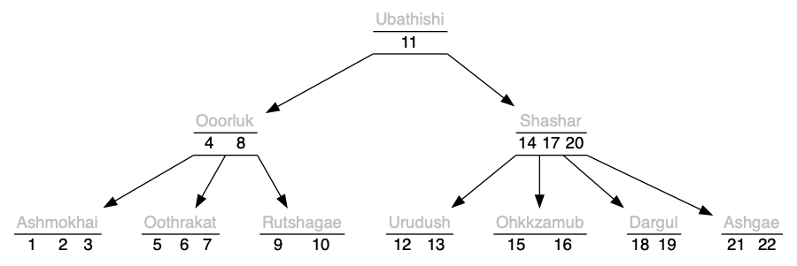
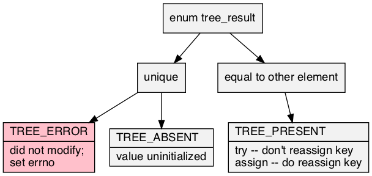
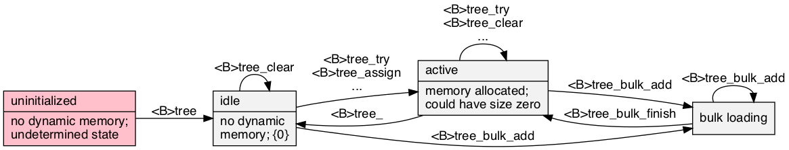

# tree\.h #

Header [\.\./\.\./src/tree\.h](../../src/tree.h); examples [\.\./\.\./test/test\_tree\.c](../../test/test_tree.c); article [\.\./tree/tree\.pdf](../tree/tree.pdf)\.

## Ordered tree ##

 * [Description](#user-content-preamble)
 * [Typedef Aliases](#user-content-typedef): [&lt;pT&gt;key](#user-content-typedef-95e6d0aa), [&lt;pT&gt;value](#user-content-typedef-3a465e90), [&lt;pT&gt;less_fn](#user-content-typedef-ca992ecb), [&lt;pT&gt;to_string_fn](#user-content-typedef-4442127b)
 * [Struct, Union, and Enum Definitions](#user-content-tag): [tree_result](#user-content-tag-9c3f99d7), [&lt;t&gt;tree](#user-content-tag-31fcdbd1), [table_stats](#user-content-tag-89e31bf3)
 * [Function Summary](#user-content-summary)
 * [Function Definitions](#user-content-fn)
 * [License](#user-content-license)

## <a id = "user-content-preamble" name = "user-content-preamble">Description</a> ##

A [&lt;t&gt;tree](#user-content-tag-31fcdbd1) is an ordered set or map contained in an unstable tree; the order is suppled by [&lt;t&gt;less](#user-content-fn-534b464c)\. For memory locality, this is implemented B\-tree, described in [Bayer, McCreight, 1972, Large](https://scholar.google.ca/scholar?q=Bayer%2C+McCreight%2C+1972%2C+Large)\.

All operations are fail\-fast and will not compromise the integrity of any existing tree\.

Adding, deleting, or changes in the topology of the tree invalidate the iterator\. To modify the tree while iterating, take the [&lt;T&gt;key](#user-content-fn-3154790) and restart the iterator with [&lt;T&gt;less](#user-content-fn-8d54d9ac) or [&lt;T&gt;more](#user-content-fn-5c40636c) as appropriate\.

 * Parameter: TREE\_NAME, TREE\_KEY  
   `<t>` that satisfies `C` naming conventions when mangled, required, and `TREE_KEY`, a type, [&lt;pT&gt;key](#user-content-typedef-95e6d0aa), whose default is `unsigned int`\.
 * Parameter: TREE\_VALUE  
   Optional payload to go with the type, [&lt;pT&gt;value](#user-content-typedef-3a465e90), thus making it a map instead of a set\.
 * Parameter: TREE\_LESS  
   By default, defines [&lt;t&gt;less](#user-content-fn-534b464c) `(a, b) -> a < b`\.
 * Parameter: TREE\_ORDER  
   Sets the branching factor, or order as [Knuth, 1998 Art 3](https://scholar.google.ca/scholar?q=Knuth%2C+1998+Art+3), to the range `[3, UINT_MAX+1]`\. Default 65 is tuned to an integer to pointer map, and should be okay for most variations\. 4 is isomorphic to left\-leaning red\-black tree, [Sedgewick, 2008, LLRB](https://scholar.google.ca/scholar?q=Sedgewick%2C+2008%2C+LLRB)\. The above illustration is 5\.
 * Parameter: TREE\_DEFAULT  
   Default trait which must be set to a [&lt;pT&gt;value](#user-content-typedef-3a465e90), used in [&lt;T&gt;tree&lt;R&gt;get](#user-content-fn-d5fb169d)\.
 * Parameter: TREE\_TO\_STRING  
   To string trait contained in [\.\./\.\./src/to\_string\.h](../../src/to_string.h)\. See [&lt;pT&gt;to_string_fn](#user-content-typedef-4442127b)\.
 * Parameter: TREE\_EXPECT\_TRAIT, TREE\_TRAIT  
   Named traits are obtained by including `tree.h` multiple times with `TREE_EXPECT_TRAIT` and then subsequently including the name that satisfies `C` naming conventions when mangled in `TREE_TRAIT`\.
 * Parameter: TREE\_DECLARE\_ONLY, TREE\_NON\_STATIC  
   For headers in different compilation units\.
 * Standard:  
   C89
 * Dependancies:  
   [box](../../src/box.h)
 * Caveat:  
   merge, difference, trie ([&lt;T&gt;less](#user-content-fn-8d54d9ac), [&lt;T&gt;more](#user-content-fn-5c40636c))

## <a id = "user-content-typedef" name = "user-content-typedef">Typedef Aliases</a> ##

### <a id = "user-content-typedef-95e6d0aa" name = "user-content-typedef-95e6d0aa">&lt;pT&gt;key</a> ###

<code>typedef TREE_KEY <strong>&lt;pT&gt;key</strong>;</code>

Ordered type used by [&lt;pT&gt;less_fn](#user-content-typedef-ca992ecb); defaults to `unsigned`\.

### <a id = "user-content-typedef-3a465e90" name = "user-content-typedef-3a465e90">&lt;pT&gt;value</a> ###

<code>typedef TREE_VALUE <strong>&lt;pT&gt;value</strong>;</code>

On `TREE_VALUE`, this creates a map, otherwise a set of [&lt;pT&gt;key](#user-content-typedef-95e6d0aa)\.

### <a id = "user-content-typedef-ca992ecb" name = "user-content-typedef-ca992ecb">&lt;pT&gt;less_fn</a> ###

<code>typedef int(*<strong>&lt;pT&gt;less_fn</strong>)(const &lt;pT&gt;key a, const &lt;pT&gt;key b);</code>

Inducing a strict weak order by returning a positive result if `a` is out\-of\-order with respect to `b`\. It only needs to divide entries into two instead of three categories\. Compatible, but less strict then the comparators from `bsearch` and `qsort`\. For example, `return a > b` or `return strcmp(a, b)` would give an ascending tree\.

### <a id = "user-content-typedef-4442127b" name = "user-content-typedef-4442127b">&lt;pT&gt;to_string_fn</a> ###

<code>typedef void(*<strong>&lt;pT&gt;to_string_fn</strong>)(const &lt;pT&gt;key, const &lt;pT&gt;value *, char(*)[12]);</code>

The type of the required `<tr>to_string`\. Responsible for turning the read\-only argument into a 12\-max\-`char` output string\. `<pT>value` is omitted when it's a set\.

## <a id = "user-content-tag" name = "user-content-tag">Struct, Union, and Enum Definitions</a> ##

### <a id = "user-content-tag-9c3f99d7" name = "user-content-tag-9c3f99d7">tree_result</a> ###

<code>enum <strong>tree_result</strong> { TREE_RESULT };</code>

A result of modifying the tree, of which `TREE_ERROR` is false\.

### <a id = "user-content-tag-31fcdbd1" name = "user-content-tag-31fcdbd1">&lt;t&gt;tree</a> ###

<code>struct <strong>&lt;t&gt;tree</strong>;</code>

See [&lt;t&gt;tree](#user-content-fn-31fcdbd1)\.

### <a id = "user-content-tag-89e31bf3" name = "user-content-tag-89e31bf3">table_stats</a> ###

<code>struct <strong>table_stats</strong> { size_t n, max; double mean, ssdm; };</code>

[Welford1962Note](https://scholar.google.ca/scholar?q=Welford1962Note): population variance: `ssdm/n`, sample variance: `ssdm/(n-1)`\.

## <a id = "user-content-summary" name = "user-content-summary">Function Summary</a> ##

<table>

<tr><th>Modifiers</th><th>Function Name</th><th>Argument List</th></tr>

<tr><td align = right>struct &lt;T&gt;cursor</td><td><a href = "#user-content-fn-80df50b2">&lt;T&gt;begin</a></td><td>&lt;t&gt;tree</td></tr>

<tr><td align = right>int</td><td><a href = "#user-content-fn-dd6c86e1">&lt;T&gt;exists</a></td><td>&lt;T&gt;cursor</td></tr>

<tr><td align = right>&lt;pT&gt;ref *</td><td><a href = "#user-content-fn-1d176e37">&lt;T&gt;entry</a></td><td>&lt;T&gt;cursor</td></tr>

<tr><td align = right>&lt;pT&gt;key</td><td><a href = "#user-content-fn-3154790">&lt;T&gt;key</a></td><td>&lt;T&gt;cursor</td></tr>

<tr><td align = right>&lt;pT&gt;value *</td><td><a href = "#user-content-fn-70919a06">&lt;T&gt;value</a></td><td>&lt;T&gt;cursor</td></tr>

<tr><td align = right>void</td><td><a href = "#user-content-fn-d0790d04">&lt;T&gt;next</a></td><td>&lt;T&gt;cursor</td></tr>

<tr><td align = right>void</td><td><a href = "#user-content-fn-d6c331fc">&lt;T&gt;previous</a></td><td>&lt;T&gt;cursor</td></tr>

<tr><td align = right>struct &lt;T&gt;cursor</td><td><a href = "#user-content-fn-8d54d9ac">&lt;T&gt;less</a></td><td>&lt;t&gt;tree, &lt;pT&gt;key</td></tr>

<tr><td align = right>struct &lt;T&gt;cursor</td><td><a href = "#user-content-fn-5c40636c">&lt;T&gt;more</a></td><td>&lt;t&gt;tree, &lt;pT&gt;key</td></tr>

<tr><td align = right>struct &lt;t&gt;tree</td><td><a href = "#user-content-fn-31fcdbd1">&lt;t&gt;tree</a></td><td></td></tr>

<tr><td align = right>void</td><td><a href = "#user-content-fn-3f0da08a">&lt;t&gt;tree_</a></td><td>&lt;t&gt;tree</td></tr>

<tr><td align = right>void</td><td><a href = "#user-content-fn-7f4a964e">&lt;T&gt;clear</a></td><td>&lt;t&gt;tree</td></tr>

<tr><td align = right>size_t</td><td><a href = "#user-content-fn-b1bf6340">&lt;T&gt;count</a></td><td>&lt;t&gt;tree</td></tr>

<tr><td align = right>int</td><td><a href = "#user-content-fn-988bbaac">&lt;T&gt;contains</a></td><td>&lt;t&gt;tree, &lt;pT&gt;key</td></tr>

<tr><td align = right>&lt;pT&gt;value</td><td><a href = "#user-content-fn-e9879d51">&lt;T&gt;get_or</a></td><td>&lt;t&gt;tree, &lt;pT&gt;key, &lt;pT&gt;value</td></tr>

<tr><td align = right>&lt;pT&gt;key</td><td><a href = "#user-content-fn-8379b620">&lt;T&gt;less_or</a></td><td>&lt;t&gt;tree, &lt;pT&gt;key, &lt;pT&gt;key</td></tr>

<tr><td align = right>&lt;pT&gt;key</td><td><a href = "#user-content-fn-21b4ade0">&lt;T&gt;more_or</a></td><td>&lt;t&gt;tree, &lt;pT&gt;key, &lt;pT&gt;key</td></tr>

<tr><td align = right>enum tree_result</td><td><a href = "#user-content-fn-a7e74be3">&lt;T&gt;bulk_assign</a></td><td>&lt;t&gt;tree, &lt;pT&gt;key, &lt;pT&gt;value</td></tr>

<tr><td align = right>enum tree_result</td><td><a href = "#user-content-fn-d169d163">&lt;T&gt;bulk_try</a></td><td>&lt;t&gt;tree, &lt;pT&gt;key</td></tr>

<tr><td align = right>int</td><td><a href = "#user-content-fn-81569ea5">&lt;T&gt;bulk_finish</a></td><td>&lt;t&gt;tree</td></tr>

<tr><td align = right>enum tree_result</td><td><a href = "#user-content-fn-40416930">&lt;T&gt;assign</a></td><td>&lt;t&gt;tree, &lt;pT&gt;key, &lt;pT&gt;value</td></tr>

<tr><td align = right>enum tree_result</td><td><a href = "#user-content-fn-5772e298">&lt;T&gt;update</a></td><td>&lt;t&gt;tree, &lt;pT&gt;key, &lt;pT&gt;key, &lt;pT&gt;value</td></tr>

<tr><td align = right>enum tree_result</td><td><a href = "#user-content-fn-edcfce52">&lt;T&gt;try</a></td><td>&lt;t&gt;tree, &lt;pT&gt;key</td></tr>

<tr><td align = right>enum tree_result</td><td><a href = "#user-content-fn-5772e298">&lt;T&gt;update</a></td><td>&lt;t&gt;tree, &lt;pT&gt;key, &lt;pT&gt;key</td></tr>

<tr><td align = right>int</td><td><a href = "#user-content-fn-9508049f">&lt;pT&gt;remove</a></td><td>&lt;pT&gt;tree, &lt;pT&gt;key</td></tr>

<tr><td align = right>int</td><td><a href = "#user-content-fn-56806709">&lt;T&gt;remove</a></td><td>&lt;t&gt;tree, &lt;pT&gt;key</td></tr>

<tr><td align = right>int</td><td><a href = "#user-content-fn-23a641ce">&lt;T&gt;clone</a></td><td>restrict, restrict</td></tr>

<tr><td align = right>static &lt;pT&gt;key</td><td><a href = "#user-content-fn-3154790">&lt;T&gt;key</a></td><td>cur</td></tr>

<tr><td align = right>static &lt;pT&gt;value *</td><td><a href = "#user-content-fn-70919a06">&lt;T&gt;value</a></td><td>cur</td></tr>

<tr><td align = right>static struct &lt;T&gt;cursor</td><td><a href = "#user-content-fn-8d54d9ac">&lt;T&gt;less</a></td><td>tree, x</td></tr>

<tr><td align = right>static struct &lt;T&gt;cursor</td><td><a href = "#user-content-fn-5c40636c">&lt;T&gt;more</a></td><td>tree, x</td></tr>

<tr><td align = right>static struct &lt;t&gt;tree</td><td><a href = "#user-content-fn-31fcdbd1">&lt;t&gt;tree</a></td><td></td></tr>

<tr><td align = right>static void</td><td><a href = "#user-content-fn-3f0da08a">&lt;t&gt;tree_</a></td><td>tree</td></tr>

<tr><td align = right>static void</td><td><a href = "#user-content-fn-7f4a964e">&lt;T&gt;clear</a></td><td>tree</td></tr>

<tr><td align = right>static size_t</td><td><a href = "#user-content-fn-b1bf6340">&lt;T&gt;count</a></td><td>tree</td></tr>

<tr><td align = right>static int</td><td><a href = "#user-content-fn-988bbaac">&lt;T&gt;contains</a></td><td>tree, x</td></tr>

<tr><td align = right>static &lt;pT&gt;value</td><td><a href = "#user-content-fn-e9879d51">&lt;T&gt;get_or</a></td><td>tree, key, default_value</td></tr>

<tr><td align = right>static &lt;pT&gt;key</td><td><a href = "#user-content-fn-8379b620">&lt;T&gt;less_or</a></td><td>tree, x, default_key</td></tr>

<tr><td align = right>static &lt;pT&gt;key</td><td><a href = "#user-content-fn-21b4ade0">&lt;T&gt;more_or</a></td><td>tree, x, default_key</td></tr>

<tr><td align = right>static enum tree_result</td><td><a href = "#user-content-fn-a7e74be3">&lt;T&gt;bulk_assign</a></td><td>tree, key, value</td></tr>

<tr><td align = right>static enum tree_result</td><td><a href = "#user-content-fn-d169d163">&lt;T&gt;bulk_try</a></td><td>tree, key</td></tr>

<tr><td align = right>static int</td><td><a href = "#user-content-fn-81569ea5">&lt;T&gt;bulk_finish</a></td><td>tree</td></tr>

<tr><td align = right>static enum tree_result</td><td><a href = "#user-content-fn-40416930">&lt;T&gt;assign</a></td><td>tree, key, valuep</td></tr>

<tr><td align = right>static enum tree_result</td><td><a href = "#user-content-fn-edcfce52">&lt;T&gt;try</a></td><td>tree, key</td></tr>

<tr><td align = right>static enum tree_result</td><td><a href = "#user-content-fn-5772e298">&lt;T&gt;update</a></td><td>tree, key, eject, value</td></tr>

<tr><td align = right>static int</td><td><a href = "#user-content-fn-56806709">&lt;T&gt;remove</a></td><td>tree, key</td></tr>

<tr><td align = right>static int</td><td><a href = "#user-content-fn-23a641ce">&lt;T&gt;clone</a></td><td>tree, source</td></tr>

<tr><td align = right>const char *</td><td><a href = "#user-content-fn-260f8348">&lt;TR&gt;to_string</a></td><td>box</td></tr>

<tr><td align = right>static const char *</td><td><a href = "#user-content-fn-260f8348">&lt;TR&gt;to_string</a></td><td>box</td></tr>

<tr><td align = right>void</td><td><a href = "#user-content-fn-4e047ffb">&lt;T&gt;graph</a></td><td>&lt;pT&gt;box</td></tr>

<tr><td align = right>int</td><td><a href = "#user-content-fn-6c32bc30">&lt;T&gt;graph_fn</a></td><td>&lt;pT&gt;box, char</td></tr>

<tr><td align = right>static &lt;pT&gt;value</td><td><a href = "#user-content-fn-d5fb169d">&lt;T&gt;tree&lt;R&gt;get</a></td><td>tree, key</td></tr>

</table>

## <a id = "user-content-fn" name = "user-content-fn">Function Definitions</a> ##

### <a id = "user-content-fn-80df50b2" name = "user-content-fn-80df50b2">&lt;T&gt;begin</a> ###

<code>struct &lt;T&gt;cursor <strong>&lt;T&gt;begin</strong>(const struct <em>&lt;t&gt;tree</em> *);</code>

### <a id = "user-content-fn-dd6c86e1" name = "user-content-fn-dd6c86e1">&lt;T&gt;exists</a> ###

<code>int <strong>&lt;T&gt;exists</strong>(struct <em>&lt;T&gt;cursor</em> *);</code>

### <a id = "user-content-fn-1d176e37" name = "user-content-fn-1d176e37">&lt;T&gt;entry</a> ###

<code>&lt;pT&gt;ref *<strong>&lt;T&gt;entry</strong>(struct <em>&lt;T&gt;cursor</em> *);</code>

### <a id = "user-content-fn-3154790" name = "user-content-fn-3154790">&lt;T&gt;key</a> ###

<code>&lt;pT&gt;key <strong>&lt;T&gt;key</strong>(const struct <em>&lt;T&gt;cursor</em> *);</code>

### <a id = "user-content-fn-70919a06" name = "user-content-fn-70919a06">&lt;T&gt;value</a> ###

<code>&lt;pT&gt;value *<strong>&lt;T&gt;value</strong>(const struct <em>&lt;T&gt;cursor</em> *);</code>

### <a id = "user-content-fn-d0790d04" name = "user-content-fn-d0790d04">&lt;T&gt;next</a> ###

<code>void <strong>&lt;T&gt;next</strong>(struct <em>&lt;T&gt;cursor</em> *);</code>

### <a id = "user-content-fn-d6c331fc" name = "user-content-fn-d6c331fc">&lt;T&gt;previous</a> ###

<code>void <strong>&lt;T&gt;previous</strong>(struct <em>&lt;T&gt;cursor</em> *);</code>

### <a id = "user-content-fn-8d54d9ac" name = "user-content-fn-8d54d9ac">&lt;T&gt;less</a> ###

<code>struct &lt;T&gt;cursor <strong>&lt;T&gt;less</strong>(struct <em>&lt;t&gt;tree</em> *, <em>&lt;pT&gt;key</em>);</code>

### <a id = "user-content-fn-5c40636c" name = "user-content-fn-5c40636c">&lt;T&gt;more</a> ###

<code>struct &lt;T&gt;cursor <strong>&lt;T&gt;more</strong>(struct <em>&lt;t&gt;tree</em> *, <em>&lt;pT&gt;key</em>);</code>

### <a id = "user-content-fn-31fcdbd1" name = "user-content-fn-31fcdbd1">&lt;t&gt;tree</a> ###

<code>struct &lt;t&gt;tree <strong>&lt;t&gt;tree</strong>(void);</code>

### <a id = "user-content-fn-3f0da08a" name = "user-content-fn-3f0da08a">&lt;t&gt;tree_</a> ###

<code>void <strong>&lt;t&gt;tree_</strong>(struct <em>&lt;t&gt;tree</em> *);</code>

### <a id = "user-content-fn-7f4a964e" name = "user-content-fn-7f4a964e">&lt;T&gt;clear</a> ###

<code>void <strong>&lt;T&gt;clear</strong>(struct <em>&lt;t&gt;tree</em> *);</code>

### <a id = "user-content-fn-b1bf6340" name = "user-content-fn-b1bf6340">&lt;T&gt;count</a> ###

<code>size_t <strong>&lt;T&gt;count</strong>(const struct <em>&lt;t&gt;tree</em> *);</code>

### <a id = "user-content-fn-988bbaac" name = "user-content-fn-988bbaac">&lt;T&gt;contains</a> ###

<code>int <strong>&lt;T&gt;contains</strong>(const struct <em>&lt;t&gt;tree</em> *, <em>&lt;pT&gt;key</em>);</code>

### <a id = "user-content-fn-e9879d51" name = "user-content-fn-e9879d51">&lt;T&gt;get_or</a> ###

<code>&lt;pT&gt;value <strong>&lt;T&gt;get_or</strong>(const struct <em>&lt;t&gt;tree</em> *, <em>&lt;pT&gt;key</em>, <em>&lt;pT&gt;value</em>);</code>

### <a id = "user-content-fn-8379b620" name = "user-content-fn-8379b620">&lt;T&gt;less_or</a> ###

<code>&lt;pT&gt;key <strong>&lt;T&gt;less_or</strong>(const struct <em>&lt;t&gt;tree</em> *, <em>&lt;pT&gt;key</em>, <em>&lt;pT&gt;key</em>);</code>

### <a id = "user-content-fn-21b4ade0" name = "user-content-fn-21b4ade0">&lt;T&gt;more_or</a> ###

<code>&lt;pT&gt;key <strong>&lt;T&gt;more_or</strong>(const struct <em>&lt;t&gt;tree</em> *, <em>&lt;pT&gt;key</em>, <em>&lt;pT&gt;key</em>);</code>

### <a id = "user-content-fn-a7e74be3" name = "user-content-fn-a7e74be3">&lt;T&gt;bulk_assign</a> ###

<code>enum tree_result <strong>&lt;T&gt;bulk_assign</strong>(struct <em>&lt;t&gt;tree</em> *, <em>&lt;pT&gt;key</em>, <em>&lt;pT&gt;value</em> **);</code>

### <a id = "user-content-fn-d169d163" name = "user-content-fn-d169d163">&lt;T&gt;bulk_try</a> ###

<code>enum tree_result <strong>&lt;T&gt;bulk_try</strong>(struct <em>&lt;t&gt;tree</em> *, <em>&lt;pT&gt;key</em>);</code>

### <a id = "user-content-fn-81569ea5" name = "user-content-fn-81569ea5">&lt;T&gt;bulk_finish</a> ###

<code>int <strong>&lt;T&gt;bulk_finish</strong>(struct <em>&lt;t&gt;tree</em> *);</code>

### <a id = "user-content-fn-40416930" name = "user-content-fn-40416930">&lt;T&gt;assign</a> ###

<code>enum tree_result <strong>&lt;T&gt;assign</strong>(struct <em>&lt;t&gt;tree</em> *, <em>&lt;pT&gt;key</em>, <em>&lt;pT&gt;value</em> **);</code>

### <a id = "user-content-fn-5772e298" name = "user-content-fn-5772e298">&lt;T&gt;update</a> ###

<code>enum tree_result <strong>&lt;T&gt;update</strong>(struct <em>&lt;t&gt;tree</em> *, <em>&lt;pT&gt;key</em>, <em>&lt;pT&gt;key</em> *, <em>&lt;pT&gt;value</em> **);</code>

### <a id = "user-content-fn-edcfce52" name = "user-content-fn-edcfce52">&lt;T&gt;try</a> ###

<code>enum tree_result <strong>&lt;T&gt;try</strong>(struct <em>&lt;t&gt;tree</em> *, <em>&lt;pT&gt;key</em>);</code>

### <a id = "user-content-fn-5772e298" name = "user-content-fn-5772e298">&lt;T&gt;update</a> ###

<code>enum tree_result <strong>&lt;T&gt;update</strong>(struct <em>&lt;t&gt;tree</em> *, <em>&lt;pT&gt;key</em>, <em>&lt;pT&gt;key</em> *);</code>

### <a id = "user-content-fn-9508049f" name = "user-content-fn-9508049f">&lt;pT&gt;remove</a> ###

<code>int <strong>&lt;pT&gt;remove</strong>(struct <em>&lt;pT&gt;tree</em> *, <em>&lt;pT&gt;key</em>);</code>

### <a id = "user-content-fn-56806709" name = "user-content-fn-56806709">&lt;T&gt;remove</a> ###

<code>int <strong>&lt;T&gt;remove</strong>(struct <em>&lt;t&gt;tree</em> *, <em>&lt;pT&gt;key</em>);</code>

### <a id = "user-content-fn-23a641ce" name = "user-content-fn-23a641ce">&lt;T&gt;clone</a> ###

<code>int <strong>&lt;T&gt;clone</strong>(struct &lt;t&gt;tree *<em>restrict</em>, const struct &lt;t&gt;tree *<em>restrict</em>);</code>

### <a id = "user-content-fn-3154790" name = "user-content-fn-3154790">&lt;T&gt;key</a> ###

<code>static &lt;pT&gt;key <strong>&lt;T&gt;key</strong>(const struct &lt;T&gt;cursor *const <em>cur</em>)</code>

 * Return:  
   Extract the key from `cur` when it points at a valid element\.

### <a id = "user-content-fn-70919a06" name = "user-content-fn-70919a06">&lt;T&gt;value</a> ###

<code>static &lt;pT&gt;value *<strong>&lt;T&gt;value</strong>(const struct &lt;T&gt;cursor *const <em>cur</em>)</code>

 * Return:  
   Extract the value from `cur` when it points at a valid element, if `TREE_VALUE`\.

### <a id = "user-content-fn-8d54d9ac" name = "user-content-fn-8d54d9ac">&lt;T&gt;less</a> ###

<code>static struct &lt;T&gt;cursor <strong>&lt;T&gt;less</strong>(struct &lt;t&gt;tree *const <em>tree</em>, const &lt;pT&gt;key <em>x</em>)</code>

 * Return:  
   Cursor in `tree` such that [&lt;T&gt;key](#user-content-fn-3154790) is the greatest key that is less\-than\-or\-equal\-to `x`, or if `x` is less than all in `tree`, [&lt;T&gt;begin](#user-content-fn-80df50b2)\.
 * Order:  
   &#920;\(log |`tree`|\)
 * Caveat:  
   Update\.

### <a id = "user-content-fn-5c40636c" name = "user-content-fn-5c40636c">&lt;T&gt;more</a> ###

<code>static struct &lt;T&gt;cursor <strong>&lt;T&gt;more</strong>(struct &lt;t&gt;tree *const <em>tree</em>, const &lt;pT&gt;key <em>x</em>)</code>

 * Return:  
   Cursor in `tree` such that [&lt;T&gt;more](#user-content-fn-5c40636c) is the smallest key that is greater\-than\-or\-equal\-to `x`, or, \(…\) if `x` is greater than all in `tree`\.
 * Order:  
   &#920;\(log |`tree`|\)
 * Caveat:  
   Update\.

### <a id = "user-content-fn-31fcdbd1" name = "user-content-fn-31fcdbd1">&lt;t&gt;tree</a> ###

<code>static struct &lt;t&gt;tree <strong>&lt;t&gt;tree</strong>(void)</code>

Zeroed data \(not all\-bits\-zero\) is initialized\.

 * Return:  
   An idle tree\.
 * Order:  
   &#920;\(1\)

### <a id = "user-content-fn-3f0da08a" name = "user-content-fn-3f0da08a">&lt;t&gt;tree_</a> ###

<code>static void <strong>&lt;t&gt;tree_</strong>(struct &lt;t&gt;tree *const <em>tree</em>)</code>

Returns an initialized `tree` to idle, `tree` can be null\.

 * Order:  
   &#927;\(|`tree`|\)

### <a id = "user-content-fn-7f4a964e" name = "user-content-fn-7f4a964e">&lt;T&gt;clear</a> ###

<code>static void <strong>&lt;T&gt;clear</strong>(struct &lt;t&gt;tree *const <em>tree</em>)</code>

Clears `tree`, which can be null, idle, empty, or full\. If it is empty or full, it remains active, \(all except one node are freed\.\)

 * Order:  
   &#927;\(|`tree`|\)

### <a id = "user-content-fn-b1bf6340" name = "user-content-fn-b1bf6340">&lt;T&gt;count</a> ###

<code>static size_t <strong>&lt;T&gt;count</strong>(const struct &lt;t&gt;tree *const <em>tree</em>)</code>

Counts all the keys on `tree`, which can be null\.

 * Order:  
   &#927;\(|`tree`|\)

### <a id = "user-content-fn-988bbaac" name = "user-content-fn-988bbaac">&lt;T&gt;contains</a> ###

<code>static int <strong>&lt;T&gt;contains</strong>(const struct &lt;t&gt;tree *const <em>tree</em>, const &lt;pT&gt;key <em>x</em>)</code>

 * Return:  
   Is `x` in `tree` \(which can be null\)?
 * Order:  
   &#927;\(log |`tree`|\)

### <a id = "user-content-fn-e9879d51" name = "user-content-fn-e9879d51">&lt;T&gt;get_or</a> ###

<code>static &lt;pT&gt;value <strong>&lt;T&gt;get_or</strong>(const struct &lt;t&gt;tree *const <em>tree</em>, const &lt;pT&gt;key <em>key</em>, const &lt;pT&gt;value <em>default_value</em>)</code>

 * Return:  
   Get the value of `key` in `tree`, or if no key, `default_value`\. The map type is `TREE_VALUE` and the set type is `TREE_KEY`\.
 * Order:  
   &#927;\(log |`tree`|\)

### <a id = "user-content-fn-8379b620" name = "user-content-fn-8379b620">&lt;T&gt;less_or</a> ###

<code>static &lt;pT&gt;key <strong>&lt;T&gt;less_or</strong>(const struct &lt;t&gt;tree *const <em>tree</em>, const &lt;pT&gt;key <em>x</em>, const &lt;pT&gt;key <em>default_key</em>)</code>

For example, `tree = { 10 }`, `x = 5 -> default_value`, `x = 10 -> 10`, `x = 11 -> 10`\.

 * Return:  
   Key in `tree` less\-then\-or\-equal to `x` or `default_key` if `x` is smaller than all in `tree`\.
 * Order:  
   &#927;\(log |`tree`|\)

### <a id = "user-content-fn-21b4ade0" name = "user-content-fn-21b4ade0">&lt;T&gt;more_or</a> ###

<code>static &lt;pT&gt;key <strong>&lt;T&gt;more_or</strong>(const struct &lt;t&gt;tree *const <em>tree</em>, const &lt;pT&gt;key <em>x</em>, const &lt;pT&gt;key <em>default_key</em>)</code>

For example, `tree = { 10 }`, `x = 5 -> 10`, `x = 10 -> 10`, `x = 11 -> default_value`\.

 * Return:  
   Key in `tree` greater\-than\-or\-equal to `x` or `default_key` if `x` is greater than all in `tree`\.
 * Order:  
   &#927;\(log |`tree`|\)

### <a id = "user-content-fn-a7e74be3" name = "user-content-fn-a7e74be3">&lt;T&gt;bulk_assign</a> ###

<code>static enum tree_result <strong>&lt;T&gt;bulk_assign</strong>(struct &lt;t&gt;tree *const <em>tree</em>, &lt;pT&gt;key <em>key</em>, &lt;pT&gt;value **const <em>value</em>)</code>

Only if `TREE_VALUE` is set; the set version is [&lt;T&gt;try](#user-content-fn-edcfce52)\. Packs `key` on the right side of `tree` without doing the usual restructuring\. All other topology modification functions should be avoided until followed by [&lt;T&gt;bulk_finish](#user-content-fn-81569ea5)\.

 * Parameter: _value_  
   A pointer to the key's value which is set by the function on returning true\. Can be null\.
 * Return:  
   One of [tree_result](#user-content-tag-9c3f99d7): `TREE_ERROR` and `errno` will be set, `TREE_PRESENT` if the key is already \(the highest\) in the tree, and `TREE_ABSENT`, added, the `value` \(if applicable\) is uninitialized\.
 * Exceptional return: EDOM  
   `x` is smaller than the largest key in `tree`\.
 * Exceptional return: malloc  
 * Order:  
   &#927;\(log |`tree`|\)

### <a id = "user-content-fn-d169d163" name = "user-content-fn-d169d163">&lt;T&gt;bulk_try</a> ###

<code>static enum tree_result <strong>&lt;T&gt;bulk_try</strong>(struct &lt;t&gt;tree *const <em>tree</em>, &lt;pT&gt;key <em>key</em>)</code>

Only if `TREE_VALUE` is not set; see [&lt;T&gt;assign](#user-content-fn-40416930), which is the map version\. Packs `key` on the right side of `tree`\.

### <a id = "user-content-fn-81569ea5" name = "user-content-fn-81569ea5">&lt;T&gt;bulk_finish</a> ###

<code>static int <strong>&lt;T&gt;bulk_finish</strong>(struct &lt;t&gt;tree *const <em>tree</em>)</code>

Distributes `tree` \(can be null\) on the right side so that, after a series of [&lt;T&gt;bulk_try](#user-content-fn-d169d163) or [&lt;T&gt;bulk_assign](#user-content-fn-a7e74be3), it will be consistent with the minimum number of keys in a node\.

 * Return:  
   The re\-distribution was a success and all nodes are within rules\. \(Only when intermixing bulk and regular operations, can the function return false\.\)
 * Order:  
   &#927;\(log |`tree`|\)

### <a id = "user-content-fn-40416930" name = "user-content-fn-40416930">&lt;T&gt;assign</a> ###

<code>static enum tree_result <strong>&lt;T&gt;assign</strong>(struct &lt;t&gt;tree *const <em>tree</em>, const &lt;pT&gt;key <em>key</em>, &lt;pT&gt;value **const <em>valuep</em>)</code>

Adds or gets `key` in `tree`\. If `key` is already in `tree`, uses the old value, _vs_ [&lt;T&gt;update](#user-content-fn-5772e298)\. \(This is only significant in trees with distinguishable keys\.\)

 * Parameter: _valuep_  
   Only present if `TREE_VALUE` \(map\) was specified\. If this parameter is non\-null and a return value other then `TREE_ERROR`, this receives the address of the value associated with the `key`\. This pointer is only guaranteed to be valid only while the `tree` doesn't undergo structural changes, \(such as potentially calling it again\.\)
 * Return:  
   Either `TREE_ERROR` \(false\) and doesn't touch `tree`, `TREE_ABSENT` and adds a new key with `key`, or `TREE_PRESENT` there was already an existing key\.
 * Exceptional return: malloc  
 * Order:  
   &#920;\(log |`tree`|\)

### <a id = "user-content-fn-edcfce52" name = "user-content-fn-edcfce52">&lt;T&gt;try</a> ###

<code>static enum tree_result <strong>&lt;T&gt;try</strong>(struct &lt;t&gt;tree *const <em>tree</em>, const &lt;pT&gt;key <em>key</em>)</code>

Only if `TREE_VALUE` is not defined\. Adds `key` to `tree` only if it is a new value, otherwise returns `TREE_PRESENT`\. See [&lt;T&gt;assign](#user-content-fn-40416930), which is the map version\.

### <a id = "user-content-fn-5772e298" name = "user-content-fn-5772e298">&lt;T&gt;update</a> ###

<code>static enum tree_result <strong>&lt;T&gt;update</strong>(struct &lt;t&gt;tree *const <em>tree</em>, const &lt;pT&gt;key <em>key</em>, &lt;pT&gt;key *const <em>eject</em>, &lt;pT&gt;value **const <em>value</em>)</code>

Adds or updates `key` in `tree`\.

 * Parameter: _eject_  
   If this parameter is non\-null and a return value of `TREE_PRESENT`, the old key is stored in `eject`, replaced by `key`\. A null value indicates that on conflict, the new key yields to the old key, as [&lt;T&gt;try](#user-content-fn-edcfce52)\. This is only significant in trees with distinguishable keys\.
 * Parameter: _value_  
   Only present if `TREE_VALUE` \(map\) was specified\. If this parameter is non\-null and a return value other then `TREE_ERROR`, this receives the address of the value associated with the key\.
 * Return:  
   Either `TREE_ERROR` \(false,\) `errno` is set and doesn't touch `tree`; `TREE_ABSENT`, adds a new key; or `TREE_PRESENT`, there was already an existing key\.
 * Exceptional return: malloc  
 * Order:  
   &#920;\(log |`tree`|\)

### <a id = "user-content-fn-56806709" name = "user-content-fn-56806709">&lt;T&gt;remove</a> ###

<code>static int <strong>&lt;T&gt;remove</strong>(struct &lt;t&gt;tree *const <em>tree</em>, const &lt;pT&gt;key <em>key</em>)</code>

Tries to remove `key` from `tree`\.

 * Return:  
   Success, otherwise it was not in `tree`\.
 * Order:  
   &#920;\(log |`tree`|\)

### <a id = "user-content-fn-23a641ce" name = "user-content-fn-23a641ce">&lt;T&gt;clone</a> ###

<code>static int <strong>&lt;T&gt;clone</strong>(struct &lt;t&gt;tree *const restrict <em>tree</em>, const struct &lt;t&gt;tree *const restrict <em>source</em>)</code>

`source` is copied to, and overwrites, `tree`\.

 * Parameter: _source_  
   In the case where it's null or idle, if `tree` is empty, then it continues to be\.
 * Return:  
   Success, otherwise `tree` is not modified\.
 * Exceptional return: malloc  
 * Exceptional return: EDOM  
   `tree` is null\.
 * Exceptional return: ERANGE  
   The size of `source` nodes doesn't fit into `size_t`\.
 * Order:  
   &#927;\(|`source`| \+ |`tree`|\) time and temporary space\.

### <a id = "user-content-fn-260f8348" name = "user-content-fn-260f8348">&lt;TR&gt;to_string</a> ###

<code>const char *<strong>&lt;TR&gt;to_string</strong>(const &lt;pT&gt;box *const <em>box</em>);</code>

### <a id = "user-content-fn-260f8348" name = "user-content-fn-260f8348">&lt;TR&gt;to_string</a> ###

<code>static const char *<strong>&lt;TR&gt;to_string</strong>(const &lt;pT&gt;box *const <em>box</em>)</code>

[\.\./\.\./src/to\_string\.h](../../src/to_string.h): print the contents of `box` in a static string buffer of 256 bytes, with limitations of only printing 4 things in a single sequence point\.

 * Return:  
   Address of the static buffer\.
 * Order:  
   &#920;\(1\)

### <a id = "user-content-fn-4e047ffb" name = "user-content-fn-4e047ffb">&lt;T&gt;graph</a> ###

<code>void <strong>&lt;T&gt;graph</strong>(const <em>&lt;pT&gt;box</em> *, FILE *);</code>

### <a id = "user-content-fn-6c32bc30" name = "user-content-fn-6c32bc30">&lt;T&gt;graph_fn</a> ###

<code>int <strong>&lt;T&gt;graph_fn</strong>(const <em>&lt;pT&gt;box</em> *, const <em>char</em> *);</code>

### <a id = "user-content-fn-d5fb169d" name = "user-content-fn-d5fb169d">&lt;T&gt;tree&lt;R&gt;get</a> ###

<code>static &lt;pT&gt;value <strong>&lt;T&gt;tree&lt;R&gt;get</strong>(const struct &lt;t&gt;tree *const <em>tree</em>, const &lt;pT&gt;key <em>key</em>)</code>

This is functionally identical to [&lt;T&gt;get_or](#user-content-fn-e9879d51), but a with a trait specifying a constant default value\.

 * Return:  
   The value associated with `key` in `tree`, \(which can be null\.\) If no such value exists, the `TREE_DEFAULT` is returned\.
 * Order:  
   &#927;\(log |`tree`|\)\.

## <a id = "user-content-license" name = "user-content-license">License</a> ##

2022 Neil Edelman, distributed under the terms of the [MIT License](https://opensource.org/licenses/MIT)\.

