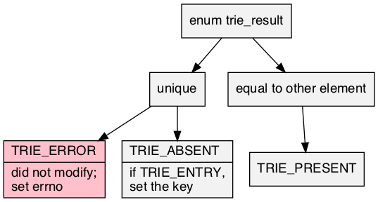

# trie\.h #

Header [\.\./src/trie\.h](../src/trie.h) requires [\.\./src/bmp\.h](../src/bmp.h); examples [\.\./test/test\_trie\.c](../test/test_trie.c); article [\.\./doc/trie/trie\.pdf](../doc/trie/trie.pdf)\.

## Prefix tree ##

 * [Description](#user-content-preamble)
 * [Typedef Aliases](#user-content-typedef): [&lt;pT&gt;key](#user-content-typedef-95e6d0aa), [&lt;pT&gt;entry](#user-content-typedef-9be2614d), [&lt;pT&gt;remit](#user-content-typedef-26fd9b58), [&lt;pT&gt;string_fn](#user-content-typedef-9cf8629b), [&lt;pT&gt;key_fn](#user-content-typedef-d71854df), [&lt;pTR&gt;to_string_fn](#user-content-typedef-d00960b3)
 * [Struct, Union, and Enum Definitions](#user-content-tag): [trie_result](#user-content-tag-eb9850a3), [&lt;t&gt;trie](#user-content-tag-21f3c845)
 * [General Declarations](#user-content-data): [trie](#user-content-data-7d944861)
 * [Function Summary](#user-content-summary)
 * [Function Definitions](#user-content-fn)
 * [License](#user-content-license)

## <a id = "user-content-preamble" name = "user-content-preamble">Description</a> ##

A [&lt;t&gt;trie](#user-content-tag-21f3c845) is a prefix\-tree, digital\-tree, or trie: an ordered set or map of byte null\-terminated immutable key strings allowing efficient prefix queries\. The implementation is as [Morrison, 1968 PATRICiA](https://scholar.google.ca/scholar?q=Morrison%2C+1968+PATRICiA): a compact [binary radix trie](https://en.wikipedia.org/wiki/Radix_tree) that acts as an index, only storing the where the key bits are different\. The keys are grouped in fixed\-size nodes in a relaxed version of a B\-tree, as [Bayer, McCreight, 1972 Large](https://scholar.google.ca/scholar?q=Bayer%2C+McCreight%2C+1972+Large), where the height is no longer fixed\.

While the worse\-case run\-time of querying or modifying is bounded by &#927;\(|`string`|\), [Tong, Goebel, Lin, 2015, Smoothed](https://scholar.google.ca/scholar?q=Tong%2C+Goebel%2C+Lin%2C+2015%2C+Smoothed) show that, in an iid model, a better fit is &#927;\(log |`trie`|\), which is seen and reported here\. It is not stable\.

 * Parameter: TRIE\_NAME  
   Required `<t>` that satisfies `C` naming conventions when mangled\.
 * Parameter: TRIE\_KEY  
   Optional [&lt;pT&gt;key](#user-content-typedef-95e6d0aa), the default of which is `const char *`\. Requires implementation of [&lt;pT&gt;string_fn](#user-content-typedef-9cf8629b) `<t>string` to convert [&lt;pT&gt;key](#user-content-typedef-95e6d0aa) to a `const char *`\.
 * Parameter: TRIE\_ENTRY  
   Optional [&lt;pT&gt;entry](#user-content-typedef-9be2614d) that contains the key, the default of which is the entry is the key\. Requires [&lt;pT&gt;key_fn](#user-content-typedef-d71854df) `<t>key`, that picks out [&lt;pT&gt;key](#user-content-typedef-95e6d0aa) from [&lt;pT&gt;entry](#user-content-typedef-9be2614d)\.
 * Parameter: TRIE\_TO\_STRING  
   To string trait contained in [src/to\_string\.h](src/to_string.h)\. The unnamed trait is automatically supplied by the string, but others require `<name><trait>to_string` be declared as [&lt;pTR&gt;to_string_fn](#user-content-typedef-d00960b3)\.
 * Parameter: TRIE\_EXPECT\_TRAIT, TRIE\_TRAIT  
   Named traits are obtained by including `trie.h` multiple times with `TRIE_EXPECT_TRAIT` and then subsequently including the name in `TRIE_TRAIT`\.
 * Parameter: TRIE\_DECLARE\_ONLY  
   For headers in different compilation units\.
 * Standard:  
   C89 \(Specifically, ISO/IEC 9899/AMD1:1995 because it uses EILSEQ\.\)
 * Caveat:  
   ([&lt;T&gt;from_array](#user-content-fn-bd6b720b), [trie](#user-content-data-7d944861))

## <a id = "user-content-typedef" name = "user-content-typedef">Typedef Aliases</a> ##

### <a id = "user-content-typedef-95e6d0aa" name = "user-content-typedef-95e6d0aa">&lt;pT&gt;key</a> ###

<code>typedef TRIE_KEY <strong>&lt;pT&gt;key</strong>;</code>

The default is `const char *`\. If one sets `TRIE_KEY` to a different type, then one must also declare `<t>string` as a [&lt;pT&gt;string_fn](#user-content-typedef-9cf8629b)\.

### <a id = "user-content-typedef-9be2614d" name = "user-content-typedef-9be2614d">&lt;pT&gt;entry</a> ###

<code>typedef TRIE_ENTRY <strong>&lt;pT&gt;entry</strong>;</code>

If `TRIE_ENTRY` is set, one must provide `<t>key` as a [&lt;pT&gt;key_fn](#user-content-typedef-d71854df); otherwise a set and [&lt;pT&gt;entry](#user-content-typedef-9be2614d) and [&lt;pT&gt;key](#user-content-typedef-95e6d0aa) are the same\.

### <a id = "user-content-typedef-26fd9b58" name = "user-content-typedef-26fd9b58">&lt;pT&gt;remit</a> ###

<code>typedef &lt;pT&gt;entry *<strong>&lt;pT&gt;remit</strong>;</code>

Remit is either an extra indirection on [&lt;pT&gt;entry](#user-content-typedef-9be2614d) on `TRIE_ENTRY` or not\.

### <a id = "user-content-typedef-9cf8629b" name = "user-content-typedef-9cf8629b">&lt;pT&gt;string_fn</a> ###

<code>typedef const char *(*<strong>&lt;pT&gt;string_fn</strong>)(&lt;pT&gt;key);</code>

Transforms a [&lt;pT&gt;key](#user-content-typedef-95e6d0aa) into a `const char *`\.

### <a id = "user-content-typedef-d71854df" name = "user-content-typedef-d71854df">&lt;pT&gt;key_fn</a> ###

<code>typedef &lt;pT&gt;key(*<strong>&lt;pT&gt;key_fn</strong>)(const &lt;pT&gt;entry *);</code>

Extracts [&lt;pT&gt;key](#user-content-typedef-95e6d0aa) from [&lt;pT&gt;entry](#user-content-typedef-9be2614d)\.

### <a id = "user-content-typedef-d00960b3" name = "user-content-typedef-d00960b3">&lt;pTR&gt;to_string_fn</a> ###

<code>typedef void(*<strong>&lt;pTR&gt;to_string_fn</strong>)(const &lt;pT&gt;key, const &lt;pT&gt;entry *, char(*)[12]);</code>

Type of `TRIE_TO_STRING` needed function `<tr>to_string`\. Responsible for turning the read\-only argument into a 12\-max\-`char` output string\. `<pT>value` is omitted when it's a set\. Only available to named traits, the `TRIE_TO_STRING` of the anonymous trait is implicitly the string itself\.

## <a id = "user-content-tag" name = "user-content-tag">Struct, Union, and Enum Definitions</a> ##

### <a id = "user-content-tag-eb9850a3" name = "user-content-tag-eb9850a3">trie_result</a> ###

<code>enum <strong>trie_result</strong> { TRIE_RESULT };</code>

A result of modifying the table, of which `TRIE_ERROR` is false\.

### <a id = "user-content-tag-21f3c845" name = "user-content-tag-21f3c845">&lt;t&gt;trie</a> ###

<code>struct <strong>&lt;t&gt;trie</strong>;</code>

To initialize it to an idle state, see [&lt;t&gt;trie](#user-content-fn-21f3c845), `{0}`, or being `static`\.

## <a id = "user-content-data" name = "user-content-data">General Declarations</a> ##

### <a id = "user-content-data-7d944861" name = "user-content-data-7d944861">trie</a> ###

<code>static void &lt;t&gt;trie_(struct &lt;t&gt;trie *const <strong>trie</strong>){ if(!trie ||!trie -&gt;root)return; if(trie -&gt;root -&gt;bsize !=USHRT_MAX)&lt;pT&gt;clear_r(trie -&gt;root); free(trie -&gt;root); *trie = &lt;t&gt;trie(); } static void &lt;T&gt;clear(struct &lt;t&gt;trie *const trie){ if(!trie ||!trie -&gt;root)return; if(trie -&gt;root -&gt;bsize !=USHRT_MAX)&lt;pT&gt;clear_r(trie -&gt;root); trie -&gt;root -&gt;bsize = USHRT_MAX; } static &lt;pT&gt;remit &lt;T&gt;match(const struct &lt;t&gt;trie *const trie, const char *const string){ struct &lt;pT&gt;ref ref; return trie &amp;&amp;string &amp;&amp;&lt;pT&gt;match(trie, string, &amp;ref)?&lt;pT&gt;ref_to_remit(&amp;ref):0; } static &lt;pT&gt;remit &lt;T&gt;get(const struct &lt;t&gt;trie *const trie, const char *const string){ struct &lt;pT&gt;ref ref; return trie &amp;&amp;string &amp;&amp;&lt;pT&gt;get(trie, string, &amp;ref)?&lt;pT&gt;ref_to_remit(&amp;ref):0; } static enum trie_result &lt;T&gt;match(const struct &lt;t&gt;trie *const trie, const char *const string, &lt;pT&gt;remit *const remit){ struct &lt;pT&gt;ref ref; if(trie &amp;&amp;string &amp;&amp;&lt;pT&gt;match(trie, string, &amp;ref)){ if(remit)*remit = &lt;pT&gt;ref_to_remit(&amp;ref); return TRIE_PRESENT; } return TRIE_ABSENT; } static enum trie_result &lt;T&gt;get(const struct &lt;t&gt;trie *const trie, const char *const string, &lt;pT&gt;remit *const remit){ struct &lt;pT&gt;ref ref; if(trie &amp;&amp;string &amp;&amp;&lt;pT&gt;get(trie, string, &amp;ref)){ if(remit)*remit = &lt;pT&gt;ref_to_remit(&amp;ref); return TRIE_PRESENT; } return TRIE_ABSENT; } static enum trie_result &lt;T&gt;try(struct &lt;t&gt;trie *const trie, const &lt;pT&gt;key key){ assert(trie &amp;&amp;&lt;t&gt;string(key)); return &lt;pT&gt;add(trie, key, 0); } static enum trie_result &lt;T&gt;try(struct &lt;t&gt;trie *const trie, const &lt;pT&gt;key key, &lt;pT&gt;entry **const entry){ enum trie_result result; struct &lt;pT&gt;ref r; assert(trie &amp;&amp;&lt;t&gt;string(key)); if(result = &lt;pT&gt;add(trie, key, &amp;r))*entry = &amp;r .tree -&gt;leaf[r .lf].as_entry; return result; } static int &lt;T&gt;remove(struct &lt;t&gt;trie *const trie, const char *const string){ return trie &amp;&amp;string &amp;&amp;&lt;pT&gt;remove(trie, string); } static size_t &lt;pT&gt;size_r(const struct &lt;pT&gt;iterator *const it){ return it -&gt;end .lf -it -&gt;cur .lf; } static size_t &lt;T&gt;trie_size(const struct &lt;T&gt;trie_iterator *const it){ return assert(it), &lt;pT&gt;size_r(&amp;it -&gt;_); } static void &lt;pT&gt;unused_base_coda(void);</code>

Returns any initialized `trie` \(can be null\) to idle\. Clears every entry in a valid `trie` \(can be null\), but it continues to be active if it is not idle\. Looks at only the index of `trie` for potential `string` \(can both be null\) matches\. Does not access the string itself, thus will ignore the bits that are not in the index\. If may not have a null, the `remit` is stuck as a pointer on the end and a `trie_result` is returned\. If may not have a null, the `remit` is stuck as a pointer on the end and a `trie_result` is returned\. `string` match for `trie` \-> `remit`\. `string` exact match for `trie` \-> `remit`\. Adds `key` to `trie` \(which must both exist\) if it doesn't exist\. Adds `key` to `trie` if it doesn't exist already\.

If `TRIE_ENTRY` was specified and the return is `TRIE_ABSENT`, the trie is in an invalid state until filling in the key with an equivalent `key`\. \(Because [&lt;pT&gt;key](#user-content-typedef-95e6d0aa) is not invertible in this case, it is agnostic of the method of setting the key\.\) Tries to remove `string` from `trie`\. Counts the of the items in `it`\.

 * Caveat:  
   Doesn't work at all\.

## <a id = "user-content-summary" name = "user-content-summary">Function Summary</a> ##

<table>

<tr><th>Modifiers</th><th>Function Name</th><th>Argument List</th></tr>

<tr><td align = right>static void</td><td><a href = "#user-content-fn-d0790d04">&lt;T&gt;next</a></td><td>cur</td></tr>

<tr><td align = right>static struct &lt;T&gt;cursor</td><td><a href = "#user-content-fn-331bec0d">&lt;T&gt;prefix</a></td><td>trie, prefix</td></tr>

<tr><td align = right>static &lt;pT&gt;remit</td><td><a href = "#user-content-fn-1d176e37">&lt;T&gt;entry</a></td><td>cur</td></tr>

<tr><td align = right>static struct &lt;t&gt;trie</td><td><a href = "#user-content-fn-21f3c845">&lt;t&gt;trie</a></td><td></td></tr>

<tr><td align = right>static int</td><td><a href = "#user-content-fn-bd6b720b">&lt;T&gt;from_array</a></td><td>trie, array, array_size</td></tr>

<tr><td align = right>static const char *</td><td><a href = "#user-content-fn-260f8348">&lt;TR&gt;to_string</a></td><td>box</td></tr>

</table>

## <a id = "user-content-fn" name = "user-content-fn">Function Definitions</a> ##

### <a id = "user-content-fn-d0790d04" name = "user-content-fn-d0790d04">&lt;T&gt;next</a> ###

<code>static void <strong>&lt;T&gt;next</strong>(struct &lt;T&gt;cursor *const <em>cur</em>)</code>

Advancing `cur` to the next element\.

 * Order:  
   &#927;\(log |`trie`|\)

### <a id = "user-content-fn-331bec0d" name = "user-content-fn-331bec0d">&lt;T&gt;prefix</a> ###

<code>static struct &lt;T&gt;cursor <strong>&lt;T&gt;prefix</strong>(struct &lt;t&gt;trie *const <em>trie</em>, const char *const <em>prefix</em>)</code>

 * Parameter: _prefix_  
   To fill with the entire `trie`, use the empty string\.
 * Return:  
   A set to strings that start with `prefix` in `trie`\. It is valid until a topological change to `trie`\. Calling [&lt;T&gt;next](#user-content-fn-d0790d04) will iterate them in order\.
 * Order:  
   &#927;\(log |`trie`|\)

### <a id = "user-content-fn-1d176e37" name = "user-content-fn-1d176e37">&lt;T&gt;entry</a> ###

<code>static &lt;pT&gt;remit <strong>&lt;T&gt;entry</strong>(const struct &lt;T&gt;cursor *const <em>cur</em>)</code>

 * Return:  
   The entry at a valid, non\-null `cur`\.

### <a id = "user-content-fn-21f3c845" name = "user-content-fn-21f3c845">&lt;t&gt;trie</a> ###

<code>static struct &lt;t&gt;trie <strong>&lt;t&gt;trie</strong>(void)</code>

Zeroed data \(not all\-bits\-zero\) is initialized\.

 * Return:  
   An idle tree\.
 * Order:  
   &#920;\(1\)

### <a id = "user-content-fn-bd6b720b" name = "user-content-fn-bd6b720b">&lt;T&gt;from_array</a> ###

<code>static int <strong>&lt;T&gt;from_array</strong>(struct &lt;T&gt;trie *const <em>trie</em>, &lt;pT&gt;type *const *const <em>array</em>, const size_t <em>array_size</em>)</code>

Initializes `trie` from an `array` of pointers\-to\-`<T>` of `array_size`\.

 * Return:  
   Success\.
 * Exceptional return: realloc  
 * Order:  
   &#927;\(`array_size`\)
 * Caveat:  
   Write this function, somehow\.

### <a id = "user-content-fn-260f8348" name = "user-content-fn-260f8348">&lt;TR&gt;to_string</a> ###

<code>static const char *<strong>&lt;TR&gt;to_string</strong>(const &lt;pT&gt;box *const <em>box</em>)</code>

[src/to\_string\.h](src/to_string.h): print the contents of `box` in a static string buffer of 256 bytes, with limitations of only printing 4 things in a single sequence point\.

 * Return:  
   Address of the static buffer\.
 * Order:  
   &#920;\(1\)

## <a id = "user-content-license" name = "user-content-license">License</a> ##

2020 Neil Edelman, distributed under the terms of the [MIT License](https://opensource.org/licenses/MIT)\.

