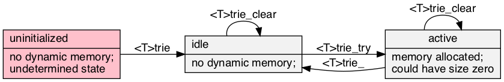

# trie\.h #

Header [\.\./src/trie\.h](../src/trie.h) requires [\.\./src/bmp\.h](../src/bmp.h); examples [\.\./test/test\_trie\.c](../test/test_trie.c); article [\.\./doc/trie/trie\.pdf](../doc/trie/trie.pdf)\.

## Prefix tree ##

 * [Description](#user-content-preamble)
 * [Typedef Aliases](#user-content-typedef): [&lt;PT&gt;key](#user-content-typedef-eeee1b4a), [&lt;PT&gt;entry](#user-content-typedef-41052ced), [&lt;PT&gt;remit](#user-content-typedef-b92c77f8), [&lt;PT&gt;string_fn](#user-content-typedef-fda6adfb), [&lt;PT&gt;key_fn](#user-content-typedef-1e6e6b3f), [&lt;PSTR&gt;to_string_fn](#user-content-typedef-8a8349ca)
 * [Struct, Union, and Enum Definitions](#user-content-tag): [trie_result](#user-content-tag-eb9850a3), [&lt;T&gt;trie](#user-content-tag-754a10a5), [&lt;T&gt;trie_iterator](#user-content-tag-854250a4)
 * [Function Summary](#user-content-summary)
 * [Function Definitions](#user-content-fn)
 * [License](#user-content-license)

## <a id = "user-content-preamble" name = "user-content-preamble">Description</a> ##

A [&lt;T&gt;trie](#user-content-tag-754a10a5) is a prefix\-tree, digital\-tree, or trie: an ordered set or map of byte null\-terminated immutable key strings allowing efficient prefix queries\. The implementation is as [Morrison, 1968 PATRICiA](https://scholar.google.ca/scholar?q=Morrison%2C+1968+PATRICiA): a compact [binary radix trie](https://en.wikipedia.org/wiki/Radix_tree) that acts as an index, only storing the where the key bits are different\. The keys are grouped in fixed\-size nodes in a relaxed version of a B\-tree, as [Bayer, McCreight, 1972 Large](https://scholar.google.ca/scholar?q=Bayer%2C+McCreight%2C+1972+Large), where the height is no longer fixed\.

While the worse\-case run\-time of querying or modifying is bounded by &#927;\(|`string`|\), [Tong, Goebel, Lin, 2015, Smoothed](https://scholar.google.ca/scholar?q=Tong%2C+Goebel%2C+Lin%2C+2015%2C+Smoothed) show that, in an iid model, a better fit is &#927;\(log |`trie`|\), which is seen and reported here\.

 * Parameter: TRIE\_NAME  
   Required `<T>` that satisfies `C` naming conventions when mangled\. `<PT>` is private, whose names are prefixed in a manner to avoid collisions\.
 * Parameter: TRIE\_KEY  
   Optional [&lt;PT&gt;key](#user-content-typedef-eeee1b4a), the default of which is `const char *`\. Requires implementation of [&lt;PT&gt;string_fn](#user-content-typedef-fda6adfb) `<T>string` to convert [&lt;PT&gt;key](#user-content-typedef-eeee1b4a) to a `const char *`\.
 * Parameter: TRIE\_ENTRY  
   Optional [&lt;PT&gt;entry](#user-content-typedef-41052ced) that contains the key, the default of which is the entry is the key\. Requires [&lt;PT&gt;key_fn](#user-content-typedef-1e6e6b3f) `<T>key`, that picks out [&lt;PT&gt;key](#user-content-typedef-eeee1b4a) from [&lt;PT&gt;entry](#user-content-typedef-41052ced)\.
 * Parameter: TRIE\_TO\_STRING  
   To string trait `<STR>` contained in [src/to\_string\.h](src/to_string.h)\. The unnamed trait is automatically supplied by the string, but others require `<name><trait>to_string` be declared as [&lt;PSTR&gt;to_string_fn](#user-content-typedef-8a8349ca)\.
 * Parameter: TRIE\_EXPECT\_TRAIT, TRIE\_TRAIT  
   Named traits are obtained by including `trie.h` multiple times with `TRIE_EXPECT_TRAIT` and then subsequently including the name in `TRIE_TRAIT`\.
 * Standard:  
   C89 \(Specifically, ISO/IEC 9899/AMD1:1995 because it uses EILSEQ\.\)
 * Caveat:  
   ([&lt;T&gt;trie_from_array](#user-content-fn-3554106c))

## <a id = "user-content-typedef" name = "user-content-typedef">Typedef Aliases</a> ##

### <a id = "user-content-typedef-eeee1b4a" name = "user-content-typedef-eeee1b4a">&lt;PT&gt;key</a> ###

<code>typedef TRIE_KEY <strong>&lt;PT&gt;key</strong>;</code>

The default is `const char *`\. If one sets `TRIE_KEY` to a different type, then one must also declare `
string` as a [&lt;PT&gt;string_fn](#user-content-typedef-fda6adfb)\.

### <a id = "user-content-typedef-41052ced" name = "user-content-typedef-41052ced">&lt;PT&gt;entry</a> ###

<code>typedef TRIE_ENTRY <strong>&lt;PT&gt;entry</strong>;</code>

If `TRIE_ENTRY` is set, one must provide `<T>key` as a [&lt;PT&gt;key_fn](#user-content-typedef-1e6e6b3f); otherwise a set and [&lt;PT&gt;entry](#user-content-typedef-41052ced) and [&lt;PT&gt;key](#user-content-typedef-eeee1b4a) are the same\.

### <a id = "user-content-typedef-b92c77f8" name = "user-content-typedef-b92c77f8">&lt;PT&gt;remit</a> ###

<code>typedef &lt;PT&gt;entry *<strong>&lt;PT&gt;remit</strong>;</code>

Remit is either an extra indirection on [&lt;PT&gt;entry](#user-content-typedef-41052ced) on `TRIE_ENTRY` or not\.

### <a id = "user-content-typedef-fda6adfb" name = "user-content-typedef-fda6adfb">&lt;PT&gt;string_fn</a> ###

<code>typedef const char *(*<strong>&lt;PT&gt;string_fn</strong>)(&lt;PT&gt;key);</code>

Transforms a [&lt;PT&gt;key](#user-content-typedef-eeee1b4a) into a `const char *`\.

### <a id = "user-content-typedef-1e6e6b3f" name = "user-content-typedef-1e6e6b3f">&lt;PT&gt;key_fn</a> ###

<code>typedef &lt;PT&gt;key(*<strong>&lt;PT&gt;key_fn</strong>)(const &lt;PT&gt;entry *);</code>

Extracts [&lt;PT&gt;key](#user-content-typedef-eeee1b4a) from [&lt;PT&gt;entry](#user-content-typedef-41052ced)\.

### <a id = "user-content-typedef-8a8349ca" name = "user-content-typedef-8a8349ca">&lt;PSTR&gt;to_string_fn</a> ###

<code>typedef void(*<strong>&lt;PSTR&gt;to_string_fn</strong>)(const &lt;PSTR&gt;element *, char(*)[12]);</code>

[src/to\_string\.h](src/to_string.h): responsible for turning the read\-only argument into a 12\-`char` null\-terminated output string, passed as a pointer in the last argument\. This function can have 2 or 3 arguments, where `<PSTR>element` might be a map with a key\-value pair\.

## <a id = "user-content-tag" name = "user-content-tag">Struct, Union, and Enum Definitions</a> ##

### <a id = "user-content-tag-eb9850a3" name = "user-content-tag-eb9850a3">trie_result</a> ###

<code>enum <strong>trie_result</strong> { TRIE_RESULT };</code>

A result of modifying the table, of which `TRIE_ERROR` is false\.

### <a id = "user-content-tag-754a10a5" name = "user-content-tag-754a10a5">&lt;T&gt;trie</a> ###

<code>struct <strong>&lt;T&gt;trie</strong>;</code>

To initialize it to an idle state, see [&lt;T&gt;trie](#user-content-fn-754a10a5), `{0}`, or being `static`\.

### <a id = "user-content-tag-854250a4" name = "user-content-tag-854250a4">&lt;T&gt;trie_iterator</a> ###

<code>struct <strong>&lt;T&gt;trie_iterator</strong>;</code>

Represents a range of in\-order keys in &#927;\(1\) space\.

## <a id = "user-content-summary" name = "user-content-summary">Function Summary</a> ##

<table>

<tr><th>Modifiers</th><th>Function Name</th><th>Argument List</th></tr>

<tr><td align = right>static struct &lt;T&gt;trie</td><td><a href = "#user-content-fn-754a10a5">&lt;T&gt;trie</a></td><td></td></tr>

<tr><td align = right>static int</td><td><a href = "#user-content-fn-3554106c">&lt;T&gt;trie_from_array</a></td><td>trie, array, array_size</td></tr>

<tr><td align = right>static void</td><td><a href = "#user-content-fn-9d98b98e">&lt;T&gt;trie_</a></td><td>trie</td></tr>

<tr><td align = right>static void</td><td><a href = "#user-content-fn-1e455cff">&lt;T&gt;trie_clear</a></td><td>trie</td></tr>

<tr><td align = right>static &lt;PT&gt;remit</td><td><a href = "#user-content-fn-46d99cc7">&lt;T&gt;trie_match</a></td><td>trie, string</td></tr>

<tr><td align = right>static &lt;PT&gt;remit</td><td><a href = "#user-content-fn-d0ca0cba">&lt;T&gt;trie_get</a></td><td>trie, string</td></tr>

<tr><td align = right>static enum trie_result</td><td><a href = "#user-content-fn-6750ab7">&lt;T&gt;trie_try</a></td><td>trie, key, entry</td></tr>

<tr><td align = right>static int</td><td><a href = "#user-content-fn-7b28a4ea">&lt;T&gt;trie_remove</a></td><td>trie, string</td></tr>

<tr><td align = right>static struct &lt;T&gt;trie_iterator</td><td><a href = "#user-content-fn-b720a682">&lt;T&gt;trie_prefix</a></td><td>trie, prefix</td></tr>

<tr><td align = right>static &lt;PT&gt;remit</td><td><a href = "#user-content-fn-1422bb56">&lt;T&gt;trie_entry</a></td><td>it</td></tr>

<tr><td align = right>static int</td><td><a href = "#user-content-fn-f36d1483">&lt;T&gt;trie_next</a></td><td>it</td></tr>

<tr><td align = right>static const char *</td><td><a href = "#user-content-fn-751c6337">&lt;STR&gt;to_string</a></td><td>box</td></tr>

</table>

## <a id = "user-content-fn" name = "user-content-fn">Function Definitions</a> ##

### <a id = "user-content-fn-754a10a5" name = "user-content-fn-754a10a5">&lt;T&gt;trie</a> ###

<code>static struct &lt;T&gt;trie <strong>&lt;T&gt;trie</strong>(void)</code>

Zeroed data \(not all\-bits\-zero\) is initialized\.

 * Return:  
   An idle tree\.
 * Order:  
   &#920;\(1\)

### <a id = "user-content-fn-3554106c" name = "user-content-fn-3554106c">&lt;T&gt;trie_from_array</a> ###

<code>static int <strong>&lt;T&gt;trie_from_array</strong>(struct &lt;T&gt;trie *const <em>trie</em>, &lt;PT&gt;type *const *const <em>array</em>, const size_t <em>array_size</em>)</code>

Initializes `trie` from an `array` of pointers\-to\-`<T>` of `array_size`\.

 * Return:  
   Success\.
 * Exceptional return: realloc  
 * Order:  
   &#927;\(`array_size`\)
 * Caveat:  
   Write this function, somehow\.

### <a id = "user-content-fn-9d98b98e" name = "user-content-fn-9d98b98e">&lt;T&gt;trie_</a> ###

<code>static void <strong>&lt;T&gt;trie_</strong>(struct &lt;T&gt;trie *const <em>trie</em>)</code>

Returns any initialized `trie` \(can be null\) to idle\.

 * Order:  
   &#927;\(|`trie`|\)

### <a id = "user-content-fn-1e455cff" name = "user-content-fn-1e455cff">&lt;T&gt;trie_clear</a> ###

<code>static void <strong>&lt;T&gt;trie_clear</strong>(struct &lt;T&gt;trie *const <em>trie</em>)</code>

Clears every entry in a valid `trie` \(can be null\), but it continues to be active if it is not idle\.

 * Order:  
   &#927;\(|`trie`|\)

### <a id = "user-content-fn-46d99cc7" name = "user-content-fn-46d99cc7">&lt;T&gt;trie_match</a> ###

<code>static &lt;PT&gt;remit <strong>&lt;T&gt;trie_match</strong>(const struct &lt;T&gt;trie *const <em>trie</em>, const char *const <em>string</em>)</code>

Looks at only the index of `trie` for potential `string` \(can both be null\) matches\. Does not access the string itself, thus will ignore the bits that are not in the index\. If may not have a null, the `remit` is stuck as a pointer on the end and a `trie_result` is returned\.

 * Return:  
   A candidate match for `string` or null\.
 * Order:  
   &#927;\(|`string`|\)

### <a id = "user-content-fn-d0ca0cba" name = "user-content-fn-d0ca0cba">&lt;T&gt;trie_get</a> ###

<code>static &lt;PT&gt;remit <strong>&lt;T&gt;trie_get</strong>(const struct &lt;T&gt;trie *const <em>trie</em>, const char *const <em>string</em>)</code>

If may not have a null, the `remit` is stuck as a pointer on the end and a `trie_result` is returned\.

 * Return:  
   Exact `string` match for `trie` or null, \(both can be null\.\)
 * Order:  
   &#927;\(log |`trie`|\) iid

### <a id = "user-content-fn-6750ab7" name = "user-content-fn-6750ab7">&lt;T&gt;trie_try</a> ###

<code>static enum trie_result <strong>&lt;T&gt;trie_try</strong>(struct &lt;T&gt;trie *const <em>trie</em>, const &lt;PT&gt;key <em>key</em>, &lt;PT&gt;entry **const <em>entry</em>)</code>

Adds `key` to `trie` if it doesn't exist already\.

If `TRIE_ENTRY` was specified and the return is `TRIE_ABSENT`, the trie is in an invalid state until filling in the key with an equivalent `key`\. \(Because [&lt;PT&gt;key](#user-content-typedef-eeee1b4a) is not invertible in this case, it is agnostic of the method of setting the key\.\)

 * Parameter: _entry_  
   Output pointer\. Only if `TRIE_ENTRY` is set will this parameter exist\.
 * Return:  
   One of, `TRIE_ERROR`, `errno` is set and `entry` is not; `TRIE_ABSENT`, `key` is added to `trie`; `TRIE_PRESENT`, the value associated with `key`\.
 * Exceptional return: EILSEQ  
   The string has a distinguishing run of bytes with a neighbouring string that is too long\. On most platforms, this is about 32 bytes the same\.
 * Exceptional return: malloc  
 * Order:  
   &#927;\(log |`trie`|\)

### <a id = "user-content-fn-7b28a4ea" name = "user-content-fn-7b28a4ea">&lt;T&gt;trie_remove</a> ###

<code>static int <strong>&lt;T&gt;trie_remove</strong>(struct &lt;T&gt;trie *const <em>trie</em>, const char *const <em>string</em>)</code>

Tries to remove `string` from `trie`\.

 * Return:  
   Success\. If either parameter is null or the `string` is not in `trie`, returns false without setting `errno`\.
 * Exceptional return: EILSEQ  
   The deletion of `string` would cause an overflow with the rest of the strings\.
 * Order:  
   &#927;\(log |`trie`|\)

### <a id = "user-content-fn-b720a682" name = "user-content-fn-b720a682">&lt;T&gt;trie_prefix</a> ###

<code>static struct &lt;T&gt;trie_iterator <strong>&lt;T&gt;trie_prefix</strong>(struct &lt;T&gt;trie *const <em>trie</em>, const char *const <em>prefix</em>)</code>

 * Parameter: _prefix_  
   To fill with the entire `trie`, use the empty string\.
 * Return:  
   An iterator set to strings that start with `prefix` in `trie`\. It is valid until a topological change to `trie`\. Calling [&lt;T&gt;trie_next](#user-content-fn-f36d1483) will iterate them in order\.
 * Order:  
   &#927;\(log |`trie`|\)

### <a id = "user-content-fn-1422bb56" name = "user-content-fn-1422bb56">&lt;T&gt;trie_entry</a> ###

<code>static &lt;PT&gt;remit <strong>&lt;T&gt;trie_entry</strong>(const struct &lt;T&gt;trie_iterator *const <em>it</em>)</code>

 * Return:  
   The entry at a valid, non\-null `it`\.

### <a id = "user-content-fn-f36d1483" name = "user-content-fn-f36d1483">&lt;T&gt;trie_next</a> ###

<code>static int <strong>&lt;T&gt;trie_next</strong>(struct &lt;T&gt;trie_iterator *const <em>it</em>)</code>

 * Return:  
   Whether advancing `it` to the next element is successful\.
 * Order:  
   &#927;\(log |`trie`|\)

### <a id = "user-content-fn-751c6337" name = "user-content-fn-751c6337">&lt;STR&gt;to_string</a> ###

<code>static const char *<strong>&lt;STR&gt;to_string</strong>(const &lt;PSTR&gt;box *const <em>box</em>)</code>

[src/to\_string\.h](src/to_string.h): print the contents of `box` in a static string buffer of 256 bytes, with limitations of only printing 4 things in a single sequence point\.

 * Return:  
   Address of the static buffer\.
 * Order:  
   &#920;\(1\)

## <a id = "user-content-license" name = "user-content-license">License</a> ##

2020 Neil Edelman, distributed under the terms of the [MIT License](https://opensource.org/licenses/MIT)\.

