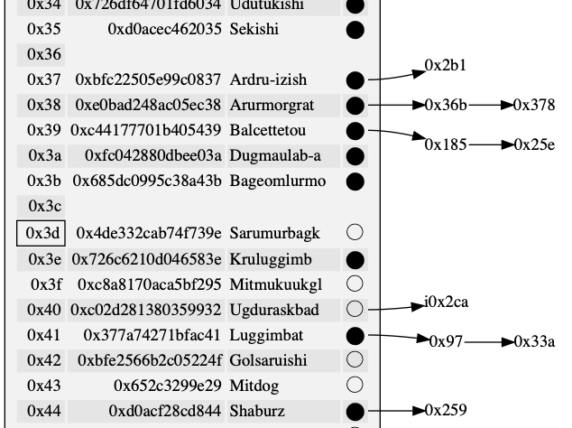

# set\.h #

## Unordered associative array ##

 * [Description](#user-content-preamble)
 * [Typedef Aliases](#user-content-typedef): [&lt;PS&gt;uint](#user-content-typedef-f1ed2088), [&lt;PS&gt;type](#user-content-typedef-5ef437c0), [&lt;PS&gt;mtype](#user-content-typedef-39f53ca7), [&lt;PS&gt;hash_fn](#user-content-typedef-87d76975), [&lt;PS&gt;is_equal_fn](#user-content-typedef-bbf0b37c), [&lt;PS&gt;replace_fn](#user-content-typedef-ccec694d), [&lt;PSZ&gt;box](#user-content-typedef-ace240bb), [&lt;PSZ&gt;type](#user-content-typedef-d1a7c35e), [&lt;PSZ&gt;to_string_fn](#user-content-typedef-8b890812)
 * [Struct, Union, and Enum Definitions](#user-content-tag): [&lt;S&gt;setlink](#user-content-tag-3e55d3ba), [&lt;S&gt;set](#user-content-tag-54aaac2)
 * [Function Summary](#user-content-summary)
 * [Function Definitions](#user-content-fn)
 * [License](#user-content-license)

## <a id = "user-content-preamble" name = "user-content-preamble">Description</a> ##

[&lt;S&gt;set](#user-content-tag-54aaac2) is a collection of elements of [&lt;S&gt;setlink](#user-content-tag-3e55d3ba) that doesn't allow duplication; it must be supplied an equality function, `SET_IS_EQUAL` [&lt;PS&gt;is_equal_fn](#user-content-typedef-bbf0b37c), and a hash function, `SET_HASH` [&lt;PS&gt;hash_fn](#user-content-typedef-87d76975)\.

Internally, it is a separately chained hash table with a maximum load factor of `ln 2`, power\-of\-two resizes, with buckets as a forward linked list of [&lt;S&gt;setlink](#user-content-tag-3e55d3ba)\. This offers some independence of sets from set elements\. It can be expanded to an associative array by enclosing the `<S>setlink` in another `struct`\.

 * Parameter: SET\_NAME, SET\_TYPE  
   `<S>` that satisfies `C` naming conventions when mangled and a valid [&lt;PS&gt;type](#user-content-typedef-5ef437c0) associated therewith; required\. `<PS>` is private, whose names are prefixed in a manner to avoid collisions; any should be re\-defined prior to use elsewhere\.
 * Parameter: SET\_HASH  
   A function satisfying [&lt;PS&gt;hash_fn](#user-content-typedef-87d76975); required\.
 * Parameter: SET\_IS\_EQUAL  
   A function satisfying [&lt;PS&gt;is_equal_fn](#user-content-typedef-bbf0b37c); required\.
 * Parameter: SET\_POINTER  
   Usually [&lt;PS&gt;mtype](#user-content-typedef-39f53ca7) in the same as [&lt;PS&gt;type](#user-content-typedef-5ef437c0) for simple `SET_TYPE`, but this flag makes `<PS>mtype` be a pointer\-to\-`<PS>type`\. This affects [&lt;PS&gt;hash_fn](#user-content-typedef-87d76975), [&lt;PS&gt;is_equal_fn](#user-content-typedef-bbf0b37c), and [&lt;S&gt;set_get](#user-content-fn-4b32a391), making them accept a pointer\-to\-const\-`<S>` instead of a copy of `<S>`\.
 * Parameter: SET\_UINT  
   This is [&lt;PS&gt;uint](#user-content-typedef-f1ed2088) and defaults to `unsigned int`; use when [&lt;PS&gt;hash_fn](#user-content-typedef-87d76975) is a specific hash length\.
 * Parameter: SET\_NO\_CACHE  
   Calculates the hash every time and discards it; should be used when the hash calculation is trivial to avoid storing duplicate [&lt;PS&gt;uint](#user-content-typedef-f1ed2088) _per_ datum, \(in rare cases\.\)
 * Parameter: SET\_ITERATE  
   Satisfies the [iterate\.h](iterate.h) interface for forwards iteration in original inclusion\.
 * Parameter: SET\_EXPECT\_TRAIT  
   Do not un\-define certain variables for subsequent inclusion in a trait\.
 * Parameter: SET\_TO\_STRING  
   To string trait contained in [to\_string\.h](to_string.h); `<SZ>` that satisfies `C` naming conventions when mangled and function implementing [&lt;PSZ&gt;to_string_fn](#user-content-typedef-8b890812)\. There can be multiple to string traits, but only one can omit `SET_TO_STRING_NAME`\.
 * Standard:  
   C89
 * Caveat:  
   ([&lt;PS&gt;mtype](#user-content-typedef-39f53ca7))

## <a id = "user-content-typedef" name = "user-content-typedef">Typedef Aliases</a> ##

### <a id = "user-content-typedef-f1ed2088" name = "user-content-typedef-f1ed2088">&lt;PS&gt;uint</a> ###

<code>typedef SET_UINT <strong>&lt;PS&gt;uint</strong>;</code>

Valid unsigned integer type used for hash values\. The hash map will saturate at `min(((ln 2)/2) &#183; range(<PS>uint), (1/8) &#183; range(size_t))`, at which point no new buckets can be added and the load factor will increase over the maximum\.

### <a id = "user-content-typedef-5ef437c0" name = "user-content-typedef-5ef437c0">&lt;PS&gt;type</a> ###

<code>typedef SET_TYPE <strong>&lt;PS&gt;type</strong>;</code>

Valid tag type defined by `SET_TYPE`\. Included in [&lt;S&gt;setlink](#user-content-tag-3e55d3ba)\.

### <a id = "user-content-typedef-39f53ca7" name = "user-content-typedef-39f53ca7">&lt;PS&gt;mtype</a> ###

<code>typedef const &lt;PS&gt;type *<strong>&lt;PS&gt;mtype</strong>;</code>

`SET_POINTER` modifies `<PS>mtype` to be a pointer, otherwise it's the same as [&lt;PS&gt;type](#user-content-typedef-5ef437c0)\.

 * Caveat:  
   This is confusing\.

### <a id = "user-content-typedef-87d76975" name = "user-content-typedef-87d76975">&lt;PS&gt;hash_fn</a> ###

<code>typedef &lt;PS&gt;uint(*<strong>&lt;PS&gt;hash_fn</strong>)(const &lt;PS&gt;mtype);</code>

A map from [&lt;PS&gt;mtype](#user-content-typedef-39f53ca7) onto [&lt;PS&gt;uint](#user-content-typedef-f1ed2088)\. Should be as close as possible to a discrete uniform distribution while using all argument for maximum performance\.

### <a id = "user-content-typedef-bbf0b37c" name = "user-content-typedef-bbf0b37c">&lt;PS&gt;is_equal_fn</a> ###

<code>typedef int(*<strong>&lt;PS&gt;is_equal_fn</strong>)(const &lt;PS&gt;mtype a, const &lt;PS&gt;mtype b);</code>

Equivalence relation between [&lt;PS&gt;mtype](#user-content-typedef-39f53ca7) that satisfies `<PS>is_equal_fn(a, b) -> <PS>hash_fn(a) == <PS>hash_fn(b)`\.

### <a id = "user-content-typedef-ccec694d" name = "user-content-typedef-ccec694d">&lt;PS&gt;replace_fn</a> ###

<code>typedef int(*<strong>&lt;PS&gt;replace_fn</strong>)(&lt;PS&gt;type *original, &lt;PS&gt;type *replace);</code>

A di\-predicate; returns true if the `replace` replaces the `original`\.

### <a id = "user-content-typedef-ace240bb" name = "user-content-typedef-ace240bb">&lt;PSZ&gt;box</a> ###

<code>typedef BOX_CONTAINER <strong>&lt;PSZ&gt;box</strong>;</code>

[to\_string\.h](to_string.h): an alias to the box\.

### <a id = "user-content-typedef-d1a7c35e" name = "user-content-typedef-d1a7c35e">&lt;PSZ&gt;type</a> ###

<code>typedef BOX_CONTENTS <strong>&lt;PSZ&gt;type</strong>;</code>

[to\_string\.h](to_string.h): an alias to the individual type contained in the box\.

### <a id = "user-content-typedef-8b890812" name = "user-content-typedef-8b890812">&lt;PSZ&gt;to_string_fn</a> ###

<code>typedef void(*<strong>&lt;PSZ&gt;to_string_fn</strong>)(const &lt;PSZ&gt;type *, char(*)[12]);</code>

Responsible for turning the argument [&lt;PSZ&gt;type](#user-content-typedef-d1a7c35e) into a 12\-`char` null\-terminated output string\.

## <a id = "user-content-tag" name = "user-content-tag">Struct, Union, and Enum Definitions</a> ##

### <a id = "user-content-tag-3e55d3ba" name = "user-content-tag-3e55d3ba">&lt;S&gt;setlink</a> ###

<code>struct <strong>&lt;S&gt;setlink</strong> { &lt;PS&gt;type key; struct &lt;S&gt;setlink *next; &lt;PS&gt;uint hash; };</code>

Contains [&lt;PS&gt;type](#user-content-typedef-5ef437c0) as the first element `key`, along with data internal to the set\. Storage of the `<S>setlink` structure is the responsibility of the caller\.

### <a id = "user-content-tag-54aaac2" name = "user-content-tag-54aaac2">&lt;S&gt;set</a> ###

<code>struct <strong>&lt;S&gt;set</strong>;</code>

An `<S>set` of `size`\. To initialise, see [&lt;S&gt;set](#user-content-fn-54aaac2), `SET_IDLE`, `{0}` \(`C99`,\) or being `static`\.

## <a id = "user-content-summary" name = "user-content-summary">Function Summary</a> ##

<table>

<tr><th>Modifiers</th><th>Function Name</th><th>Argument List</th></tr>

<tr><td align = right>static void</td><td><a href = "#user-content-fn-54aaac2">&lt;S&gt;set</a></td><td>set</td></tr>

<tr><td align = right>static void</td><td><a href = "#user-content-fn-f18a9527">&lt;S&gt;set_</a></td><td>set</td></tr>

<tr><td align = right>static void</td><td><a href = "#user-content-fn-b2194878">&lt;S&gt;set_clear</a></td><td>set</td></tr>

<tr><td align = right>static struct &lt;S&gt;setlink *</td><td><a href = "#user-content-fn-4b32a391">&lt;S&gt;set_get</a></td><td>set, data</td></tr>

<tr><td align = right>static int</td><td><a href = "#user-content-fn-7cc805b1">&lt;S&gt;set_reserve</a></td><td>set, reserve</td></tr>

<tr><td align = right>static struct &lt;S&gt;setlink *</td><td><a href = "#user-content-fn-fd0e5a1c">&lt;S&gt;set_put</a></td><td>set, element</td></tr>

<tr><td align = right>static struct &lt;S&gt;setlink *</td><td><a href = "#user-content-fn-e5100be7">&lt;S&gt;set_policy_put</a></td><td>set, element, replace</td></tr>

<tr><td align = right>static struct &lt;S&gt;setlink *</td><td><a href = "#user-content-fn-f336902b">&lt;S&gt;set_remove</a></td><td>set, data</td></tr>

<tr><td align = right>static const char *</td><td><a href = "#user-content-fn-b11709d3">&lt;SZ&gt;to_string</a></td><td>box</td></tr>

</table>

## <a id = "user-content-fn" name = "user-content-fn">Function Definitions</a> ##

### <a id = "user-content-fn-54aaac2" name = "user-content-fn-54aaac2">&lt;S&gt;set</a> ###

<code>static void <strong>&lt;S&gt;set</strong>(struct &lt;S&gt;set *const <em>set</em>)</code>

Initialises `set` to idle\.

 * Order:  
   &#920;\(1\)

### <a id = "user-content-fn-f18a9527" name = "user-content-fn-f18a9527">&lt;S&gt;set_</a> ###

<code>static void <strong>&lt;S&gt;set_</strong>(struct &lt;S&gt;set *const <em>set</em>)</code>

Destroys `set` and returns it to idle\.

### <a id = "user-content-fn-b2194878" name = "user-content-fn-b2194878">&lt;S&gt;set_clear</a> ###

<code>static void <strong>&lt;S&gt;set_clear</strong>(struct &lt;S&gt;set *const <em>set</em>)</code>

Clears and removes all entries from `set`\. The capacity and memory of the hash table is preserved, but all previous values are un\-associated\. The load factor will be less until it reaches it's previous size\.

 * Parameter: _set_  
   If null, does nothing\.
 * Order:  
   &#920;\(`set.buckets`\)

### <a id = "user-content-fn-4b32a391" name = "user-content-fn-4b32a391">&lt;S&gt;set_get</a> ###

<code>static struct &lt;S&gt;setlink *<strong>&lt;S&gt;set_get</strong>(struct &lt;S&gt;set *const <em>set</em>, const &lt;PS&gt;mtype <em>data</em>)</code>

 * Parameter: _set_  
   If null, returns null\.
 * Return:  
   The value in `set` which [&lt;PS&gt;is_equal_fn](#user-content-typedef-bbf0b37c) `SET_IS_EQUAL` `data`, or, if no such value exists, null\.
 * Order:  
   Average &#927;\(1\), \(hash distributes elements uniformly\); worst &#927;\(n\)\.

### <a id = "user-content-fn-7cc805b1" name = "user-content-fn-7cc805b1">&lt;S&gt;set_reserve</a> ###

<code>static int <strong>&lt;S&gt;set_reserve</strong>(struct &lt;S&gt;set *const <em>set</em>, const size_t <em>reserve</em>)</code>

Reserve at least `reserve`, divided by the maximum load factor, space in the buckets of `set`\.

 * Return:  
   Success\.
 * Exceptional return: ERANGE  
   `reserve` plus the size would take a bigger number then could fit in a `size_t`\.
 * Exceptional return: realloc  

### <a id = "user-content-fn-fd0e5a1c" name = "user-content-fn-fd0e5a1c">&lt;S&gt;set_put</a> ###

<code>static struct &lt;S&gt;setlink *<strong>&lt;S&gt;set_put</strong>(struct &lt;S&gt;set *const <em>set</em>, struct &lt;S&gt;setlink *const <em>element</em>)</code>

Puts the `element` in `set`\.

 * Parameter: _set_  
   If null, returns null\.
 * Parameter: _element_  
   If null, returns null\. Should not be of a set because the integrity of that set will be compromised\.
 * Return:  
   Any ejected element or null\. \(An ejected element has [&lt;PS&gt;is_equal_fn](#user-content-typedef-bbf0b37c) `SET_IS_EQUAL` the `element`\.\)
 * Exceptional return: realloc, ERANGE  
   There was an error with a re\-sizing\. Successfully calling [&lt;S&gt;set_reserve](#user-content-fn-7cc805b1) with at least one before ensures that this does not happen\.
 * Order:  
   Average amortised &#927;\(1\), \(hash distributes elements uniformly\); worst &#927;\(n\)\.

### <a id = "user-content-fn-e5100be7" name = "user-content-fn-e5100be7">&lt;S&gt;set_policy_put</a> ###

<code>static struct &lt;S&gt;setlink *<strong>&lt;S&gt;set_policy_put</strong>(struct &lt;S&gt;set *const <em>set</em>, struct &lt;S&gt;setlink *const <em>element</em>, const &lt;PS&gt;replace_fn <em>replace</em>)</code>

Puts the `element` in `set` only if the entry is absent or if calling `replace` returns true\.

 * Parameter: _set_  
   If null, returns null\.
 * Parameter: _element_  
   If null, returns null\. Should not be of a set because the integrity of that set will be compromised\.
 * Parameter: _replace_  
   Called on collision and only replaces it if the function returns true\. If null, doesn't do any replacement on collision\.
 * Return:  
   Any ejected element or null\. On collision, if `replace` returns false or `replace` is null, returns `element` and leaves the other element in the set\.
 * Exceptional return: realloc, ERANGE  
   There was an error with a re\-sizing\. Successfully calling [&lt;S&gt;set_reserve](#user-content-fn-7cc805b1) with at least one before ensures that this does not happen\.
 * Order:  
   Average amortised &#927;\(1\), \(hash distributes elements uniformly\); worst &#927;\(n\)\.

### <a id = "user-content-fn-f336902b" name = "user-content-fn-f336902b">&lt;S&gt;set_remove</a> ###

<code>static struct &lt;S&gt;setlink *<strong>&lt;S&gt;set_remove</strong>(struct &lt;S&gt;set *const <em>set</em>, const &lt;PS&gt;mtype <em>data</em>)</code>

Removes an element `data` from `set`\.

 * Return:  
   Successfully ejected element or null\. This element is free to be put into another set or modify it's hash values\.
 * Order:  
   Average &#927;\(1\), \(hash distributes elements uniformly\); worst &#927;\(n\)\.

### <a id = "user-content-fn-b11709d3" name = "user-content-fn-b11709d3">&lt;SZ&gt;to_string</a> ###

<code>static const char *<strong>&lt;SZ&gt;to_string</strong>(const &lt;PSZ&gt;box *const <em>box</em>)</code>

 * Return:  
   Print the contents of [&lt;PSZ&gt;box](#user-content-typedef-ace240bb) `box` in a static string buffer of 256 bytes with limitations of only printing 4 things at a time\.
 * Order:  
   &#920;\(1\)

## <a id = "user-content-license" name = "user-content-license">License</a> ##

2019 Neil Edelman, distributed under the terms of the [MIT License](https://opensource.org/licenses/MIT)\.

