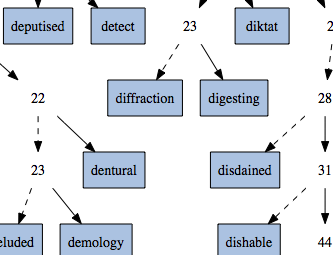

# trie\.h #

## Prefix Tree ##

 * [Description](#user-content-preamble)
 * [Typedef Aliases](#user-content-typedef): [&lt;PT&gt;type](#user-content-typedef-245060ab), [&lt;PT&gt;ctype](#user-content-typedef-6317b018), [&lt;PT&gt;key_fn](#user-content-typedef-1e6e6b3f), [&lt;PT&gt;replace_fn](#user-content-typedef-246bd5da), [&lt;PZ&gt;to_string_fn](#user-content-typedef-22f3d7f1), [&lt;PT&gt;action_fn](#user-content-typedef-ba462b2e)
 * [Struct, Union, and Enum Definitions](#user-content-tag): [&lt;T&gt;trie](#user-content-tag-754a10a5)
 * [Function Summary](#user-content-summary)
 * [Function Definitions](#user-content-fn)
 * [License](#user-content-license)

## <a id = "user-content-preamble" name = "user-content-preamble">Description</a> ##

A [&lt;T&gt;trie](#user-content-tag-754a10a5) is a prefix tree, digital tree, or trie, implemented as an array of pointers\-to\-`T` whose keys are always in lexicographically\-sorted order\. It can be seen as a [Morrison, 1968 PATRICiA](https://scholar.google.ca/scholar?q=Morrison%2C+1968+PATRICiA): a compact [binary radix trie](https://en.wikipedia.org/wiki/Radix_tree), only storing the where the keys are different\. Strings can be any encoding with a byte null\-terminator, including [modified UTF-8](https://en.wikipedia.org/wiki/UTF-8#Modified_UTF-8)\.

 * Parameter: TRIE\_NAME, TRIE\_TYPE  
   [&lt;PT&gt;type](#user-content-typedef-245060ab) that satisfies `C` naming conventions when mangled and an optional returnable type that is declared, \(it is used by reference only except if `TRIE_TEST`\.\) `<PT>` is private, whose names are prefixed in a manner to avoid collisions\.
 * Parameter: TRIE\_KEY  
   A function that satisfies [&lt;PT&gt;key_fn](#user-content-typedef-1e6e6b3f)\. Must be defined if and only if `TRIE_TYPE` is defined\.
 * Parameter: TRIE\_TO\_STRING  
   Defining this includes [to\_string\.h](to_string.h) with the keys as the string\.
 * Parameter: TRIE\_TEST  
   Unit testing framework [&lt;T&gt;trie_test](#user-content-fn-ae9d3396), included in a separate header, [\.\./test/test\_trie\.h](../test/test_trie.h)\. Must be defined equal to a \(random\) filler function, satisfying [&lt;PT&gt;action_fn](#user-content-typedef-ba462b2e)\. Requires that `NDEBUG` not be defined and `TRIE_ITERATE_TO_STRING`\.
 * Standard:  
   C89
 * Dependancies:  
   [array](https://github.com/neil-edelman/array), [iterate\.h](iterate.h)
 * Caveat:  
   Have a replace; potentially much less wasteful than remove and add\. Compression _ala_ Judy; 64 bits to store mostly 0/1? Could it be done? Don't put two strings side\-by\-side or delete one that causes two strings to be side\-by\-side that have more than 512 matching characters in the same bit\-positions, it will trip an `assert`\. \(Genomic data, perhaps?\)

## <a id = "user-content-typedef" name = "user-content-typedef">Typedef Aliases</a> ##

### <a id = "user-content-typedef-245060ab" name = "user-content-typedef-245060ab">&lt;PT&gt;type</a> ###

<code>typedef TRIE_TYPE <strong>&lt;PT&gt;type</strong>;</code>

A valid tag type set by `TRIE_TYPE`; defaults to `const char`\.

### <a id = "user-content-typedef-6317b018" name = "user-content-typedef-6317b018">&lt;PT&gt;ctype</a> ###

<code>typedef const TRIE_TYPE <strong>&lt;PT&gt;ctype</strong>;</code>

Same as [&lt;PT&gt;type](#user-content-typedef-245060ab), except read\-only\.

### <a id = "user-content-typedef-1e6e6b3f" name = "user-content-typedef-1e6e6b3f">&lt;PT&gt;key_fn</a> ###

<code>typedef const char *(*<strong>&lt;PT&gt;key_fn</strong>)(&lt;PT&gt;ctype *);</code>

Responsible for picking out the null\-terminated string\. One must not modify this string while in any trie\.

### <a id = "user-content-typedef-246bd5da" name = "user-content-typedef-246bd5da">&lt;PT&gt;replace_fn</a> ###

<code>typedef int(*<strong>&lt;PT&gt;replace_fn</strong>)(&lt;PT&gt;type *original, &lt;PT&gt;type *replace);</code>

A bi\-predicate; returns true if the `replace` replaces the `original`; used in [&lt;T&gt;trie_policy_put](#user-content-fn-50d1d256)\.

### <a id = "user-content-typedef-22f3d7f1" name = "user-content-typedef-22f3d7f1">&lt;PZ&gt;to_string_fn</a> ###

<code>typedef void(*<strong>&lt;PZ&gt;to_string_fn</strong>)(const &lt;PZ&gt;type *, char(*)[12]);</code>

Responsible for turning the first argument into a 12\-`char` null\-terminated output string\.

### <a id = "user-content-typedef-ba462b2e" name = "user-content-typedef-ba462b2e">&lt;PT&gt;action_fn</a> ###

<code>typedef void(*<strong>&lt;PT&gt;action_fn</strong>)(&lt;PT&gt;type *);</code>

Only used if `TRIE_TEST`\.

## <a id = "user-content-tag" name = "user-content-tag">Struct, Union, and Enum Definitions</a> ##

### <a id = "user-content-tag-754a10a5" name = "user-content-tag-754a10a5">&lt;T&gt;trie</a> ###

<code>struct <strong>&lt;T&gt;trie</strong> { struct trie_branch_array branches; struct &lt;PT&gt;leaf_array leaves; };</code>

To initialize it to an idle state, see [&lt;T&gt;trie](#user-content-fn-754a10a5), `TRIE_IDLE`, `{0}` \(`C99`\), or being `static`\.

A full binary tree stored semi\-implicitly in two Arrays: as `branches` backed by one as pointers\-to\-[&lt;PT&gt;type](#user-content-typedef-245060ab) as `leaves` in lexicographically\-sorted order\.

## <a id = "user-content-summary" name = "user-content-summary">Function Summary</a> ##

<table>

<tr><th>Modifiers</th><th>Function Name</th><th>Argument List</th></tr>

<tr><td align = right>static void</td><td><a href = "#user-content-fn-754a10a5">&lt;T&gt;trie</a></td><td>trie</td></tr>

<tr><td align = right>static void</td><td><a href = "#user-content-fn-9d98b98e">&lt;T&gt;trie_</a></td><td>trie</td></tr>

<tr><td align = right>static int</td><td><a href = "#user-content-fn-3554106c">&lt;T&gt;trie_from_array</a></td><td>trie, array, array_size</td></tr>

<tr><td align = right>static size_t</td><td><a href = "#user-content-fn-b7ff4bcf">&lt;T&gt;trie_size</a></td><td>trie</td></tr>

<tr><td align = right>static &lt;PT&gt;type *const *</td><td><a href = "#user-content-fn-53884c17">&lt;T&gt;trie_array</a></td><td>trie</td></tr>

<tr><td align = right>static void</td><td><a href = "#user-content-fn-1e455cff">&lt;T&gt;trie_clear</a></td><td>trie</td></tr>

<tr><td align = right>static &lt;PT&gt;type *</td><td><a href = "#user-content-fn-f9b9ebc1">&lt;T&gt;trie_index_get</a></td><td>trie, key</td></tr>

<tr><td align = right>static &lt;PT&gt;type *</td><td><a href = "#user-content-fn-d0ca0cba">&lt;T&gt;trie_get</a></td><td>trie, key</td></tr>

<tr><td align = right>static void</td><td><a href = "#user-content-fn-6f140c4b">&lt;T&gt;trie_index_prefix</a></td><td>trie, prefix, low, high</td></tr>

<tr><td align = right>static int</td><td><a href = "#user-content-fn-70c096ed">&lt;T&gt;trie_add</a></td><td>trie, datum</td></tr>

<tr><td align = right>static int</td><td><a href = "#user-content-fn-bd93d12b">&lt;T&gt;trie_put</a></td><td>trie, datum, eject</td></tr>

<tr><td align = right>static int</td><td><a href = "#user-content-fn-50d1d256">&lt;T&gt;trie_policy_put</a></td><td>trie, datum, eject, replace</td></tr>

<tr><td align = right>static int</td><td><a href = "#user-content-fn-7b28a4ea">&lt;T&gt;trie_remove</a></td><td>trie, key</td></tr>

<tr><td align = right>static int</td><td><a href = "#user-content-fn-2b8ab027">&lt;T&gt;trie_shrink</a></td><td>trie</td></tr>

<tr><td align = right>static const char *</td><td><a href = "#user-content-fn-4ecb4112">&lt;Z&gt;to_string</a></td><td>box</td></tr>

<tr><td align = right>static void</td><td><a href = "#user-content-fn-ae9d3396">&lt;T&gt;trie_test</a></td><td></td></tr>

</table>

## <a id = "user-content-fn" name = "user-content-fn">Function Definitions</a> ##

### <a id = "user-content-fn-754a10a5" name = "user-content-fn-754a10a5">&lt;T&gt;trie</a> ###

<code>static void <strong>&lt;T&gt;trie</strong>(struct &lt;T&gt;trie *const <em>trie</em>)</code>

Initialises `trie` to idle\.

 * Order:  
   &#920;\(1\)

### <a id = "user-content-fn-9d98b98e" name = "user-content-fn-9d98b98e">&lt;T&gt;trie_</a> ###

<code>static void <strong>&lt;T&gt;trie_</strong>(struct &lt;T&gt;trie *const <em>trie</em>)</code>

Returns an initialised `trie` to idle\.

### <a id = "user-content-fn-3554106c" name = "user-content-fn-3554106c">&lt;T&gt;trie_from_array</a> ###

<code>static int <strong>&lt;T&gt;trie_from_array</strong>(struct &lt;T&gt;trie *const <em>trie</em>, &lt;PT&gt;type *const *const <em>array</em>, const size_t <em>array_size</em>)</code>

Initializes `trie` from an `array` of pointers\-to\-`<T>` of `array_size`\.

 * Return:  
   Success\.
 * Exceptional return: realloc  
 * Order:  
   &#927;\(`array_size`\)

### <a id = "user-content-fn-b7ff4bcf" name = "user-content-fn-b7ff4bcf">&lt;T&gt;trie_size</a> ###

<code>static size_t <strong>&lt;T&gt;trie_size</strong>(const struct &lt;T&gt;trie *const <em>trie</em>)</code>

 * Return:  
   The number of elements in the `trie`\.
 * Order:  
   &#920;\(1\)

### <a id = "user-content-fn-53884c17" name = "user-content-fn-53884c17">&lt;T&gt;trie_array</a> ###

<code>static &lt;PT&gt;type *const *<strong>&lt;T&gt;trie_array</strong>(const struct &lt;T&gt;trie *const <em>trie</em>)</code>

It remains valid up to a structural modification of `trie` and is indexed up to [&lt;T&gt;trie_size](#user-content-fn-b7ff4bcf)\.

 * Return:  
   An array of pointers to the leaves of `trie`, ordered by key\.

### <a id = "user-content-fn-1e455cff" name = "user-content-fn-1e455cff">&lt;T&gt;trie_clear</a> ###

<code>static void <strong>&lt;T&gt;trie_clear</strong>(struct &lt;T&gt;trie *const <em>trie</em>)</code>

Sets `trie` to be empty\. That is, the size of `trie` will be zero, but if it was previously in an active non\-idle state, it continues to be\.

 * Order:  
   &#920;\(1\)

### <a id = "user-content-fn-f9b9ebc1" name = "user-content-fn-f9b9ebc1">&lt;T&gt;trie_index_get</a> ###

<code>static &lt;PT&gt;type *<strong>&lt;T&gt;trie_index_get</strong>(const struct &lt;T&gt;trie *const <em>trie</em>, const char *const <em>key</em>)</code>

 * Return:  
   The [&lt;PT&gt;type](#user-content-typedef-245060ab) that matches `key` bits in `trie`, excluding don't\-cares\.

### <a id = "user-content-fn-d0ca0cba" name = "user-content-fn-d0ca0cba">&lt;T&gt;trie_get</a> ###

<code>static &lt;PT&gt;type *<strong>&lt;T&gt;trie_get</strong>(const struct &lt;T&gt;trie *const <em>trie</em>, const char *const <em>key</em>)</code>

 * Return:  
   The [&lt;PT&gt;type](#user-content-typedef-245060ab) with `key` in `trie` or null no such item exists\.
 * Order:  
   &#927;\(|`key`|\), [Thareja 2011, Data](https://scholar.google.ca/scholar?q=Thareja+2011%2C+Data)\.

### <a id = "user-content-fn-6f140c4b" name = "user-content-fn-6f140c4b">&lt;T&gt;trie_index_prefix</a> ###

<code>static void <strong>&lt;T&gt;trie_index_prefix</strong>(const struct &lt;T&gt;trie *const <em>trie</em>, const char *const <em>prefix</em>, size_t *const <em>low</em>, size_t *const <em>high</em>)</code>

In `trie`, which must be non\-empty, given a partial `prefix`, stores all leaf prefix matches between `low`, `high`, only given the index, ignoring don't care bits\.

 * Order:  
   &#927;\(`prefix.length`\)

### <a id = "user-content-fn-70c096ed" name = "user-content-fn-70c096ed">&lt;T&gt;trie_add</a> ###

<code>static int <strong>&lt;T&gt;trie_add</strong>(struct &lt;T&gt;trie *const <em>trie</em>, &lt;PT&gt;type *const <em>datum</em>)</code>

Adds `datum` to `trie` if absent\.

 * Parameter: _trie_  
   If null, returns null\.
 * Parameter: _datum_  
   If null, returns null\.
 * Return:  
   Success\. If data with the same key is present, returns true but doesn't add `datum`\.
 * Exceptional return: realloc  
   There was an error with a re\-sizing\.
 * Exceptional return: ERANGE  
   The key is greater then 510 characters or the trie has reached it's maximum size\.
 * Order:  
   &#927;\(`size`\)

### <a id = "user-content-fn-bd93d12b" name = "user-content-fn-bd93d12b">&lt;T&gt;trie_put</a> ###

<code>static int <strong>&lt;T&gt;trie_put</strong>(struct &lt;T&gt;trie *const <em>trie</em>, &lt;PT&gt;type *const <em>datum</em>, &lt;PT&gt;type **const <em>eject</em>)</code>

Updates or adds `datum` to `trie`\.

 * Parameter: _trie_  
   If null, returns null\.
 * Parameter: _datum_  
   If null, returns null\.
 * Parameter: _eject_  
   If not null, on success it will hold the overwritten value or a pointer\-to\-null if it did not overwrite\.
 * Return:  
   Success\.
 * Exceptional return: realloc  
   There was an error with a re\-sizing\.
 * Exceptional return: ERANGE  
   The key is greater then 510 characters or the trie has reached it's maximum size\.
 * Order:  
   &#927;\(`size`\)

### <a id = "user-content-fn-50d1d256" name = "user-content-fn-50d1d256">&lt;T&gt;trie_policy_put</a> ###

<code>static int <strong>&lt;T&gt;trie_policy_put</strong>(struct &lt;T&gt;trie *const <em>trie</em>, &lt;PT&gt;type *const <em>datum</em>, &lt;PT&gt;type **const <em>eject</em>, const &lt;PT&gt;replace_fn <em>replace</em>)</code>

Adds `datum` to `trie` only if the entry is absent or if calling `replace` returns true\.

 * Parameter: _eject_  
   If not null, on success it will hold the overwritten value or a pointer\-to\-null if it did not overwrite a previous value\. If a collision occurs and `replace` does not return true, this value will be `data`\.
 * Parameter: _replace_  
   Called on collision and only replaces it if the function returns true\. If null, it is semantically equivalent to [&lt;T&gt;trie_put](#user-content-fn-bd93d12b)\.
 * Return:  
   Success\.
 * Exceptional return: realloc  
   There was an error with a re\-sizing\.
 * Exceptional return: ERANGE  
   The key is greater then 510 characters or the trie has reached it's maximum size\.
 * Order:  
   &#927;\(`size`\)

### <a id = "user-content-fn-7b28a4ea" name = "user-content-fn-7b28a4ea">&lt;T&gt;trie_remove</a> ###

<code>static int <strong>&lt;T&gt;trie_remove</strong>(struct &lt;T&gt;trie *const <em>trie</em>, const char *const <em>key</em>)</code>

Remove `key` from `trie`\.

 * Return:  
   Success or else `key` was not in `trie`\.
 * Order:  
   &#927;\(`size`\)

### <a id = "user-content-fn-2b8ab027" name = "user-content-fn-2b8ab027">&lt;T&gt;trie_shrink</a> ###

<code>static int <strong>&lt;T&gt;trie_shrink</strong>(struct &lt;T&gt;trie *const <em>trie</em>)</code>

Shrinks the capacity of `trie` to size\.

 * Return:  
   Success\.
 * Exceptional return: ERANGE, realloc  
   Unlikely `realloc` error\.

### <a id = "user-content-fn-4ecb4112" name = "user-content-fn-4ecb4112">&lt;Z&gt;to_string</a> ###

<code>static const char *<strong>&lt;Z&gt;to_string</strong>(const &lt;PZ&gt;box *const <em>box</em>)</code>

 * Return:  
   Print the contents of `box` in a static string buffer of 256 bytes with limitations of only printing 4 things at a time\.
 * Order:  
   &#920;\(1\)

### <a id = "user-content-fn-ae9d3396" name = "user-content-fn-ae9d3396">&lt;T&gt;trie_test</a> ###

<code>static void <strong>&lt;T&gt;trie_test</strong>(void)</code>

Will be tested on stdout\. Requires `TRIE_TEST`, and not `NDEBUG` while defining `assert`\.

## <a id = "user-content-license" name = "user-content-license">License</a> ##

2020 Neil Edelman, distributed under the terms of the [MIT License](https://opensource.org/licenses/MIT)\.

