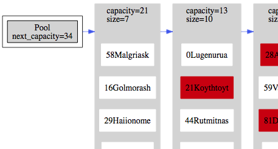

 # Set\.h #

 * [Description](#user-content-preamble)
 * [Typedef Aliases](#user-content-typedef):  [&lt;PE&gt;Hash](#user-content-typedef-812e78a), [&lt;PE&gt;Equal](#user-content-typedef-557336ea), [&lt;PE&gt;Replace](#user-content-typedef-a4aa6992), [&lt;PE&gt;ToString](#user-content-typedef-a5b40ebe), [&lt;PE&gt;Action](#user-content-typedef-9c0e506c)
 * [Struct, Union, and Enum Definitions](#user-content-tag):  [&lt;E&gt;SetElement](#user-content-tag-8952cfcc), [&lt;E&gt;Set](#user-content-tag-c69e9d84)
 * [Function Summary](#user-content-summary)
 * [Function Definitions](#user-content-fn)
 * [License](#user-content-license)

 ## <a id = "user-content-preamble" name = "user-content-preamble">Description</a> ##

`<E>Set` is a collection of elements of type `E` , along with a hash function and equality function, that doesn't allow duplication\. Internally, it is a separately chained hash set having a maximum load factor of `ln 2` \. It requires the storage of [&lt;E&gt;SetElement](#user-content-tag-8952cfcc)\. While in the set, the hash value cannot change\. One can use this as the key in an associative array or other more exotic structures by having a parent structure\.

 - Parameter: SET\_NAME, SET\_TYPE  
   `E` that satisfies `C` naming conventions when mangled; required\. For performance, this should be as close to a basic data type as possible, \(_eg_ , a pointer instead of a struct\.\)
 - Parameter: SET\_HASH  
   A function satisfying [&lt;PE&gt;Hash](#user-content-typedef-812e78a); required\.
 - Parameter: SET\_EQUAL  
   A function satisfying [&lt;PE&gt;Equal](#user-content-typedef-557336ea); required\.
 - Parameter: SET\_NO\_CACHE  
   Should be used when the hash calculation is trivial to avoid storing duplicate information _per_ datum\. It always calculates the hash and discards it\. Using non\-randomly\-distributed data directly as a hash is not ostensibly sound, but in certain situations, such as permanent auto\-incrementing, the expectation value of the links traversed will probably be low\.
 - Parameter: SET\_TO\_STRING  
   Optional print function implementing [&lt;PE&gt;ToString](#user-content-typedef-a5b40ebe); makes available [&lt;E&gt;SetToString](#user-content-fn-b4e4b20)\.
 - Parameter: SET\_TEST  
   Unit testing framework, included in a separate header, [\.\./test/SetTest\.h](../test/SetTest.h)\. Must be defined equal to a random filler function, satisfying [&lt;PE&gt;Action](#user-content-typedef-9c0e506c)\. Requires `SET\_TO\_STRING` \.
 * Standard:  
   C89/90
 * Caveat:  
   `SET\_TYPE` is actually not needed; an order without values is also super\-useful\.

 ## <a id = "user-content-typedef" name = "user-content-typedef">Typedef Aliases</a> ##

 ### <a id = "user-content-typedef-812e78a" name = "user-content-typedef-812e78a"><PE>Hash</a> ###

<code>typedef unsigned(*<strong>&lt;PE&gt;Hash</strong>)(const E);</code>

A map from `E` onto `unsigned int` \. Should be as close as possible to a discrete uniform distribution for maximum performance and, when computing, take all of `E` into account\.

 ### <a id = "user-content-typedef-557336ea" name = "user-content-typedef-557336ea"><PE>Equal</a> ###

<code>typedef int(*<strong>&lt;PE&gt;Equal</strong>)(const E, const E);</code>

A constant equivalence relation between `E` that satisfies `<PE>IsEqual\(a, b\) \-> <PE>Hash\(a\) == <PE>Hash\(b\)` \.

 ### <a id = "user-content-typedef-a4aa6992" name = "user-content-typedef-a4aa6992"><PE>Replace</a> ###

<code>typedef int(*<strong>&lt;PE&gt;Replace</strong>)(E *original, E *replace);</code>

Returns true if the `replace` replaces the `original` ; used in [&lt;E&gt;SetPolicyPut](#user-content-fn-2ceb4efb)\.

 ### <a id = "user-content-typedef-a5b40ebe" name = "user-content-typedef-a5b40ebe"><PE>ToString</a> ###

<code>typedef void(*<strong>&lt;PE&gt;ToString</strong>)(const E *const, char(*const)[12]);</code>

Responsible for turning `E` \(the first argument\) into a 12 `char` string \(the second\.\)

 ### <a id = "user-content-typedef-9c0e506c" name = "user-content-typedef-9c0e506c"><PE>Action</a> ###

<code>typedef void(*<strong>&lt;PE&gt;Action</strong>)(E *const);</code>

Used for `SET\_TEST` \.

 ## <a id = "user-content-tag" name = "user-content-tag">Struct, Union, and Enum Definitions</a> ##

 ### <a id = "user-content-tag-8952cfcc" name = "user-content-tag-8952cfcc"><E>SetElement</a> ###

<code>struct <strong>&lt;E&gt;SetElement</strong>;</code>

Contains `E` as the element `data` along with data internal to the set\. Storage of the `<E>SetElement` structure is the responsibility of the caller; it could be one part of a more complex super\-structure, \(thus using it as a hash table, for instance\.\)

 ### <a id = "user-content-tag-c69e9d84" name = "user-content-tag-c69e9d84"><E>Set</a> ###

<code>struct <strong>&lt;E&gt;Set</strong>;</code>

An `<E>Set` \. To initialise, see [&lt;E&gt;Set](#user-content-fn-c69e9d84)\.

 ## <a id = "user-content-summary" name = "user-content-summary">Function Summary</a> ##

<table>

<tr><th>Modifiers</th><th>Function Name</th><th>Argument List</th></tr>

<tr><td align = right>static void</td><td><a href = "#user-content-fn-86b27fc1">&lt;E&gt;Set_</a></td><td>set</td></tr>

<tr><td align = right>static void</td><td><a href = "#user-content-fn-c69e9d84">&lt;E&gt;Set</a></td><td>set</td></tr>

<tr><td align = right>static void</td><td><a href = "#user-content-fn-66181859">&lt;E&gt;SetClear</a></td><td>set</td></tr>

<tr><td align = right>static size_t</td><td><a href = "#user-content-fn-2dff525d">&lt;E&gt;SetSize</a></td><td>set</td></tr>

<tr><td align = right>static struct &lt;E&gt;SetElement *</td><td><a href = "#user-content-fn-8d1390a0">&lt;E&gt;SetGet</a></td><td>set, data</td></tr>

<tr><td align = right>static int</td><td><a href = "#user-content-fn-33c00814">&lt;E&gt;SetReserve</a></td><td>set, reserve</td></tr>

<tr><td align = right>static struct &lt;E&gt;SetElement *</td><td><a href = "#user-content-fn-df6b38cd">&lt;E&gt;SetPut</a></td><td>set, element</td></tr>

<tr><td align = right>static struct &lt;E&gt;SetElement *</td><td><a href = "#user-content-fn-2ceb4efb">&lt;E&gt;SetPolicyPut</a></td><td>set, element, replace</td></tr>

<tr><td align = right>static struct &lt;E&gt;SetElement *</td><td><a href = "#user-content-fn-21a4ad4">&lt;E&gt;SetRemove</a></td><td>set, data</td></tr>

<tr><td align = right>static const char *</td><td><a href = "#user-content-fn-b4e4b20">&lt;E&gt;SetToString</a></td><td>set</td></tr>

</table>

 ## <a id = "user-content-fn" name = "user-content-fn">Function Definitions</a> ##

 ### <a id = "user-content-fn-86b27fc1" name = "user-content-fn-86b27fc1"><E>Set\_</a> ###

<code>static void <strong>&lt;E&gt;Set_</strong>(struct &lt;E&gt;Set *const <em>set</em>)</code>

Destructor for `set` \. After, it takes no memory and is in an empty state\.

 ### <a id = "user-content-fn-c69e9d84" name = "user-content-fn-c69e9d84"><E>Set</a> ###

<code>static void <strong>&lt;E&gt;Set</strong>(struct &lt;E&gt;Set *const <em>set</em>)</code>

Initialises `set` to be take no memory and be in an empty state\. If it is `static` data, then it is initialised by default\. Alternatively, assigning `\{0\}` \(`C99` \+\) or `SET\_ZERO` as the initialiser also puts it in an empty state\. Calling this on an active set will cause memory leaks\.

 - Parameter: _set_  
   If null, does nothing\.
 - Order:  
   &#920;\(1\)

 ### <a id = "user-content-fn-66181859" name = "user-content-fn-66181859"><E>SetClear</a> ###

<code>static void <strong>&lt;E&gt;SetClear</strong>(struct &lt;E&gt;Set *const <em>set</em>)</code>

Clears and removes all entries from `set` \. The capacity and memory of the hash table is preserved, but all previous values are un\-associated\. The load factor will be less until it reaches it's previous size\.

 - Parameter: _set_  
   If null, does nothing\.
 - Order:  
   &#920;\(`set\.buckets` \)

 ### <a id = "user-content-fn-2dff525d" name = "user-content-fn-2dff525d"><E>SetSize</a> ###

<code>static size_t <strong>&lt;E&gt;SetSize</strong>(const struct &lt;E&gt;Set *const <em>set</em>)</code>

 - Parameter: _set_  
   If null, returns 0\.
 - Return:  
   The number of entries in the `set` \.
 - Order:  
   &#920;\(1\)

 ### <a id = "user-content-fn-8d1390a0" name = "user-content-fn-8d1390a0"><E>SetGet</a> ###

<code>static struct &lt;E&gt;SetElement *<strong>&lt;E&gt;SetGet</strong>(struct &lt;E&gt;Set *const <em>set</em>, const E <em>data</em>)</code>

Queries whether `data` is is `set` \.

 - Parameter: _set_  
   If null, returns null\.
 - Return:  
   The value which [&lt;PE&gt;Equal](#user-content-typedef-557336ea) `data` , or, if no such value exists, null\.
 - Order:  
   Average &#927;\(1\), \(hash distributes elements uniformly\); worst &#927;\(n\)\.

 ### <a id = "user-content-fn-33c00814" name = "user-content-fn-33c00814"><E>SetReserve</a> ###

<code>static int <strong>&lt;E&gt;SetReserve</strong>(struct &lt;E&gt;Set *const <em>set</em>, const size_t <em>reserve</em>)</code>

Reserve at least `reserve` divided by the maximum load factor, `ln 2` , space in the buckets of `set` \.

 - Return:  
   Success\.
 - Exceptional Return: ERANGE  
   `reserve` plus the size would take a bigger number then could fit in a `size\_t` \.
 - Exceptional Return: realloc  

 ### <a id = "user-content-fn-df6b38cd" name = "user-content-fn-df6b38cd"><E>SetPut</a> ###

<code>static struct &lt;E&gt;SetElement *<strong>&lt;E&gt;SetPut</strong>(struct &lt;E&gt;Set *const <em>set</em>, struct &lt;E&gt;SetElement *const <em>element</em>)</code>

Puts the `element` in `set` \. Adding an element with the same `E` , according to [&lt;PE&gt;Equal](#user-content-typedef-557336ea) `SET\_EQUAL` , causes the old data to be ejected\.

 - Parameter: _set_  
   If null, returns false\.
 - Parameter: _element_  
   If null, returns false\. Should not be of a `set` because the integrity of that `set` will be compromised\.
 - Return:  
   The ejected element or null\.
 - Exceptional Return: realloc, ERANGE  
   There was an error with a re\-sizing\. Calling [&lt;E&gt;SetReserve](#user-content-fn-33c00814) before ensures that this does not happen\.
 - Order:  
   Average amortised &#927;\(1\), \(hash distributes elements uniformly\); worst &#927;\(n\)\.

 ### <a id = "user-content-fn-2ceb4efb" name = "user-content-fn-2ceb4efb"><E>SetPolicyPut</a> ###

<code>static struct &lt;E&gt;SetElement *<strong>&lt;E&gt;SetPolicyPut</strong>(struct &lt;E&gt;Set *const <em>set</em>, struct &lt;E&gt;SetElement *const <em>element</em>, const &lt;PE&gt;Replace <em>replace</em>)</code>

Puts the `element` in `set` only if the entry is absent or if calling `replace` returns true\.

 - Parameter: _set_  
   If null, returns false\.
 - Parameter: _element_  
   If null, returns false\. Must not be part this `set` or any other\.
 - Parameter: _replace_  
   If specified, gets called on collision and only replaces it if the function returns true\. If null, doesn't do any replacement on collision\.
 - Return:  
   Successful operation, including doing nothing because the entry is already in the set\. The ejected element or null\.
 - Exceptional Return: realloc, ERANGE  
   There was an error with a re\-sizing\. Calling [&lt;E&gt;SetReserve](#user-content-fn-33c00814) before ensures that this does not happen\.
 - Order:  
   Average amortised &#927;\(1\), \(hash distributes elements uniformly\); worst &#927;\(n\)\.

 ### <a id = "user-content-fn-21a4ad4" name = "user-content-fn-21a4ad4"><E>SetRemove</a> ###

<code>static struct &lt;E&gt;SetElement *<strong>&lt;E&gt;SetRemove</strong>(struct &lt;E&gt;Set *const <em>set</em>, const E <em>data</em>)</code>

Removes an element `data` from `set` \.

 - Return:  
   Successfully removed element or null\.
 - Order:  
   Average &#927;\(1\), \(hash distributes elements uniformly\); worst &#927;\(n\)\.

 ### <a id = "user-content-fn-b4e4b20" name = "user-content-fn-b4e4b20"><E>SetToString</a> ###

<code>static const char *<strong>&lt;E&gt;SetToString</strong>(const struct &lt;E&gt;Set *const <em>set</em>)</code>

Can print 2 things at once before it overwrites\. One must set `SET\_TO\_STRING` to a function implementing [&lt;PE&gt;ToString](#user-content-typedef-a5b40ebe) to get this functionality\.

 - Return:  
   Prints `set` in a static buffer\.
 - Order:  
   &#920;\(1\); it has a 1024 character limit; every element takes some of it\.

 ## <a id = "user-content-license" name = "user-content-license">License</a> ##

2019 Neil Edelman, distributed under the terms of the [MIT License](https://opensource.org/licenses/MIT) \.

