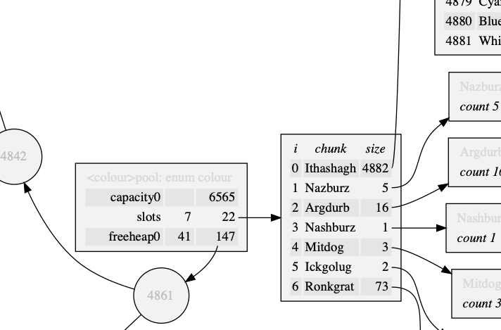

# pool\.h #

Header [src/pool\.h](src/pool.h) depends on [src/heap\.h](src/heap.h) and [src/array\.h](src/array.h); examples [test/test\_pool\.c](test/test_pool.c); article [doc/pool\.pdf](doc/pool.pdf)\. If on a compatible workstation, `make` creates the test suite of the examples\.

## Stable pool ##

 * [Description](#user-content-preamble)
 * [Typedef Aliases](#user-content-typedef): [&lt;PP&gt;type](#user-content-typedef-7560d92f), [&lt;PSTR&gt;to_string_fn](#user-content-typedef-8a8349ca)
 * [Struct, Union, and Enum Definitions](#user-content-tag): [&lt;P&gt;pool](#user-content-tag-8aba39cb)
 * [Function Summary](#user-content-summary)
 * [Function Definitions](#user-content-fn)
 * [License](#user-content-license)

## <a id = "user-content-preamble" name = "user-content-preamble">Description</a> ##

[&lt;P&gt;pool](#user-content-tag-8aba39cb) is a memory pool that stores only one type, [&lt;PP&gt;type](#user-content-typedef-7560d92f), using [slab allocation](https://en.wikipedia.org/wiki/Slab_allocation)\. A free\-heap in the active\-slab allows random\-access insertions and deletions\. Pointers to valid items in the pool are stable, but not generally in any order\. When removal is ongoing and uniformly sampled while reaching a steady\-state size, it will eventually settle in one contiguous region\.

 * Parameter: POOL\_NAME, POOL\_TYPE  
   `
` that satisfies `C` naming conventions when mangled and a valid tag type, [&lt;PP&gt;type](#user-content-typedef-7560d92f), associated therewith; required\. `<PP>` is private, whose names are prefixed in a manner to avoid collisions\.
 * Parameter: POOL\_EXPECT\_TRAIT  
   Do not un\-define certain variables for subsequent inclusion in a trait\.
 * Parameter: POOL\_TO\_STRING\_NAME, POOL\_TO\_STRING  
   To string trait contained in [src/to\_string\.h](src/to_string.h)\. An optional mangled name for uniqueness and function implementing [&lt;PSTR&gt;to_string_fn](#user-content-typedef-8a8349ca)\. \(This container is only iterable in the first slab, so this is not very useful except for debugging\.\)
 * Standard:  
   C89; however, when compiling for segmented memory models, C99 with `uintptr_t` is recommended because of it's implementation\-defined instead of undefined\-behaviour when comparing pointers from different objects\.
 * Dependancies:  
   [array](https://github.com/neil-edelman/array), [heap](https://github.com/neil-edelman/heap)

## <a id = "user-content-typedef" name = "user-content-typedef">Typedef Aliases</a> ##

### <a id = "user-content-typedef-7560d92f" name = "user-content-typedef-7560d92f">&lt;PP&gt;type</a> ###

<code>typedef POOL_TYPE <strong>&lt;PP&gt;type</strong>;</code>

A valid tag type set by `POOL_TYPE`\.

### <a id = "user-content-typedef-8a8349ca" name = "user-content-typedef-8a8349ca">&lt;PSTR&gt;to_string_fn</a> ###

<code>typedef void(*<strong>&lt;PSTR&gt;to_string_fn</strong>)(&lt;PSTR&gt;element_c, char(*)[12]);</code>

[src/to\_string\.h](src/to_string.h): responsible for turning the argument into a 12\-`char` null\-terminated output string\.

## <a id = "user-content-tag" name = "user-content-tag">Struct, Union, and Enum Definitions</a> ##

### <a id = "user-content-tag-8aba39cb" name = "user-content-tag-8aba39cb">&lt;P&gt;pool</a> ###

<code>struct <strong>&lt;P&gt;pool</strong> { struct &lt;PP&gt;slot_array slots; struct poolfree_heap free0; size_t capacity0; };</code>

This is a slab memory\-manager and free\-heap for slab zero\. A zeroed pool is a valid state\. To instantiate to an idle state, see [&lt;P&gt;pool](#user-content-fn-8aba39cb), `POOL_IDLE`, `{0}` \(`C99`,\) or being `static`\.

## <a id = "user-content-summary" name = "user-content-summary">Function Summary</a> ##

<table>

<tr><th>Modifiers</th><th>Function Name</th><th>Argument List</th></tr>

<tr><td align = right>static struct &lt;P&gt;pool</td><td><a href = "#user-content-fn-8aba39cb">&lt;P&gt;pool</a></td><td></td></tr>

<tr><td align = right>static void</td><td><a href = "#user-content-fn-f728a3fc">&lt;P&gt;pool_</a></td><td>pool</td></tr>

<tr><td align = right>static int</td><td><a href = "#user-content-fn-3579e316">&lt;P&gt;pool_buffer</a></td><td>pool, n</td></tr>

<tr><td align = right>static &lt;PP&gt;type *</td><td><a href = "#user-content-fn-e71c341a">&lt;P&gt;pool_new</a></td><td>pool</td></tr>

<tr><td align = right>static int</td><td><a href = "#user-content-fn-95972ccc">&lt;P&gt;pool_remove</a></td><td>pool, data</td></tr>

<tr><td align = right>static void</td><td><a href = "#user-content-fn-96f5dc51">&lt;P&gt;pool_clear</a></td><td>pool</td></tr>

<tr><td align = right>static const char *</td><td><a href = "#user-content-fn-751c6337">&lt;STR&gt;to_string</a></td><td>box</td></tr>

</table>

## <a id = "user-content-fn" name = "user-content-fn">Function Definitions</a> ##

### <a id = "user-content-fn-8aba39cb" name = "user-content-fn-8aba39cb">&lt;P&gt;pool</a> ###

<code>static struct &lt;P&gt;pool <strong>&lt;P&gt;pool</strong>(void)</code>

Initializes `pool` to idle\.

 * Order:  
   &#920;\(1\)

### <a id = "user-content-fn-f728a3fc" name = "user-content-fn-f728a3fc">&lt;P&gt;pool_</a> ###

<code>static void <strong>&lt;P&gt;pool_</strong>(struct &lt;P&gt;pool *const <em>pool</em>)</code>

Destroys `pool` and returns it to idle\.

 * Order:  
   &#927;\(\\log `data`\)

### <a id = "user-content-fn-3579e316" name = "user-content-fn-3579e316">&lt;P&gt;pool_buffer</a> ###

<code>static int <strong>&lt;P&gt;pool_buffer</strong>(struct &lt;P&gt;pool *const <em>pool</em>, const size_t <em>n</em>)</code>

Ensure capacity of at least `n` further items in `pool`\. Pre\-sizing is better for contiguous blocks, but takes up that memory\.

 * Return:  
   Success\.
 * Exceptional return: ERANGE, malloc  

### <a id = "user-content-fn-e71c341a" name = "user-content-fn-e71c341a">&lt;P&gt;pool_new</a> ###

<code>static &lt;PP&gt;type *<strong>&lt;P&gt;pool_new</strong>(struct &lt;P&gt;pool *const <em>pool</em>)</code>

This pointer is constant until it gets [&lt;P&gt;pool_remove](#user-content-fn-95972ccc)\.

 * Return:  
   A pointer to a new uninitialized element from `pool`\.
 * Exceptional return: ERANGE, malloc  
 * Order:  
   amortised O\(1\)

### <a id = "user-content-fn-95972ccc" name = "user-content-fn-95972ccc">&lt;P&gt;pool_remove</a> ###

<code>static int <strong>&lt;P&gt;pool_remove</strong>(struct &lt;P&gt;pool *const <em>pool</em>, &lt;PP&gt;type *const <em>data</em>)</code>

Deletes `data` from `pool`\. Do not remove data that is not in `pool`\.

 * Return:  
   Success\.
 * Order:  
   &#927;\(\\log \\log `items`\)

### <a id = "user-content-fn-96f5dc51" name = "user-content-fn-96f5dc51">&lt;P&gt;pool_clear</a> ###

<code>static void <strong>&lt;P&gt;pool_clear</strong>(struct &lt;P&gt;pool *const <em>pool</em>)</code>

Removes all from `pool`, but keeps it's active state, only freeing the smaller blocks\.

 * Order:  
   &#927;\(\\log `items`\)

### <a id = "user-content-fn-751c6337" name = "user-content-fn-751c6337">&lt;STR&gt;to_string</a> ###

<code>static const char *<strong>&lt;STR&gt;to_string</strong>(const &lt;PSTR&gt;box *const <em>box</em>)</code>

[src/to\_string\.h](src/to_string.h): print the contents of `box` in a static string buffer of 256 bytes, with limitations of only printing 4 things at a time\. `<STR>` is loosely contracted to be a name `<X>box[<X_TO_STRING_NAME>]`\.

 * Return:  
   Address of the static buffer\.
 * Order:  
   &#920;\(1\)

## <a id = "user-content-license" name = "user-content-license">License</a> ##

2021 Neil Edelman, distributed under the terms of the [MIT License](https://opensource.org/licenses/MIT)\.

