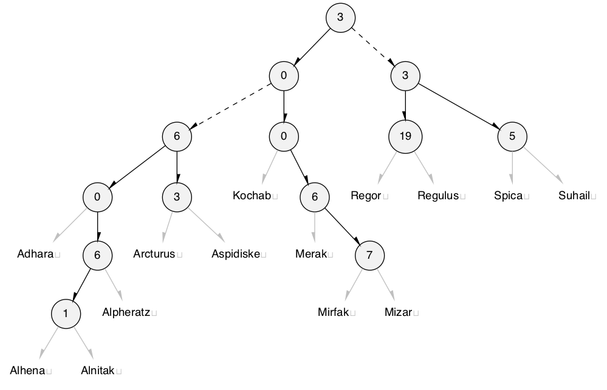

# trie\.h #

Stand\-alone header [src/trie\.h](src/trie.h); examples [test/test\_trie\.c](test/test_trie.c); article [doc/trie\.pdf](doc/trie.pdf)\. On a compatible workstation, `make` creates the test suite of the examples\.

## Prefix tree ##

 * [Description](#user-content-preamble)
 * [Typedef Aliases](#user-content-typedef): [&lt;PT&gt;value](#user-content-typedef-cc753b30), [&lt;PT&gt;entry](#user-content-typedef-41052ced), [&lt;PT&gt;key_fn](#user-content-typedef-1e6e6b3f), [&lt;PT&gt;replace_fn](#user-content-typedef-246bd5da), [&lt;PSTR&gt;to_string_fn](#user-content-typedef-8a8349ca), [&lt;PT&gt;action_fn](#user-content-typedef-ba462b2e)
 * [Struct, Union, and Enum Definitions](#user-content-tag): [trie_result](#user-content-tag-eb9850a3), [&lt;T&gt;trie_entry](#user-content-tag-1422bb56), [&lt;T&gt;trie](#user-content-tag-754a10a5)
 * [General Declarations](#user-content-data): [it](#user-content-data-47388410)
 * [Function Summary](#user-content-summary)
 * [Function Definitions](#user-content-fn)
 * [License](#user-content-license)

## <a id = "user-content-preamble" name = "user-content-preamble">Description</a> ##

A [&lt;T&gt;trie](#user-content-tag-754a10a5) is a prefix\-tree, digital\-tree, or trie: an ordered set or map of immutable key strings allowing efficient prefix queries\. The strings used here are any encoding with a byte null\-terminator, including [modified UTF-8](https://en.wikipedia.org/wiki/UTF-8#Modified_UTF-8)\.

The implementation is as [Morrison, 1968 PATRICiA](https://scholar.google.ca/scholar?q=Morrison%2C+1968+PATRICiA): a compact [binary radix trie](https://en.wikipedia.org/wiki/Radix_tree), only storing the where the key bits are different\. It uses some B\-tree techniques described in [Bayer, McCreight, 1972 Large](https://scholar.google.ca/scholar?q=Bayer%2C+McCreight%2C+1972+Large) for grouping the nodes in a compact, cache\-friendly manner\.

 * Parameter: TRIE\_NAME  
   `<T>` that satisfies `C` naming conventions when mangled; required\. `<PT>` is private, whose names are prefixed in a manner to avoid collisions\.
 * Parameter: TRIE\_VALUE, TRIE\_KEY\_IN\_VALUE  
   `TRIE_VALUE` is an optional payload type to go with the string key\. `TRIE_KEY_IN_VALUE` is an optional [&lt;PT&gt;key_fn](#user-content-typedef-1e6e6b3f) that picks out the key from the of value, otherwise it is an associative array from a string key to value, [&lt;PT&gt;entry](#user-content-tag-41052ced)\.
 * Parameter: TRIE\_TO\_STRING  
   Defining this includes [to\_string\.h](to_string.h), with the keys as the string\.
 * Standard:  
   C89
 * Caveat:  
   ([&lt;T&gt;trie_from_array](#user-content-fn-3554106c))

## <a id = "user-content-typedef" name = "user-content-typedef">Typedef Aliases</a> ##

### <a id = "user-content-typedef-cc753b30" name = "user-content-typedef-cc753b30">&lt;PT&gt;value</a> ###

<code>typedef TRIE_VALUE <strong>&lt;PT&gt;value</strong>;</code>

On `TRIE_VALUE`, otherwise just a string\.

### <a id = "user-content-typedef-41052ced" name = "user-content-typedef-41052ced">&lt;PT&gt;entry</a> ###

<code>typedef &lt;PT&gt;value <strong>&lt;PT&gt;entry</strong>;</code>

On `TRIE_VALUE` and not `TRIE_KEY_IN_VALUE`, otherwise it's just an alias for [&lt;PT&gt;value](#user-content-typedef-cc753b30)\.

### <a id = "user-content-typedef-1e6e6b3f" name = "user-content-typedef-1e6e6b3f">&lt;PT&gt;key_fn</a> ###

<code>typedef const char *(*<strong>&lt;PT&gt;key_fn</strong>)(&lt;PT&gt;entry);</code>

If `TRIE_KEY_IN_VALUE` is set, responsible for picking out the null\-terminated string from the [&lt;PT&gt;value](#user-content-typedef-cc753b30), \(in which case, the same as [&lt;PT&gt;entry](#user-content-typedef-41052ced)\.\)

### <a id = "user-content-typedef-246bd5da" name = "user-content-typedef-246bd5da">&lt;PT&gt;replace_fn</a> ###

<code>typedef int(*<strong>&lt;PT&gt;replace_fn</strong>)(&lt;PT&gt;entry *original, &lt;PT&gt;entry *replace);</code>

A bi\-predicate; returns true if the `replace` replaces the `original`; used in [&lt;T&gt;trie_policy_put](#user-content-fn-50d1d256)\.

### <a id = "user-content-typedef-8a8349ca" name = "user-content-typedef-8a8349ca">&lt;PSTR&gt;to_string_fn</a> ###

<code>typedef void(*<strong>&lt;PSTR&gt;to_string_fn</strong>)(&lt;PSTR&gt;element_c, char(*)[12]);</code>

[src/to\_string\.h](src/to_string.h): responsible for turning the argument into a 12\-`char` null\-terminated output string\.

### <a id = "user-content-typedef-ba462b2e" name = "user-content-typedef-ba462b2e">&lt;PT&gt;action_fn</a> ###

<code>typedef void(*<strong>&lt;PT&gt;action_fn</strong>)(&lt;PT&gt;entry);</code>

Works by side\-effects, _ie_ fills the type with data\. Only defined if `TRIE_TEST`\.

## <a id = "user-content-tag" name = "user-content-tag">Struct, Union, and Enum Definitions</a> ##

### <a id = "user-content-tag-eb9850a3" name = "user-content-tag-eb9850a3">trie_result</a> ###

<code>enum <strong>trie_result</strong> { TRIE_RESULT };</code>

A result of modifying the table, of which `TRIE_ERROR` is false\. 

### <a id = "user-content-tag-1422bb56" name = "user-content-tag-1422bb56">&lt;T&gt;trie_entry</a> ###

<code>struct <strong>&lt;T&gt;trie_entry</strong> { const char *key; &lt;PT&gt;value value; } typedef struct &lt;T&gt;trie_entry &lt;PT&gt;entry;</code>

On `TRIE_VALUE` but not `TRIE_KEY_IN_VALUE`, creates a map from key to value as an associative array\.

### <a id = "user-content-tag-754a10a5" name = "user-content-tag-754a10a5">&lt;T&gt;trie</a> ###

<code>struct <strong>&lt;T&gt;trie</strong>;</code>

To initialize it to an idle state, see [&lt;T&gt;trie](#user-content-fn-754a10a5), `TRIE_IDLE`, `{0}` \(`C99`\), or being `static`\.

## <a id = "user-content-data" name = "user-content-data">General Declarations</a> ##

### <a id = "user-content-data-47388410" name = "user-content-data-47388410">it</a> ###

<code>const static &lt;PT&gt;entry *&lt;PT&gt;next(struct &lt;PT&gt;iterator *const <strong>it</strong>){ assert(it); printf("_next_\n"); if(!it -&gt;trie)return 0; assert(it -&gt;current &amp;&amp;it -&gt;end); if(&amp;it -&gt;current -&gt;trunk ==it -&gt;end){ if(it -&gt;leaf &gt;it -&gt;leaf_end ||it -&gt;leaf &gt;it -&gt;current -&gt;trunk .bsize){ it -&gt;trie = 0; return 0; } } else if(it -&gt;leaf &gt;it -&gt;current -&gt;trunk .bsize){ const char *key = &lt;PT&gt;to_key(it -&gt;current -&gt;leaf[it -&gt;current -&gt;trunk .bsize]); const struct trie_trunk *trunk1 = &amp;it -&gt;current -&gt;trunk; struct trie_trunk *trunk2, *next = 0; size_t h2 = it -&gt;trie -&gt;node_height, bit2; struct { unsigned br0, br1, lf; } t2; int is_past_end = !it -&gt;end; assert(key); printf("next: %s is the last one on the tree.\n", key); for(it -&gt;current = 0, trunk2 = it -&gt;trie -&gt;root, assert(trunk2), bit2 = 0;; trunk2 = trie_inner(trunk2)-&gt;leaf[t2 .lf].link){ int is_considering = 0; if(trunk2 ==trunk1)break; assert(trunk2 -&gt;skip &lt;h2), h2 -=1 +trunk2 -&gt;skip; if(!h2){ printf("next: bailing.\n"); break; } t2 .br0 = 0, t2 .br1 = trunk2 -&gt;bsize, t2 .lf = 0; while(t2 .br0 &lt;t2 .br1){ const struct trie_branch *const branch2 = trunk2 -&gt;branch +t2 .br0; bit2 +=branch2 -&gt;skip; if(!TRIE_QUERY(key, bit2))t2 .br1 = ++t2 .br0 +branch2 -&gt;left; else t2 .br0 +=branch2 -&gt;left +1, t2 .lf +=branch2 -&gt;left +1; bit2 ++; } if(is_past_end){ is_considering = 1; } else if(trunk2 ==it -&gt;end){ is_past_end = 1; if(t2 .lf &lt;it -&gt;leaf_end)is_considering = 1; } if(is_considering &amp;&amp;t2 .lf &lt;trunk2 -&gt;bsize)next = trunk2, it -&gt;leaf = t2 .lf +1, printf("next: continues in tree %s, leaf %u.\n", orcify(trunk2), it -&gt;leaf); } if(!next){ printf("next: fin\n"); it -&gt;trie = 0; return 0; } while(h2)trunk2 = trie_inner_c(trunk2)-&gt;leaf[it -&gt;leaf].link, it -&gt;leaf = 0, assert(trunk2 -&gt;skip &lt;h2), h2 -=1 +trunk2 -&gt;skip; it -&gt;current = &lt;PT&gt;outer(trunk2); } return it -&gt;current -&gt;leaf +it -&gt;leaf ++; } static void &lt;PT&gt;clear_r(struct trie_trunk *const tr, size_t height, struct &lt;PT&gt;outer_tree **const one){ unsigned i; assert(tr &amp;&amp;height &gt;tr -&gt;skip &amp;&amp;one); if(height -=1 +tr -&gt;skip){ for(i = 0; i &lt;=tr -&gt;bsize; i ++)&lt;PT&gt;clear_r(trie_inner(tr)-&gt;leaf[i].link, height, one); free(trie_inner(tr)); } else if(!*one){ *one = &lt;PT&gt;outer(tr); } else { free(&lt;PT&gt;outer(tr)); } } struct &lt;T&gt;trie_iterator { struct &lt;PT&gt;iterator i; };</code>

Advances `it`\. Frees `tr` at `h` and it's children recursively\. Stores any one outer tree in `one`\. `height` is the node height, \(height plus one\.\) Stores an iteration range in a trie\. Any changes in the topology of the trie invalidate it\.

 * Implements:  
   next

## <a id = "user-content-summary" name = "user-content-summary">Function Summary</a> ##

<table>

<tr><th>Modifiers</th><th>Function Name</th><th>Argument List</th></tr>

<tr><td align = right>static void</td><td><a href = "#user-content-fn-754a10a5">&lt;T&gt;trie</a></td><td>trie</td></tr>

<tr><td align = right>static void</td><td><a href = "#user-content-fn-9d98b98e">&lt;T&gt;trie_</a></td><td>trie</td></tr>

<tr><td align = right>static int</td><td><a href = "#user-content-fn-3554106c">&lt;T&gt;trie_from_array</a></td><td>trie, array, array_size</td></tr>

<tr><td align = right>static &lt;PT&gt;entry *</td><td><a href = "#user-content-fn-46d99cc7">&lt;T&gt;trie_match</a></td><td>trie, key</td></tr>

<tr><td align = right>static &lt;PT&gt;entry</td><td><a href = "#user-content-fn-d0ca0cba">&lt;T&gt;trie_get</a></td><td>trie, key</td></tr>

<tr><td align = right>static enum trie_result</td><td><a href = "#user-content-fn-6750ab7">&lt;T&gt;trie_try</a></td><td>trie, entry</td></tr>

<tr><td align = right>static int</td><td><a href = "#user-content-fn-bd93d12b">&lt;T&gt;trie_put</a></td><td>trie, x, /*const fixme*/eject</td></tr>

<tr><td align = right>static int</td><td><a href = "#user-content-fn-e4521730">&lt;T&gt;trie_policy</a></td><td>trie, x, eject, replace</td></tr>

<tr><td align = right>static void</td><td><a href = "#user-content-fn-b720a682">&lt;T&gt;trie_prefix</a></td><td>trie, prefix, it</td></tr>

<tr><td align = right>static const &lt;PT&gt;entry *</td><td><a href = "#user-content-fn-f36d1483">&lt;T&gt;trie_next</a></td><td>it</td></tr>

<tr><td align = right>static size_t</td><td><a href = "#user-content-fn-b7ff4bcf">&lt;T&gt;trie_size</a></td><td>it</td></tr>

<tr><td align = right>static const char *</td><td><a href = "#user-content-fn-751c6337">&lt;STR&gt;to_string</a></td><td>box</td></tr>

<tr><td align = right>static void</td><td><a href = "#user-content-fn-ae9d3396">&lt;T&gt;trie_test</a></td><td></td></tr>

</table>

## <a id = "user-content-fn" name = "user-content-fn">Function Definitions</a> ##

### <a id = "user-content-fn-754a10a5" name = "user-content-fn-754a10a5">&lt;T&gt;trie</a> ###

<code>static void <strong>&lt;T&gt;trie</strong>(struct &lt;T&gt;trie *const <em>trie</em>)</code>

Initializes `trie` to idle\.

 * Order:  
   &#920;\(1\)

### <a id = "user-content-fn-9d98b98e" name = "user-content-fn-9d98b98e">&lt;T&gt;trie_</a> ###

<code>static void <strong>&lt;T&gt;trie_</strong>(struct &lt;T&gt;trie *const <em>trie</em>)</code>

Returns an initialized `trie` to idle\.

### <a id = "user-content-fn-3554106c" name = "user-content-fn-3554106c">&lt;T&gt;trie_from_array</a> ###

<code>static int <strong>&lt;T&gt;trie_from_array</strong>(struct &lt;T&gt;trie *const <em>trie</em>, &lt;PT&gt;type *const *const <em>array</em>, const size_t <em>array_size</em>)</code>

Initializes `trie` from an `array` of pointers\-to\-`<T>` of `array_size`\.

 * Return:  
   Success\.
 * Exceptional return: realloc  
 * Order:  
   &#927;\(`array_size`\)
 * Caveat:  
   Write this function, somehow\.

### <a id = "user-content-fn-46d99cc7" name = "user-content-fn-46d99cc7">&lt;T&gt;trie_match</a> ###

<code>static &lt;PT&gt;entry *<strong>&lt;T&gt;trie_match</strong>(const struct &lt;T&gt;trie *const <em>trie</em>, const char *const <em>key</em>)</code>

 * Return:  
   Looks at only the index of `trie` for potential `key` matches, but will ignore the values of the bits that are not in the index\.
 * Order:  
   &#927;\(|`key`|\)

### <a id = "user-content-fn-d0ca0cba" name = "user-content-fn-d0ca0cba">&lt;T&gt;trie_get</a> ###

<code>static &lt;PT&gt;entry <strong>&lt;T&gt;trie_get</strong>(const struct &lt;T&gt;trie *const <em>trie</em>, const char *const <em>key</em>)</code>

 * Return:  
   Exact match for `key` in `trie` or null no such item exists\.
 * Order:  
   &#927;\(|`key`|\), [Thareja 2011, Data](https://scholar.google.ca/scholar?q=Thareja+2011%2C+Data)\.

### <a id = "user-content-fn-6750ab7" name = "user-content-fn-6750ab7">&lt;T&gt;trie_try</a> ###

<code>static enum trie_result <strong>&lt;T&gt;trie_try</strong>(struct &lt;T&gt;trie *const <em>trie</em>, &lt;PT&gt;entry <em>entry</em>)</code>

Adds a pointer to `x` into `trie` if the key doesn't exist already\.

 * Return:  
   If the key did not exist and it was created, returns true\. If the key of `x` is already in `trie`, or an error occurred, returns false\.
 * Exceptional return: realloc, ERANGE  
   Set `errno = 0` before to tell if the operation failed due to error\.
 * Order:  
   &#927;\(|`key`|\)

### <a id = "user-content-fn-bd93d12b" name = "user-content-fn-bd93d12b">&lt;T&gt;trie_put</a> ###

<code>static int <strong>&lt;T&gt;trie_put</strong>(struct &lt;T&gt;trie *const <em>trie</em>, const &lt;PT&gt;entry <em>x</em>, &lt;PT&gt;entry *<em>/*const fixme*/eject</em>)</code>

Updates or adds a pointer to `x` into `trie`\.

 * Return:  
   Success\.
 * Exceptional return: realloc, ERANGE  
 * Order:  
   &#927;\(|`key`|\)

### <a id = "user-content-fn-e4521730" name = "user-content-fn-e4521730">&lt;T&gt;trie_policy</a> ###

<code>static int <strong>&lt;T&gt;trie_policy</strong>(struct &lt;T&gt;trie *const <em>trie</em>, const &lt;PT&gt;entry <em>x</em>, &lt;PT&gt;entry *<em>eject</em>, const &lt;PT&gt;replace_fn <em>replace</em>)</code>

Adds a pointer to `x` to `trie` only if the entry is absent or if calling `replace` returns true or is null\.

 * Parameter: _eject_  
   If not null, on success it will hold the overwritten value or a pointer\-to\-null if it did not overwrite any value\. If a collision occurs and `replace` does not return true, this will be a pointer to `x`\.
 * Parameter: _replace_  
   Called on collision and only replaces it if the function returns true\. If null, it is semantically equivalent to [&lt;T&gt;trie_put](#user-content-fn-bd93d12b)\.
 * Return:  
   Success\.
 * Exceptional return: realloc, ERANGE  
 * Order:  
   &#927;\(|`key`|\)

### <a id = "user-content-fn-b720a682" name = "user-content-fn-b720a682">&lt;T&gt;trie_prefix</a> ###

<code>static void <strong>&lt;T&gt;trie_prefix</strong>(struct &lt;T&gt;trie *const <em>trie</em>, const char *const <em>prefix</em>, struct &lt;T&gt;trie_iterator *const <em>it</em>)</code>

Fills `it` with iteration parameters that find values of keys that start with `prefix` in `trie`\.

 * Parameter: _prefix_  
   To fill `it` with the entire `trie`, use the empty string\.
 * Parameter: _it_  
   A pointer to an iterator that gets filled\. It is valid until a topological change to `trie`\. Calling [&lt;T&gt;trie_next](#user-content-fn-f36d1483) will iterate them in order\.
 * Order:  
   &#927;\(\\log `trie.size`\) or &#927;\(|`prefix`|\)

### <a id = "user-content-fn-f36d1483" name = "user-content-fn-f36d1483">&lt;T&gt;trie_next</a> ###

<code>static const &lt;PT&gt;entry *<strong>&lt;T&gt;trie_next</strong>(struct &lt;T&gt;trie_iterator *const <em>it</em>)</code>

Advances `it`\.

 * Return:  
   The previous value or null\.

### <a id = "user-content-fn-b7ff4bcf" name = "user-content-fn-b7ff4bcf">&lt;T&gt;trie_size</a> ###

<code>static size_t <strong>&lt;T&gt;trie_size</strong>(const struct &lt;T&gt;trie_iterator *const <em>it</em>)</code>

Counts the of the items in initialized `it`\.

 * Order:  
   &#927;\(|`it`|\)

### <a id = "user-content-fn-751c6337" name = "user-content-fn-751c6337">&lt;STR&gt;to_string</a> ###

<code>static const char *<strong>&lt;STR&gt;to_string</strong>(const &lt;PSTR&gt;box *const <em>box</em>)</code>

[src/to\_string\.h](src/to_string.h): print the contents of `box` in a static string buffer of 256 bytes, with limitations of only printing 4 things at a time\. `<STR>` is loosely contracted to be a name `<X>box[<X_TO_STRING_NAME>]`\.

 * Return:  
   Address of the static buffer\.
 * Order:  
   &#920;\(1\)

### <a id = "user-content-fn-ae9d3396" name = "user-content-fn-ae9d3396">&lt;T&gt;trie_test</a> ###

<code>static void <strong>&lt;T&gt;trie_test</strong>(void)</code>

Will be tested on stdout\. Requires `TRIE_TEST`, and not `NDEBUG` while defining `assert`\.

## <a id = "user-content-license" name = "user-content-license">License</a> ##

2020 Neil Edelman, distributed under the terms of the [MIT License](https://opensource.org/licenses/MIT)\.

