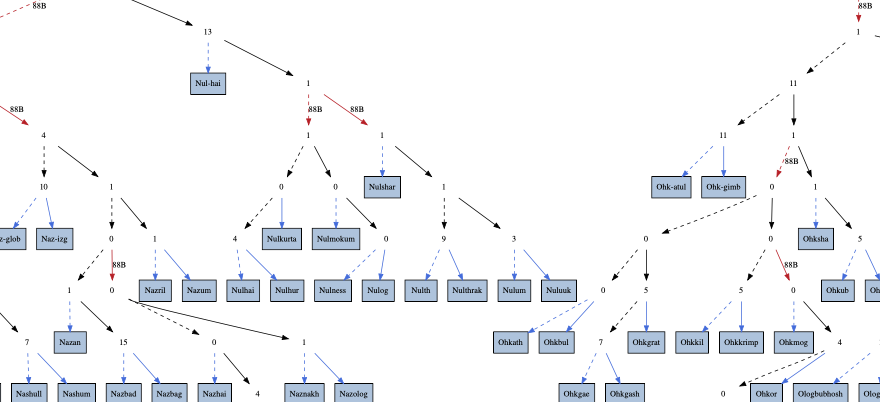

# trie\.h #

## Prefix Tree ##

 * [Description](#user-content-preamble)
 * [Typedef Aliases](#user-content-typedef): [&lt;PT&gt;type](#user-content-typedef-245060ab), [&lt;PT&gt;key_fn](#user-content-typedef-1e6e6b3f), [&lt;PT&gt;replace_fn](#user-content-typedef-246bd5da), [&lt;PZ&gt;to_string_fn](#user-content-typedef-22f3d7f1), [&lt;PT&gt;action_fn](#user-content-typedef-ba462b2e)
 * [Struct, Union, and Enum Definitions](#user-content-tag): [&lt;T&gt;trie](#user-content-tag-754a10a5), [&lt;T&gt;trie_iterator](#user-content-tag-854250a4)
 * [Function Summary](#user-content-summary)
 * [Function Definitions](#user-content-fn)
 * [License](#user-content-license)

## <a id = "user-content-preamble" name = "user-content-preamble">Description</a> ##

A [&lt;T&gt;trie](#user-content-tag-754a10a5) is a prefix tree, digital tree, or trie, implemented as an array of pointers\-to\-`T` and an index on the key string\. It can be seen as a [Morrison, 1968 PATRICiA](https://scholar.google.ca/scholar?q=Morrison%2C+1968+PATRICiA): a compact [binary radix trie](https://en.wikipedia.org/wiki/Radix_tree), only storing the where the key bits are different\. Strings can be any encoding with a byte null\-terminator, including [modified UTF-8](https://en.wikipedia.org/wiki/UTF-8#Modified_UTF-8)\.

In memory, it is similar to [Bayer, McCreight, 1972 Large](https://scholar.google.ca/scholar?q=Bayer%2C+McCreight%2C+1972+Large)\. Using [Knuth, 1998 Art 3](https://scholar.google.ca/scholar?q=Knuth%2C+1998+Art+3) terminology, but instead of a B\-tree of order\-n nodes, it is a forest of non\-empty complete binary trees\. Thus the leaves in a tree are also the branching factor; the maximum is the order, fixed by compilation macros\.

 * Parameter: TRIE\_NAME, TRIE\_TYPE  
   [&lt;PT&gt;type](#user-content-typedef-245060ab) that satisfies `C` naming conventions when mangled and an optional returnable type that is declared, \(it is used by reference only except if `TRIE_TEST`\.\) `<PT>` is private, whose names are prefixed in a manner to avoid collisions\.
 * Parameter: TRIE\_KEY  
   A function that satisfies [&lt;PT&gt;key_fn](#user-content-typedef-1e6e6b3f)\. Must be defined if and only if `TRIE_TYPE` is defined\. \(This imbues it with the properties of an associative array\.\)
 * Parameter: TRIE\_TO\_STRING  
   Defining this includes [to\_string\.h](to_string.h), with the keys as the string\.
 * Parameter: TRIE\_TEST  
   Unit testing framework [&lt;T&gt;trie_test](#user-content-fn-ae9d3396), included in a separate header, [\.\./test/test\_trie\.h](../test/test_trie.h)\. Must be defined equal to a \(random\) filler function, satisfying [&lt;PT&gt;action_fn](#user-content-typedef-ba462b2e)\. Requires `TRIE_TO_STRING` and that `NDEBUG` not be defined\.
 * Standard:  
   C89
 * Caveat:  
   ([&lt;T&gt;trie_from_array](#user-content-fn-3554106c))

## <a id = "user-content-typedef" name = "user-content-typedef">Typedef Aliases</a> ##

### <a id = "user-content-typedef-245060ab" name = "user-content-typedef-245060ab">&lt;PT&gt;type</a> ###

<code>typedef TRIE_TYPE <strong>&lt;PT&gt;type</strong>;</code>

Declared type of the trie; `char` default\.

### <a id = "user-content-typedef-1e6e6b3f" name = "user-content-typedef-1e6e6b3f">&lt;PT&gt;key_fn</a> ###

<code>typedef const char *(*<strong>&lt;PT&gt;key_fn</strong>)(const &lt;PT&gt;type *);</code>

Responsible for picking out the null\-terminated string\. Modifying the string key in the original [&lt;PT&gt;type](#user-content-typedef-245060ab) while in any trie causes the entire trie to go into an undefined state\.

### <a id = "user-content-typedef-246bd5da" name = "user-content-typedef-246bd5da">&lt;PT&gt;replace_fn</a> ###

<code>typedef int(*<strong>&lt;PT&gt;replace_fn</strong>)(&lt;PT&gt;type *original, &lt;PT&gt;type *replace);</code>

A bi\-predicate; returns true if the `replace` replaces the `original`; used in [&lt;T&gt;trie_policy_put](#user-content-fn-50d1d256)\.

### <a id = "user-content-typedef-22f3d7f1" name = "user-content-typedef-22f3d7f1">&lt;PZ&gt;to_string_fn</a> ###

<code>typedef void(*<strong>&lt;PZ&gt;to_string_fn</strong>)(const &lt;PZ&gt;type *, char(*)[12]);</code>

Responsible for turning the first argument into a 12\-`char` null\-terminated output string\.

### <a id = "user-content-typedef-ba462b2e" name = "user-content-typedef-ba462b2e">&lt;PT&gt;action_fn</a> ###

<code>typedef void(*<strong>&lt;PT&gt;action_fn</strong>)(&lt;PT&gt;type *);</code>

Works by side\-effects, _ie_ fills the type with data\. Only defined if `TRIE_TEST`\.

## <a id = "user-content-tag" name = "user-content-tag">Struct, Union, and Enum Definitions</a> ##

### <a id = "user-content-tag-754a10a5" name = "user-content-tag-754a10a5">&lt;T&gt;trie</a> ###

<code>struct <strong>&lt;T&gt;trie</strong>;</code>

To initialize it to an idle state, see [&lt;T&gt;trie](#user-content-fn-754a10a5), `TRIE_IDLE`, `{0}` \(`C99`\), or being `static`\.

### <a id = "user-content-tag-854250a4" name = "user-content-tag-854250a4">&lt;T&gt;trie_iterator</a> ###

<code>struct <strong>&lt;T&gt;trie_iterator</strong> { union &lt;PT&gt;any_tree root, next, end; unsigned leaf, leaf_end; };</code>

Stores a range in the trie\. Any changes in the topology of the trie invalidate it\.

## <a id = "user-content-summary" name = "user-content-summary">Function Summary</a> ##

<table>

<tr><th>Modifiers</th><th>Function Name</th><th>Argument List</th></tr>

<tr><td align = right>static void</td><td><a href = "#user-content-fn-754a10a5">&lt;T&gt;trie</a></td><td>trie</td></tr>

<tr><td align = right>static void</td><td><a href = "#user-content-fn-9d98b98e">&lt;T&gt;trie_</a></td><td>trie</td></tr>

<tr><td align = right>static int</td><td><a href = "#user-content-fn-3554106c">&lt;T&gt;trie_from_array</a></td><td>trie, array, array_size</td></tr>

<tr><td align = right>static &lt;PT&gt;type *</td><td><a href = "#user-content-fn-46d99cc7">&lt;T&gt;trie_match</a></td><td>trie, key</td></tr>

<tr><td align = right>static &lt;PT&gt;type *</td><td><a href = "#user-content-fn-d0ca0cba">&lt;T&gt;trie_get</a></td><td>trie, key</td></tr>

<tr><td align = right>static int</td><td><a href = "#user-content-fn-70c096ed">&lt;T&gt;trie_add</a></td><td>trie, x</td></tr>

<tr><td align = right>static int</td><td><a href = "#user-content-fn-bd93d12b">&lt;T&gt;trie_put</a></td><td>trie, x, eject</td></tr>

<tr><td align = right>static int</td><td><a href = "#user-content-fn-50d1d256">&lt;T&gt;trie_policy_put</a></td><td>trie, x, eject, replace</td></tr>

<tr><td align = right>static size_t</td><td><a href = "#user-content-fn-b7ff4bcf">&lt;T&gt;trie_size</a></td><td>it</td></tr>

<tr><td align = right>static const char *</td><td><a href = "#user-content-fn-4ecb4112">&lt;Z&gt;to_string</a></td><td>box</td></tr>

<tr><td align = right>static void</td><td><a href = "#user-content-fn-ae9d3396">&lt;T&gt;trie_test</a></td><td></td></tr>

</table>

## <a id = "user-content-fn" name = "user-content-fn">Function Definitions</a> ##

### <a id = "user-content-fn-754a10a5" name = "user-content-fn-754a10a5">&lt;T&gt;trie</a> ###

<code>static void <strong>&lt;T&gt;trie</strong>(struct &lt;T&gt;trie *const <em>trie</em>)</code>

Initialises `trie` to idle\.

 * Order:  
   &#920;\(1\)

### <a id = "user-content-fn-9d98b98e" name = "user-content-fn-9d98b98e">&lt;T&gt;trie_</a> ###

<code>static void <strong>&lt;T&gt;trie_</strong>(struct &lt;T&gt;trie *const <em>trie</em>)</code>

Returns an initialised `trie` to idle\.

### <a id = "user-content-fn-3554106c" name = "user-content-fn-3554106c">&lt;T&gt;trie_from_array</a> ###

<code>static int <strong>&lt;T&gt;trie_from_array</strong>(struct &lt;T&gt;trie *const <em>trie</em>, &lt;PT&gt;type *const *const <em>array</em>, const size_t <em>array_size</em>)</code>

Initializes `trie` from an `array` of pointers\-to\-`<T>` of `array_size`\.

 * Return:  
   Success\.
 * Exceptional return: realloc  
 * Order:  
   &#927;\(`array_size`\)
 * Caveat:  
   Write this function, somehow\.

### <a id = "user-content-fn-46d99cc7" name = "user-content-fn-46d99cc7">&lt;T&gt;trie_match</a> ###

<code>static &lt;PT&gt;type *<strong>&lt;T&gt;trie_match</strong>(const struct &lt;T&gt;trie *const <em>trie</em>, const char *const <em>key</em>)</code>

 * Return:  
   Looks at only the index of `trie` for potential `key` matches, but will ignore the values of the bits that are not in the index\.
 * Order:  
   &#927;\(|`key`|\)

### <a id = "user-content-fn-d0ca0cba" name = "user-content-fn-d0ca0cba">&lt;T&gt;trie_get</a> ###

<code>static &lt;PT&gt;type *<strong>&lt;T&gt;trie_get</strong>(const struct &lt;T&gt;trie *const <em>trie</em>, const char *const <em>key</em>)</code>

 * Return:  
   Exact match for `key` in `trie` or null no such item exists\.
 * Order:  
   &#927;\(|`key`|\), [Thareja 2011, Data](https://scholar.google.ca/scholar?q=Thareja+2011%2C+Data)\.

### <a id = "user-content-fn-70c096ed" name = "user-content-fn-70c096ed">&lt;T&gt;trie_add</a> ###

<code>static int <strong>&lt;T&gt;trie_add</strong>(struct &lt;T&gt;trie *const <em>trie</em>, &lt;PT&gt;type *const <em>x</em>)</code>

Adds a pointer to `x` into `trie` if the key doesn't exist already\.

 * Return:  
   If the key did not exist and it was created, returns true\. If the key of `x` is already in `trie`, or an error occurred, returns false\.
 * Exceptional return: realloc, ERANGE  
   Set `errno = 0` before to tell if the operation failed due to error\.
 * Order:  
   &#927;\(|`key`|\)

### <a id = "user-content-fn-bd93d12b" name = "user-content-fn-bd93d12b">&lt;T&gt;trie_put</a> ###

<code>static int <strong>&lt;T&gt;trie_put</strong>(struct &lt;T&gt;trie *const <em>trie</em>, &lt;PT&gt;type *const <em>x</em>, &lt;PT&gt;type **const <em>eject</em>)</code>

Updates or adds a pointer to `x` into `trie`\.

 * Parameter: _eject_  
   If not null, on success it will hold the overwritten value or a pointer\-to\-null if it did not overwrite any value\.
 * Return:  
   Success\.
 * Exceptional return: realloc, ERANGE  
 * Order:  
   &#927;\(|`key`|\)

### <a id = "user-content-fn-50d1d256" name = "user-content-fn-50d1d256">&lt;T&gt;trie_policy_put</a> ###

<code>static int <strong>&lt;T&gt;trie_policy_put</strong>(struct &lt;T&gt;trie *const <em>trie</em>, &lt;PT&gt;type *const <em>x</em>, &lt;PT&gt;type **const <em>eject</em>, const &lt;PT&gt;replace_fn <em>replace</em>)</code>

Adds a pointer to `x` to `trie` only if the entry is absent or if calling `replace` returns true or is null\.

 * Parameter: _eject_  
   If not null, on success it will hold the overwritten value or a pointer\-to\-null if it did not overwrite any value\. If a collision occurs and `replace` does not return true, this will be a pointer to `x`\.
 * Parameter: _replace_  
   Called on collision and only replaces it if the function returns true\. If null, it is semantically equivalent to [&lt;T&gt;trie_put](#user-content-fn-bd93d12b)\.
 * Return:  
   Success\.
 * Exceptional return: realloc, ERANGE  
 * Order:  
   &#927;\(|`key`|\)

### <a id = "user-content-fn-b7ff4bcf" name = "user-content-fn-b7ff4bcf">&lt;T&gt;trie_size</a> ###

<code>static size_t <strong>&lt;T&gt;trie_size</strong>(const struct &lt;T&gt;trie_iterator *const <em>it</em>)</code>

Counts the of the items in the new `it`; iterator must be new, \(calling [&lt;T&gt;trie_next](#user-content-fn-f36d1483) causes it to become undefined\.\)

 * Order:  
   &#927;\(|`it`|\)

### <a id = "user-content-fn-4ecb4112" name = "user-content-fn-4ecb4112">&lt;Z&gt;to_string</a> ###

<code>static const char *<strong>&lt;Z&gt;to_string</strong>(const &lt;PZ&gt;box *const <em>box</em>)</code>

 * Return:  
   Print the contents of `box` in a static string buffer of 256 bytes with limitations of only printing 4 things at a time\.
 * Order:  
   &#920;\(1\)

### <a id = "user-content-fn-ae9d3396" name = "user-content-fn-ae9d3396">&lt;T&gt;trie_test</a> ###

<code>static void <strong>&lt;T&gt;trie_test</strong>(void)</code>

Will be tested on stdout\. Requires `TRIE_TEST`, and not `NDEBUG` while defining `assert`\.

## <a id = "user-content-license" name = "user-content-license">License</a> ##

2020 Neil Edelman, distributed under the terms of the [MIT License](https://opensource.org/licenses/MIT)\.

