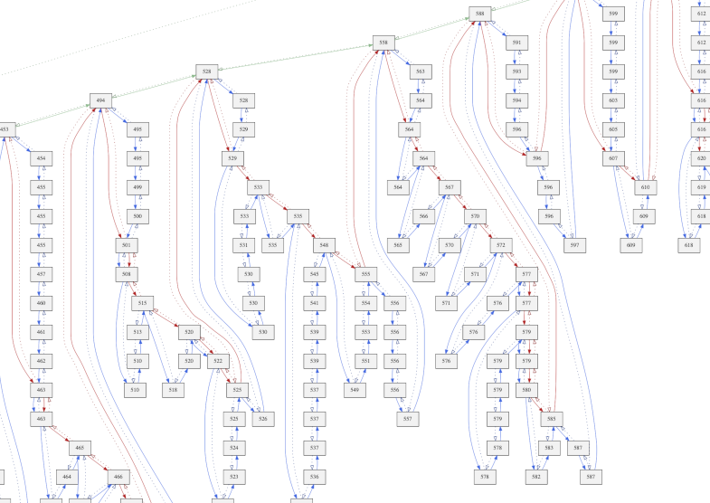

# List\.h #

## Parameterised Doubly\-Linked Closed List ##

 * [Description](#user-content-preamble)
 * [Typedef Aliases](#user-content-typedef): [&lt;PN&gt;ToString](#user-content-typedef-3f3210e1), [&lt;PN&gt;Action](#user-content-typedef-aea37eeb), [&lt;PN&gt;Predicate](#user-content-typedef-48c42a2a), [&lt;PN&gt;Compare](#user-content-typedef-afc5e5e8)
 * [Struct, Union, and Enum Definitions](#user-content-tag): [&lt;N&gt;ListLink](#user-content-tag-f795158f), [&lt;N&gt;List](#user-content-tag-3824ef2b)
 * [Function Summary](#user-content-summary)
 * [Function Definitions](#user-content-fn)
 * [License](#user-content-license)

## <a id = "user-content-preamble" name = "user-content-preamble">Description</a> ##

[&lt;N&gt;List](#user-content-tag-3824ef2b) is a list of [&lt;N&gt;ListLink](#user-content-tag-f795158f); it may be supplied a total\-order function, `LIST_COMPARE` [&lt;PN&gt;Compare](#user-content-typedef-afc5e5e8)\.

Internally, `<N>ListLink` is a doubly\-linked node with sentinels residing in `<N>List`\. It only provides an order, but `<N>ListLink` may be enclosed in another `struct` as needed\.

`<N>Link` is not synchronised\. The parameters are `#define` preprocessor macros, and are all undefined at the end of the file for convenience\. To stop assertions, use `#define NDEBUG` before inclusion of `assert.h`, \(which is used in this file\.\)

Debug: ensures that `link` has no cycles\.

 * Parameter: LIST\_NAME  
   `<N>` that satisfies `C` naming conventions when mangled; required\. `<PN>` is private, whose names are prefixed in a manner to avoid collisions; any should be re\-defined prior to use elsewhere\.
 * Parameter: LIST\_COMPARE  
   Optional total\-order function satisfying [&lt;PN&gt;Compare](#user-content-typedef-afc5e5e8)\.
 * Parameter: LIST\_TO\_STRING  
   Optional print function implementing [&lt;PN&gt;ToString](#user-content-typedef-3f3210e1); makes available [&lt;N&gt;ListToString](#user-content-fn-b8333b17)\.
 * Parameter: LIST\_TEST  
   Unit testing framework [&lt;N&gt;ListTest](#user-content-fn-c10071df), included in a separate header, [\.\./test/TestList\.h](../test/TestList.h)\. Must be defined equal to a random filler function, satisfying [&lt;PN&gt;Action](#user-content-typedef-aea37eeb)\. Requires `LIST_TO_STRING` and not `NDEBUG`\.
 * Standard:  
   C89
 * See also:  
   [Array](https://github.com/neil-edelman/Array); [Orcish](https://github.com/neil-edelman/Orcish); [Pool](https://github.com/neil-edelman/Pool); [Set](https://github.com/neil-edelman/Set)

## <a id = "user-content-typedef" name = "user-content-typedef">Typedef Aliases</a> ##

### <a id = "user-content-typedef-3f3210e1" name = "user-content-typedef-3f3210e1">&lt;PN&gt;ToString</a> ###

<code>typedef void(*<strong>&lt;PN&gt;ToString</strong>)(const struct &lt;N&gt;ListLink *, char(*)[12]);</code>

Responsible for turning [&lt;N&gt;ListLink](#user-content-tag-f795158f) \(the first argument\) into a maximum 11\-`char` string \(the second\.\) Defined when `LIST_TO_STRING`\.

### <a id = "user-content-typedef-aea37eeb" name = "user-content-typedef-aea37eeb">&lt;PN&gt;Action</a> ###

<code>typedef void(*<strong>&lt;PN&gt;Action</strong>)(struct &lt;N&gt;ListLink *);</code>

Operates by side\-effects on the link\.

### <a id = "user-content-typedef-48c42a2a" name = "user-content-typedef-48c42a2a">&lt;PN&gt;Predicate</a> ###

<code>typedef int(*<strong>&lt;PN&gt;Predicate</strong>)(const struct &lt;N&gt;ListLink *);</code>

Returns \(Non\-zero\) true or \(zero\) false when given a link\.

### <a id = "user-content-typedef-afc5e5e8" name = "user-content-typedef-afc5e5e8">&lt;PN&gt;Compare</a> ###

<code>typedef int(*<strong>&lt;PN&gt;Compare</strong>)(const struct &lt;N&gt;ListLink *a, const struct &lt;N&gt;ListLink *b);</code>

Returns less then, equal to, or greater then zero, forming an equivalence relation between `a` as compared to `b`\. Defined when `LIST_COMPARE`\.

## <a id = "user-content-tag" name = "user-content-tag">Struct, Union, and Enum Definitions</a> ##

### <a id = "user-content-tag-f795158f" name = "user-content-tag-f795158f">&lt;N&gt;ListLink</a> ###

<code>struct <strong>&lt;N&gt;ListLink</strong>;</code>

Storage of this structure is the responsibility of the caller\. One can only be in one list at a time; adding to another list while in a list destroys the integrity of the original list, see [&lt;N&gt;ListRemove](#user-content-fn-c8eb957)\.

### <a id = "user-content-tag-3824ef2b" name = "user-content-tag-3824ef2b">&lt;N&gt;List</a> ###

<code>struct <strong>&lt;N&gt;List</strong>;</code>

Serves as head and tail for linked\-list of [&lt;N&gt;ListLink](#user-content-tag-f795158f)\. Use [&lt;N&gt;ListClear](#user-content-fn-d4583b4) to initialise the list\. Because this list is closed; that is, given a valid pointer to an element, one can determine all others, null values are not allowed and it is _not_ the same as `{0}`\.

## <a id = "user-content-summary" name = "user-content-summary">Function Summary</a> ##

<table>

<tr><th>Modifiers</th><th>Function Name</th><th>Argument List</th></tr>

<tr><td align = right>static void</td><td><a href = "#user-content-fn-d4583b4">&lt;N&gt;ListClear</a></td><td>list</td></tr>

<tr><td align = right>static struct &lt;N&gt;ListLink *</td><td><a href = "#user-content-fn-9e54923f">&lt;N&gt;ListFirst</a></td><td>list</td></tr>

<tr><td align = right>static struct &lt;N&gt;ListLink *</td><td><a href = "#user-content-fn-841e6ddb">&lt;N&gt;ListLast</a></td><td>list</td></tr>

<tr><td align = right>static struct &lt;N&gt;ListLink *</td><td><a href = "#user-content-fn-3fe1382e">&lt;N&gt;ListPrevious</a></td><td>link</td></tr>

<tr><td align = right>static struct &lt;N&gt;ListLink *</td><td><a href = "#user-content-fn-d8db41e2">&lt;N&gt;ListNext</a></td><td>link</td></tr>

<tr><td align = right>static void</td><td><a href = "#user-content-fn-36544fb8">&lt;N&gt;ListUnshift</a></td><td>list, add</td></tr>

<tr><td align = right>static void</td><td><a href = "#user-content-fn-9cabbaef">&lt;N&gt;ListPush</a></td><td>list, add</td></tr>

<tr><td align = right>static void</td><td><a href = "#user-content-fn-a1d3ad9">&lt;N&gt;ListAddBefore</a></td><td>anchor, add</td></tr>

<tr><td align = right>static void</td><td><a href = "#user-content-fn-99b62ff4">&lt;N&gt;ListAddAfter</a></td><td>anchor, add</td></tr>

<tr><td align = right>static void</td><td><a href = "#user-content-fn-c8eb957">&lt;N&gt;ListRemove</a></td><td>link</td></tr>

<tr><td align = right>static struct &lt;N&gt;ListLink *</td><td><a href = "#user-content-fn-9c2ff119">&lt;N&gt;ListShift</a></td><td>list</td></tr>

<tr><td align = right>static struct &lt;N&gt;ListLink *</td><td><a href = "#user-content-fn-d736954e">&lt;N&gt;ListPop</a></td><td>list</td></tr>

<tr><td align = right>static void</td><td><a href = "#user-content-fn-ef4618a6">&lt;N&gt;ListTo</a></td><td>from, to</td></tr>

<tr><td align = right>static void</td><td><a href = "#user-content-fn-c9ee0371">&lt;N&gt;ListToBefore</a></td><td>from, anchor</td></tr>

<tr><td align = right>static void</td><td><a href = "#user-content-fn-55804f41">&lt;N&gt;ListToIf</a></td><td>from, to, predicate</td></tr>

<tr><td align = right>static void</td><td><a href = "#user-content-fn-76821c93">&lt;N&gt;ListForEach</a></td><td>list, action</td></tr>

<tr><td align = right>static struct &lt;N&gt;ListLink *</td><td><a href = "#user-content-fn-9003cf4b">&lt;N&gt;ListAny</a></td><td>list, predicate</td></tr>

<tr><td align = right>static void</td><td><a href = "#user-content-fn-a211f931">&lt;N&gt;ListSelfCorrect</a></td><td>list</td></tr>

<tr><td align = right>static void</td><td><a href = "#user-content-fn-5db2b073">&lt;N&gt;ListSort</a></td><td>list</td></tr>

<tr><td align = right>static void</td><td><a href = "#user-content-fn-d01d25f9">&lt;N&gt;ListMerge</a></td><td>list, from</td></tr>

<tr><td align = right>static int</td><td><a href = "#user-content-fn-a299d89a">&lt;N&gt;ListCompare</a></td><td>alist, blist</td></tr>

<tr><td align = right>static void</td><td><a href = "#user-content-fn-6b7d586c">&lt;N&gt;ListDuplicatesTo</a></td><td>from, to</td></tr>

<tr><td align = right>static void</td><td><a href = "#user-content-fn-84bacf56">&lt;N&gt;ListSubtractionTo</a></td><td>a, b, result</td></tr>

<tr><td align = right>static void</td><td><a href = "#user-content-fn-cea0fcef">&lt;N&gt;ListUnionTo</a></td><td>a, b, result</td></tr>

<tr><td align = right>static void</td><td><a href = "#user-content-fn-f4e619bb">&lt;N&gt;ListIntersectionTo</a></td><td>a, b, result</td></tr>

<tr><td align = right>static void</td><td><a href = "#user-content-fn-c2be8709">&lt;N&gt;ListXorTo</a></td><td>a, b, result</td></tr>

<tr><td align = right>static const char *</td><td><a href = "#user-content-fn-b8333b17">&lt;N&gt;ListToString</a></td><td>list</td></tr>

<tr><td align = right>static void</td><td><a href = "#user-content-fn-c10071df">&lt;N&gt;ListTest</a></td><td>parent_new, parent</td></tr>

</table>

## <a id = "user-content-fn" name = "user-content-fn">Function Definitions</a> ##

### <a id = "user-content-fn-d4583b4" name = "user-content-fn-d4583b4">&lt;N&gt;ListClear</a> ###

<code>static void <strong>&lt;N&gt;ListClear</strong>(struct &lt;N&gt;List *const <em>list</em>)</code>

Clears and removes all values from `list`, thereby initialising it\. All previous values are un\-associated\.

 * Parameter: _list_  
   if null, does nothing\.
 * Order:  
   &#920;\(1\)

### <a id = "user-content-fn-9e54923f" name = "user-content-fn-9e54923f">&lt;N&gt;ListFirst</a> ###

<code>static struct &lt;N&gt;ListLink *<strong>&lt;N&gt;ListFirst</strong>(const struct &lt;N&gt;List *const <em>list</em>)</code>

 * Parameter: _list_  
   If null, returns null\.
 * Return:  
   A pointer to the first element of `list`, if it exists\.
 * Order:  
   &#920;\(1\)

### <a id = "user-content-fn-841e6ddb" name = "user-content-fn-841e6ddb">&lt;N&gt;ListLast</a> ###

<code>static struct &lt;N&gt;ListLink *<strong>&lt;N&gt;ListLast</strong>(const struct &lt;N&gt;List *const <em>list</em>)</code>

 * Parameter: _list_  
   If null, returns null\.
 * Return:  
   A pointer to the last element of `list`, if it exists\.
 * Order:  
   &#920;\(1\)

### <a id = "user-content-fn-3fe1382e" name = "user-content-fn-3fe1382e">&lt;N&gt;ListPrevious</a> ###

<code>static struct &lt;N&gt;ListLink *<strong>&lt;N&gt;ListPrevious</strong>(struct &lt;N&gt;ListLink *<em>link</em>)</code>

 * Parameter: _link_  
   If null, returns null, otherwise must be part of a list\.
 * Return:  
   The previous element\. When `link` is the first element, returns null\.
 * Order:  
   &#920;\(1\)

### <a id = "user-content-fn-d8db41e2" name = "user-content-fn-d8db41e2">&lt;N&gt;ListNext</a> ###

<code>static struct &lt;N&gt;ListLink *<strong>&lt;N&gt;ListNext</strong>(struct &lt;N&gt;ListLink *<em>link</em>)</code>

 * Parameter: _link_  
   If null, returns null, otherwise must be part of a list\.
 * Return:  
   The next element\. When `link` is the last element, returns null\.
 * Order:  
   &#920;\(1\)

### <a id = "user-content-fn-36544fb8" name = "user-content-fn-36544fb8">&lt;N&gt;ListUnshift</a> ###

<code>static void <strong>&lt;N&gt;ListUnshift</strong>(struct &lt;N&gt;List *const <em>list</em>, struct &lt;N&gt;ListLink *const <em>add</em>)</code>

Adds `add` to the beginning of `list`\.

 * Parameter: _list_  
   If null, does nothing\.
 * Parameter: _add_  
   If null, does nothing\. Should not associated to any list\.
 * Order:  
   &#920;\(1\)

### <a id = "user-content-fn-9cabbaef" name = "user-content-fn-9cabbaef">&lt;N&gt;ListPush</a> ###

<code>static void <strong>&lt;N&gt;ListPush</strong>(struct &lt;N&gt;List *const <em>list</em>, struct &lt;N&gt;ListLink *const <em>add</em>)</code>

Adds `add` to the end of `list`\.

 * Parameter: _list_  
   If null, does nothing\.
 * Parameter: _add_  
   If null, does nothing\. Should not associated to any list\.
 * Order:  
   &#920;\(1\)

### <a id = "user-content-fn-a1d3ad9" name = "user-content-fn-a1d3ad9">&lt;N&gt;ListAddBefore</a> ###

<code>static void <strong>&lt;N&gt;ListAddBefore</strong>(struct &lt;N&gt;ListLink *const <em>anchor</em>, struct &lt;N&gt;ListLink *const <em>add</em>)</code>

Adds `add` immediately before `anchor`\.

 * Parameter: _anchor_  
   If null, does nothing\. Must be part of a list\.
 * Parameter: _add_  
   If null, does nothing\. Should not be part of any list\.
 * Order:  
   &#920;\(1\)

### <a id = "user-content-fn-99b62ff4" name = "user-content-fn-99b62ff4">&lt;N&gt;ListAddAfter</a> ###

<code>static void <strong>&lt;N&gt;ListAddAfter</strong>(struct &lt;N&gt;ListLink *const <em>anchor</em>, struct &lt;N&gt;ListLink *const <em>add</em>)</code>

Adds `add` immediately after `anchor`\.

 * Parameter: _anchor_  
   If null, does nothing\. Must be part of a list\.
 * Parameter: _add_  
   If null, does nothing\. Should not be part of any list\.
 * Order:  
   &#920;\(1\)

### <a id = "user-content-fn-c8eb957" name = "user-content-fn-c8eb957">&lt;N&gt;ListRemove</a> ###

<code>static void <strong>&lt;N&gt;ListRemove</strong>(struct &lt;N&gt;ListLink *const <em>link</em>)</code>

Un\-associates `link` from the list; consequently, the `link` is free to add to another list\. Removing an element that was not added to a list results in undefined behaviour\.

 * Parameter: _link_  
   If null, does nothing\.
 * Order:  
   &#920;\(1\)

### <a id = "user-content-fn-9c2ff119" name = "user-content-fn-9c2ff119">&lt;N&gt;ListShift</a> ###

<code>static struct &lt;N&gt;ListLink *<strong>&lt;N&gt;ListShift</strong>(struct &lt;N&gt;List *const <em>list</em>)</code>

Un\-associates the first element of `list`\.

 * Parameter: _list_  
   If null, returns null\.
 * Return:  
   The erstwhile first element or null if the list was empty\.
 * Order:  
   &#920;\(1\)

### <a id = "user-content-fn-d736954e" name = "user-content-fn-d736954e">&lt;N&gt;ListPop</a> ###

<code>static struct &lt;N&gt;ListLink *<strong>&lt;N&gt;ListPop</strong>(struct &lt;N&gt;List *const <em>list</em>)</code>

Un\-associates the last element of `list`\.

 * Parameter: _list_  
   If null, returns null\.
 * Return:  
   The erstwhile last element or null if the list was empty\.
 * Order:  
   &#920;\(1\)

### <a id = "user-content-fn-ef4618a6" name = "user-content-fn-ef4618a6">&lt;N&gt;ListTo</a> ###

<code>static void <strong>&lt;N&gt;ListTo</strong>(struct &lt;N&gt;List *const <em>from</em>, struct &lt;N&gt;List *const <em>to</em>)</code>

Moves the elements `from` onto `to` at the end\.

 * Parameter: _from_  
   If null, it does nothing, otherwise this list will be empty on return\.
 * Parameter: _to_  
   If null, then it removes elements from `from`\.
 * Order:  
   &#920;\(1\)

### <a id = "user-content-fn-c9ee0371" name = "user-content-fn-c9ee0371">&lt;N&gt;ListToBefore</a> ###

<code>static void <strong>&lt;N&gt;ListToBefore</strong>(struct &lt;N&gt;List *const <em>from</em>, struct &lt;N&gt;ListLink *const <em>anchor</em>)</code>

Moves the elements `from` immediately before `anchor`\.

 * Parameter: _from_  
   If null, does nothing\. This list will be empty on return\.
 * Parameter: _anchor_  
   If null, does nothing\. Must be part of a valid list that is not `from`\.
 * Order:  
   &#920;\(1\)

### <a id = "user-content-fn-55804f41" name = "user-content-fn-55804f41">&lt;N&gt;ListToIf</a> ###

<code>static void <strong>&lt;N&gt;ListToIf</strong>(struct &lt;N&gt;List *const <em>from</em>, struct &lt;N&gt;List *const <em>to</em>, const &lt;PN&gt;Predicate <em>predicate</em>)</code>

Moves all elements `from` onto `to` at the end if `predicate` is null or true\.

 * Parameter: _from_  
   If null, does nothing\.
 * Parameter: _to_  
   If null, then it removes elements\.
 * Order:  
   &#920;\(|`from`|\) &#215; &#927;\(`predicate`\)

### <a id = "user-content-fn-76821c93" name = "user-content-fn-76821c93">&lt;N&gt;ListForEach</a> ###

<code>static void <strong>&lt;N&gt;ListForEach</strong>(struct &lt;N&gt;List *const <em>list</em>, const &lt;PN&gt;Action <em>action</em>)</code>

Performs `action` for each element in `list` in order\. `action` can be to delete the element\.

 * Parameter: _list_  
   If null, does nothing\.
 * Parameter: _action_  
   If null, does nothing\.
 * Order:  
   &#920;\(|`list`|\) &#215; O\(`action`\)

### <a id = "user-content-fn-9003cf4b" name = "user-content-fn-9003cf4b">&lt;N&gt;ListAny</a> ###

<code>static struct &lt;N&gt;ListLink *<strong>&lt;N&gt;ListAny</strong>(const struct &lt;N&gt;List *const <em>list</em>, const &lt;PN&gt;Predicate <em>predicate</em>)</code>

Iterates through `list` and calls `predicate` until it returns true\.

 * Parameter: _list_  
   If null, returns null\.
 * Parameter: _predicate_  
   If null, returns null\.
 * Return:  
   The first `predicate` that returned true, or, if the statement is false on all, null\.
 * Order:  
   &#927;\(|`list`|\) &#215; &#927;\(`predicate`\)

### <a id = "user-content-fn-a211f931" name = "user-content-fn-a211f931">&lt;N&gt;ListSelfCorrect</a> ###

<code>static void <strong>&lt;N&gt;ListSelfCorrect</strong>(struct &lt;N&gt;List *const <em>list</em>)</code>

Usually [&lt;N&gt;List](#user-content-tag-3824ef2b) doesn't change memory locations, but when it does, this corrects `list`'s two ends, \(not the nodes, which must be fixed\.\) Note that the two ends become invalid even when it's empty\.

 * Parameter: _list_  
   If null, does nothing\.
 * Order:  
   &#920;\(1\)

### <a id = "user-content-fn-5db2b073" name = "user-content-fn-5db2b073">&lt;N&gt;ListSort</a> ###

<code>static void <strong>&lt;N&gt;ListSort</strong>(struct &lt;N&gt;List *const <em>list</em>)</code>

Performs a stable, adaptive sort of `list` according to `compare`\. Requires `LIST_COMPARE`\. [Peters 2002, Timsort](https://scholar.google.ca/scholar?q=Peters+2002%2C+Timsort), _via_ [McIlroy 1993, Optimistic](https://scholar.google.ca/scholar?q=McIlroy+1993%2C+Optimistic), does long merges by galloping, but we don't have random access to the data because we are in a linked\-list; this does natural merge sort\.

 * Parameter: _list_  
   If null, does nothing\.
 * Order:  
   &#937;\(|`list`|\), &#927;\(|`list`| log |`list`|\)

### <a id = "user-content-fn-d01d25f9" name = "user-content-fn-d01d25f9">&lt;N&gt;ListMerge</a> ###

<code>static void <strong>&lt;N&gt;ListMerge</strong>(struct &lt;N&gt;List *const <em>list</em>, struct &lt;N&gt;List *const <em>from</em>)</code>

Merges from `from` into `list` according to `compare`\. If the elements are sorted in both lists, \(see [&lt;N&gt;ListSort](#user-content-fn-5db2b073),\) then the elements of `list` will be sorted, too\. Requires `LIST_COMPARE`\.

 * Parameter: _list_  
   If null, then it removes elements\.
 * Parameter: _from_  
   If null, does nothing, otherwise this list will be empty on return\.
 * Order:  
   &#927;\(|`list`| \+ |`from`|\)

### <a id = "user-content-fn-a299d89a" name = "user-content-fn-a299d89a">&lt;N&gt;ListCompare</a> ###

<code>static int <strong>&lt;N&gt;ListCompare</strong>(const struct &lt;N&gt;List *const <em>alist</em>, const struct &lt;N&gt;List *const <em>blist</em>)</code>

Compares `alist` to `blist` as sequences\. Requires `LIST_COMPARE`\.

 * Return:  
   The first `LIST_COMPARE` that is not equal to zero, or 0 if they are equal\. Null is considered as before everything else; two null pointers are considered equal\.
 * Implements:  
   [&lt;PN&gt;Compare](#user-content-typedef-afc5e5e8) as `<<PN>List>Compare`
 * Order:  
   &#920;\(min\(|`alist`|, |`blist`|\)\)

### <a id = "user-content-fn-6b7d586c" name = "user-content-fn-6b7d586c">&lt;N&gt;ListDuplicatesTo</a> ###

<code>static void <strong>&lt;N&gt;ListDuplicatesTo</strong>(struct &lt;N&gt;List *const <em>from</em>, struct &lt;N&gt;List *const <em>to</em>)</code>

Moves all local\-duplicates of `from` to the end of `to`\. Requires `LIST_COMPARE`\. All parameters must be unique or can be null\.

For example, if `from` is `(A, B, B, A)`, it would concatenate `(B)` to `to` and leave `(A, B, A)` in `from`\. If one [&lt;N&gt;ListSort](#user-content-fn-5db2b073) `from` first, `(A, A, B, B)`, the global duplicates will be transferred, `(A, B)`\.

 * Order:  
   O\(|`from`|\)

### <a id = "user-content-fn-84bacf56" name = "user-content-fn-84bacf56">&lt;N&gt;ListSubtractionTo</a> ###

<code>static void <strong>&lt;N&gt;ListSubtractionTo</strong>(struct &lt;N&gt;List *const <em>a</em>, struct &lt;N&gt;List *const <em>b</em>, struct &lt;N&gt;List *const <em>result</em>)</code>

Subtracts `a` from `b`, as sequential sorted individual elements, and moves it to `result`\. All elements are removed from `a`\. Requires `LIST_COMPARE`\. All parameters must be unique or can be null\.

For example, if `a` contains `(A, B, D)` and `b` contains `(B, C)` then `(a:A, a:D)` would be moved to `result`\.

 * Order:  
   &#927;\(|`a`| \+ |`b`|\)

### <a id = "user-content-fn-cea0fcef" name = "user-content-fn-cea0fcef">&lt;N&gt;ListUnionTo</a> ###

<code>static void <strong>&lt;N&gt;ListUnionTo</strong>(struct &lt;N&gt;List *const <em>a</em>, struct &lt;N&gt;List *const <em>b</em>, struct &lt;N&gt;List *const <em>result</em>)</code>

Moves the union of `a` and `b` as sequential sorted individual elements to `result`\. Equal elements are moved from `a`\. Requires `LIST_COMPARE`\. All parameters must be unique or can be null\.

For example, if `a` contains `(A, B, D)` and `b` contains `(B, C)` then `(a:A, a:B, b:C, a:D)` would be moved to `result`\.

 * Order:  
   &#927;\(|`a`| \+ |`b`|\)

### <a id = "user-content-fn-f4e619bb" name = "user-content-fn-f4e619bb">&lt;N&gt;ListIntersectionTo</a> ###

<code>static void <strong>&lt;N&gt;ListIntersectionTo</strong>(struct &lt;N&gt;List *const <em>a</em>, struct &lt;N&gt;List *const <em>b</em>, struct &lt;N&gt;List *const <em>result</em>)</code>

Moves the intersection of `a` and `b` as sequential sorted individual elements to `result`\. Equal elements are moved from `a`\. Requires `LIST_COMPARE`\. All parameters must be unique or can be null\.

For example, if `a` contains `(A, B, D)` and `b` contains `(B, C)` then `(a:B)` would be moved to `result`\.

 * Order:  
   &#927;\(|`a`| \+ |`b`|\)

### <a id = "user-content-fn-c2be8709" name = "user-content-fn-c2be8709">&lt;N&gt;ListXorTo</a> ###

<code>static void <strong>&lt;N&gt;ListXorTo</strong>(struct &lt;N&gt;List *const <em>a</em>, struct &lt;N&gt;List *const <em>b</em>, struct &lt;N&gt;List *const <em>result</em>)</code>

Moves `a` exclusive\-or `b` as sequential sorted individual elements to `result`\. Equal elements are moved from `a`\. Requires `LIST_COMPARE`\. All parameters must be unique or can be null\.

For example, if `a` contains `(A, B, D)` and `b` contains `(B, C)` then `(a:A, b:C, a:D)` would be moved to `result`\.

 * Order:  
   O\(|`a`| \+ |`b`|\)

### <a id = "user-content-fn-b8333b17" name = "user-content-fn-b8333b17">&lt;N&gt;ListToString</a> ###

<code>static const char *<strong>&lt;N&gt;ListToString</strong>(const struct &lt;N&gt;List *const <em>list</em>)</code>

Can print 2 things at once before it overwrites\. One must set `LIST_TO_STRING` to a function implementing [&lt;PN&gt;ToString](#user-content-typedef-3f3210e1) to get this functionality\.

 * Return:  
   Prints `list` in a static buffer\.
 * Order:  
   &#920;\(1\); it has a 1024 character limit; every element takes some\.

### <a id = "user-content-fn-c10071df" name = "user-content-fn-c10071df">&lt;N&gt;ListTest</a> ###

<code>static void <strong>&lt;N&gt;ListTest</strong>(struct &lt;N&gt;ListLink *(*const <em>parent_new</em>)(void *), void *const <em>parent</em>)</code>

The linked\-list will be tested on stdout\. `LIST_TEST` has to be set\.

 * Parameter: _parent\_new_  
   Responsible for creating new objects and returning the list\.
 * Parameter: _parent_  
   Responsible for creating new objects and returning the list\.

## <a id = "user-content-license" name = "user-content-license">License</a> ##

2017 Neil Edelman, distributed under the terms of the [MIT License](https://opensource.org/licenses/MIT)\.

