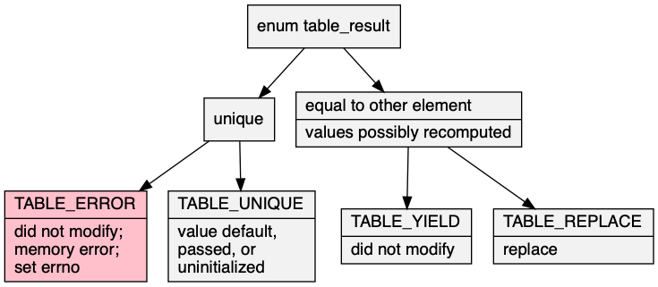

# table\.h #

## Hash table ##

 * [Description](#user-content-preamble)
 * [Typedef Aliases](#user-content-typedef): [&lt;PN&gt;uint](#user-content-typedef-c13937ad), [&lt;PN&gt;key](#user-content-typedef-e7af8dc0), [&lt;PN&gt;ckey](#user-content-typedef-c325bde5), [&lt;PN&gt;hash_fn](#user-content-typedef-5e79a292), [&lt;PN&gt;inverse_hash_fn](#user-content-typedef-a239fded), [&lt;PN&gt;is_equal_fn](#user-content-typedef-52314bb), [&lt;PN&gt;value](#user-content-typedef-218ce716), [&lt;PN&gt;entry](#user-content-typedef-a9017e7), [&lt;PN&gt;policy_fn](#user-content-typedef-1244a528), [&lt;PSZ&gt;to_string_fn](#user-content-typedef-8b890812)
 * [Struct, Union, and Enum Definitions](#user-content-tag): [table_result](#user-content-tag-4f1ea759), [&lt;N&gt;table_entry](#user-content-tag-b491b196), [&lt;N&gt;table](#user-content-tag-8f317be5), [&lt;N&gt;table_iterator](#user-content-tag-f67540e4)
 * [Function Summary](#user-content-summary)
 * [Function Definitions](#user-content-fn)
 * [License](#user-content-license)

## <a id = "user-content-preamble" name = "user-content-preamble">Description</a> ##

[&lt;N&gt;table](#user-content-tag-8f317be5) implements a set or map of [&lt;PN&gt;entry](#user-content-typedef-a9017e7) as a hash table\. It must be supplied a [&lt;PN&gt;hash_fn](#user-content-typedef-5e79a292) and, [&lt;PN&gt;is_equal_fn](#user-content-typedef-52314bb) or [&lt;PN&gt;inverse_hash_fn](#user-content-typedef-a239fded)\.

fixme

 * Parameter: TABLE\_NAME, TABLE\_KEY  
   `<N>` that satisfies `C` naming conventions when mangled and a valid [&lt;PN&gt;key](#user-content-typedef-e7af8dc0) associated therewith; required\. `<PN>` is private, whose names are prefixed in a manner to avoid collisions\.
 * Parameter: TABLE\_HASH, TABLE\_IS\_EQUAL, TABLE\_INVERSE  
   `TABLE_HASH`, and either `TABLE_IS_EQUAL` or `TABLE_INVERSE`, but not both, are required\. Function satisfying [&lt;PN&gt;hash_fn](#user-content-typedef-5e79a292), and [&lt;PN&gt;is_equal_fn](#user-content-typedef-52314bb) or [&lt;PN&gt;inverse_hash_fn](#user-content-typedef-a239fded)\.
 * Parameter: TABLE\_VALUE  
   An optional type that is the payload of the key, thus making this an associative array\. If the key is part of an aggregate value, it will be more efficient and robust to use a type conversion instead of storing related pointers\.
 * Parameter: TABLE\_UINT  
   This is [&lt;PN&gt;uint](#user-content-typedef-c13937ad), the unsigned type of hash hash of the key given by [&lt;PN&gt;hash_fn](#user-content-typedef-5e79a292); defaults to `size_t`\.
 * Parameter: TABLE\_EXPECT\_TRAIT  
   Do not un\-define certain variables for subsequent inclusion in a trait\.
 * Parameter: TABLE\_DEFAULT\_NAME, TABLE\_DEFAULT  
   Default trait; a name that satisfies `C` naming conventions when mangled and a [&lt;PN&gt;value](#user-content-typedef-218ce716) used in [&lt;N&gt;table&lt;D&gt;get](#user-content-fn-92774ccb)\. There can be multiple to defaults, but only one can omit `TABLE_DEFAULT_NAME`\.
 * Parameter: TABLE\_TO\_STRING\_NAME, TABLE\_TO\_STRING  
   To string trait contained in [to\_string\.h](to_string.h); `<SZ>` that satisfies `C` naming conventions when mangled and function implementing [&lt;PSZ&gt;to_string_fn](#user-content-typedef-8b890812)\. There can be multiple to string traits, but only one can omit `TABLE_TO_STRING_NAME`\.
 * Standard:  
   C89

## <a id = "user-content-typedef" name = "user-content-typedef">Typedef Aliases</a> ##

### <a id = "user-content-typedef-c13937ad" name = "user-content-typedef-c13937ad">&lt;PN&gt;uint</a> ###

<code>typedef TABLE_UINT <strong>&lt;PN&gt;uint</strong>;</code>

[&lt;PN&gt;hash_fn](#user-content-typedef-5e79a292) returns this hash type by `TABLE_UINT`, which must be be an unsigned integer\. Places a simplifying limit on the maximum number of items in this container of half the cardinality\.

### <a id = "user-content-typedef-e7af8dc0" name = "user-content-typedef-e7af8dc0">&lt;PN&gt;key</a> ###

<code>typedef TABLE_KEY <strong>&lt;PN&gt;key</strong>;</code>

Valid tag type defined by `TABLE_KEY` used for keys\.

### <a id = "user-content-typedef-c325bde5" name = "user-content-typedef-c325bde5">&lt;PN&gt;ckey</a> ###

<code>typedef const TABLE_KEY <strong>&lt;PN&gt;ckey</strong>;</code>

Read\-only [&lt;PN&gt;key](#user-content-typedef-e7af8dc0)\. Makes the simplifying assumption that this is not `const`\-qualified\.

### <a id = "user-content-typedef-5e79a292" name = "user-content-typedef-5e79a292">&lt;PN&gt;hash_fn</a> ###

<code>typedef &lt;PN&gt;uint(*<strong>&lt;PN&gt;hash_fn</strong>)(&lt;PN&gt;ckey);</code>

A map from [&lt;PN&gt;ckey](#user-content-typedef-c325bde5) onto [&lt;PN&gt;uint](#user-content-typedef-c13937ad) that, ideally, should be easy to compute while minimizing duplicate addresses, \(that is, hash modulo size of table\.\) Must be consistent while in the table\. If [&lt;PN&gt;key](#user-content-typedef-e7af8dc0) is a pointer, one is permitted to have null in the domain\.

### <a id = "user-content-typedef-a239fded" name = "user-content-typedef-a239fded">&lt;PN&gt;inverse_hash_fn</a> ###

<code>typedef &lt;PN&gt;key(*<strong>&lt;PN&gt;inverse_hash_fn</strong>)(&lt;PN&gt;uint);</code>

Defining `TABLE_INVERSE` says [&lt;PN&gt;hash_fn](#user-content-typedef-5e79a292) forms a bijection between the range in [&lt;PN&gt;key](#user-content-typedef-e7af8dc0) and the image in [&lt;PN&gt;uint](#user-content-typedef-c13937ad)\. The keys are not stored in the hash table at all, but rely on this, the inverse\-mapping\.

### <a id = "user-content-typedef-52314bb" name = "user-content-typedef-52314bb">&lt;PN&gt;is_equal_fn</a> ###

<code>typedef int(*<strong>&lt;PN&gt;is_equal_fn</strong>)(&lt;PN&gt;ckey a, &lt;PN&gt;ckey b);</code>

Equivalence relation between [&lt;PN&gt;key](#user-content-typedef-e7af8dc0) that satisfies `<PN>is_equal_fn(a, b) -> <PN>hash(a) == <PN>hash(b)`\.

### <a id = "user-content-typedef-218ce716" name = "user-content-typedef-218ce716">&lt;PN&gt;value</a> ###

<code>typedef TABLE_VALUE <strong>&lt;PN&gt;value</strong>;</code>

Defining `TABLE_VALUE` produces an associative map, otherwise it is the same as [&lt;PN&gt;key](#user-content-typedef-e7af8dc0)\.

### <a id = "user-content-typedef-a9017e7" name = "user-content-typedef-a9017e7">&lt;PN&gt;entry</a> ###

<code>typedef struct &lt;N&gt;table_entry <strong>&lt;PN&gt;entry</strong>;</code>

If `TABLE_VALUE`, this is [&lt;N&gt;table_entry](#user-content-tag-b491b196); otherwise, it's the same as [&lt;PN&gt;key](#user-content-typedef-e7af8dc0)\.

### <a id = "user-content-typedef-1244a528" name = "user-content-typedef-1244a528">&lt;PN&gt;policy_fn</a> ###

<code>typedef int(*<strong>&lt;PN&gt;policy_fn</strong>)(&lt;PN&gt;key original, &lt;PN&gt;key replace);</code>

Returns true if the `replace` replaces the `original`\.

### <a id = "user-content-typedef-8b890812" name = "user-content-typedef-8b890812">&lt;PSZ&gt;to_string_fn</a> ###

<code>typedef void(*<strong>&lt;PSZ&gt;to_string_fn</strong>)(const &lt;PSZ&gt;type *, char(*)[12]);</code>

[to\_string\.h](to_string.h): responsible for turning the argument into a 12\-`char` null\-terminated output string\. `<PSZ>type` is contracted to be an internal iteration type of the box\.

## <a id = "user-content-tag" name = "user-content-tag">Struct, Union, and Enum Definitions</a> ##

### <a id = "user-content-tag-4f1ea759" name = "user-content-tag-4f1ea759">table_result</a> ###

<code>enum <strong>table_result</strong> { TABLE_RESULT };</code>

This is the result of modifying the table, of which `TABLE_ERROR` is false\. 

### <a id = "user-content-tag-b491b196" name = "user-content-tag-b491b196">&lt;N&gt;table_entry</a> ###

<code>struct <strong>&lt;N&gt;table_entry</strong> { &lt;PN&gt;key key; &lt;PN&gt;value value; };</code>

Defining `TABLE_VALUE` creates this map from [&lt;PN&gt;key](#user-content-typedef-e7af8dc0) to [&lt;PN&gt;value](#user-content-typedef-218ce716) as an interface with table\. In general, reducing the size of these elements will be better for performance\.

### <a id = "user-content-tag-8f317be5" name = "user-content-tag-8f317be5">&lt;N&gt;table</a> ###

<code>struct <strong>&lt;N&gt;table</strong> { struct &lt;PN&gt;bucket *buckets; &lt;PN&gt;uint log_capacity, size, top; };</code>

To initialize, see [&lt;N&gt;table](#user-content-fn-8f317be5), `TABLE_IDLE`, `{0}` \(`C99`,\) or being `static`\. The fields should be treated as read\-only; any modification is liable to cause the table to go into an invalid state\.

### <a id = "user-content-tag-f67540e4" name = "user-content-tag-f67540e4">&lt;N&gt;table_iterator</a> ###

<code>struct <strong>&lt;N&gt;table_iterator</strong> { struct &lt;PN&gt;iterator it; };</code>

Iteration usually not in any particular order\. The asymptotic runtime of iterating though the whole table is proportional to the capacity\.

## <a id = "user-content-summary" name = "user-content-summary">Function Summary</a> ##

<table>

<tr><th>Modifiers</th><th>Function Name</th><th>Argument List</th></tr>

<tr><td align = right>static void</td><td><a href = "#user-content-fn-8f317be5">&lt;N&gt;table</a></td><td>table</td></tr>

<tr><td align = right>static void</td><td><a href = "#user-content-fn-24e5c5ce">&lt;N&gt;table_</a></td><td>table</td></tr>

<tr><td align = right>static int</td><td><a href = "#user-content-fn-4afceb58">&lt;N&gt;table_buffer</a></td><td>table, n</td></tr>

<tr><td align = right>static void</td><td><a href = "#user-content-fn-abc0643f">&lt;N&gt;table_clear</a></td><td>table</td></tr>

<tr><td align = right>static int</td><td><a href = "#user-content-fn-a8bd2b22">&lt;N&gt;table_is</a></td><td>table, key</td></tr>

<tr><td align = right>static int</td><td><a href = "#user-content-fn-72aa7b72">&lt;N&gt;table_query</a></td><td>table, key, result</td></tr>

<tr><td align = right>static &lt;PN&gt;value</td><td><a href = "#user-content-fn-638dcc26">&lt;N&gt;table_get_or</a></td><td>table, key, default_value</td></tr>

<tr><td align = right>static enum table_result</td><td><a href = "#user-content-fn-1680bdf7">&lt;N&gt;table_try</a></td><td>table, entry</td></tr>

<tr><td align = right>static enum table_result</td><td><a href = "#user-content-fn-6bd7561a">&lt;N&gt;table_replace</a></td><td>table, entry, eject</td></tr>

<tr><td align = right>static enum table_result</td><td><a href = "#user-content-fn-cea327b7">&lt;N&gt;table_update</a></td><td>table, entry, eject, update</td></tr>

<tr><td align = right>static enum table_result</td><td><a href = "#user-content-fn-f9e3ef3">&lt;N&gt;table_compute</a></td><td>table, key, value</td></tr>

<tr><td align = right>static struct &lt;N&gt;setlink *</td><td><a href = "#user-content-fn-4f0ac85e">&lt;N&gt;set_remove</a></td><td>hash, data</td></tr>

<tr><td align = right>static void</td><td><a href = "#user-content-fn-89645eb3">&lt;N&gt;table_begin</a></td><td>it, table</td></tr>

<tr><td align = right>static int</td><td><a href = "#user-content-fn-f5d778c3">&lt;N&gt;table_next</a></td><td>it, entry</td></tr>

<tr><td align = right>static int</td><td><a href = "#user-content-fn-cbb7429a">&lt;N&gt;table_has_next</a></td><td>it</td></tr>

<tr><td align = right>static &lt;PN&gt;key</td><td><a href = "#user-content-fn-69407e33">&lt;N&gt;table_next_key</a></td><td>it</td></tr>

<tr><td align = right>static &lt;PN&gt;value</td><td><a href = "#user-content-fn-df072cd">&lt;N&gt;table_next_value</a></td><td>it</td></tr>

<tr><td align = right>static &lt;PN&gt;value</td><td><a href = "#user-content-fn-92774ccb">&lt;N&gt;table&lt;D&gt;get</a></td><td>table, key</td></tr>

<tr><td align = right>static const char *</td><td><a href = "#user-content-fn-b11709d3">&lt;SZ&gt;to_string</a></td><td>box</td></tr>

</table>

## <a id = "user-content-fn" name = "user-content-fn">Function Definitions</a> ##

### <a id = "user-content-fn-8f317be5" name = "user-content-fn-8f317be5">&lt;N&gt;table</a> ###

<code>static void <strong>&lt;N&gt;table</strong>(struct &lt;N&gt;table *const <em>table</em>)</code>

Initialises `table` to idle\.

 * Order:  
   &#920;\(1\)

### <a id = "user-content-fn-24e5c5ce" name = "user-content-fn-24e5c5ce">&lt;N&gt;table_</a> ###

<code>static void <strong>&lt;N&gt;table_</strong>(struct &lt;N&gt;table *const <em>table</em>)</code>

Destroys `table` and returns it to idle\.

### <a id = "user-content-fn-4afceb58" name = "user-content-fn-4afceb58">&lt;N&gt;table_buffer</a> ###

<code>static int <strong>&lt;N&gt;table_buffer</strong>(struct &lt;N&gt;table *const <em>table</em>, const &lt;PN&gt;uint <em>n</em>)</code>

Reserve at least `n` space for buckets of `table`\. This will ensure that there is space for those buckets and may increase iteration time\.

 * Return:  
   Success\.
 * Exceptional return: ERANGE  
   The request was unsatisfiable\.
 * Exceptional return: realloc  

### <a id = "user-content-fn-abc0643f" name = "user-content-fn-abc0643f">&lt;N&gt;table_clear</a> ###

<code>static void <strong>&lt;N&gt;table_clear</strong>(struct &lt;N&gt;table *const <em>table</em>)</code>

Clears and removes all buckets from `table`\. The capacity and memory of the `table` is preserved, but all previous values are un\-associated\. \(The load factor will be less until it reaches it's previous size\.\)

 * Order:  
   &#920;\(`table.capacity`\)

### <a id = "user-content-fn-a8bd2b22" name = "user-content-fn-a8bd2b22">&lt;N&gt;table_is</a> ###

<code>static int <strong>&lt;N&gt;table_is</strong>(struct &lt;N&gt;table *const <em>table</em>, const &lt;PN&gt;key <em>key</em>)</code>

 * Return:  
   Is `key` in `table`? \(which can be null\.\)

### <a id = "user-content-fn-72aa7b72" name = "user-content-fn-72aa7b72">&lt;N&gt;table_query</a> ###

<code>static int <strong>&lt;N&gt;table_query</strong>(struct &lt;N&gt;table *const <em>table</em>, const &lt;PN&gt;key <em>key</em>, &lt;PN&gt;entry *const <em>result</em>)</code>

 * Parameter: _result_  
   If null, behaves like [&lt;N&gt;table_is](#user-content-fn-a8bd2b22), otherwise, a [&lt;PN&gt;entry](#user-content-typedef-a9017e7) which gets filled on true\.
 * Return:  
   Is `key` in `table`? \(which can be null\.\)

### <a id = "user-content-fn-638dcc26" name = "user-content-fn-638dcc26">&lt;N&gt;table_get_or</a> ###

<code>static &lt;PN&gt;value <strong>&lt;N&gt;table_get_or</strong>(struct &lt;N&gt;table *const <em>table</em>, const &lt;PN&gt;key <em>key</em>, &lt;PN&gt;value <em>default_value</em>)</code>

 * Return:  
   The value associated with `key` in `table`, \(which can be null\.\) If no such value exists, the `default_value` is returned\.
 * Order:  
   Average &#927;\(1\); worst &#927;\(n\)\.

### <a id = "user-content-fn-1680bdf7" name = "user-content-fn-1680bdf7">&lt;N&gt;table_try</a> ###

<code>static enum table_result <strong>&lt;N&gt;table_try</strong>(struct &lt;N&gt;table *const <em>table</em>, &lt;PN&gt;entry <em>entry</em>)</code>

Puts `entry` in `table` only if absent\.

 * Return:  
   One of: `TABLE_ERROR`, the table is not modified; `TABLE_YIELD`, not modified if there is another entry with the same key; `TABLE_UNIQUE`, put an entry in the table\.
 * Exceptional return: realloc, ERANGE  
   There was an error with resizing\.
 * Order:  
   Average amortised &#927;\(1\); worst &#927;\(n\)\.

### <a id = "user-content-fn-6bd7561a" name = "user-content-fn-6bd7561a">&lt;N&gt;table_replace</a> ###

<code>static enum table_result <strong>&lt;N&gt;table_replace</strong>(struct &lt;N&gt;table *const <em>table</em>, &lt;PN&gt;entry <em>entry</em>, &lt;PN&gt;entry *<em>eject</em>)</code>

Puts `entry` in `table`\.

 * Return:  
   One of: `TABLE_ERROR`, the table is not modified; `TABLE_REPLACE`, the `entry` is put if the table, and, if non\-null, `eject` will be filled; `TABLE_UNIQUE`, on a unique entry\.
 * Exceptional return: realloc, ERANGE  
   There was an error with resizing\.
 * Order:  
   Average amortised &#927;\(1\); worst &#927;\(n\)\.

### <a id = "user-content-fn-cea327b7" name = "user-content-fn-cea327b7">&lt;N&gt;table_update</a> ###

<code>static enum table_result <strong>&lt;N&gt;table_update</strong>(struct &lt;N&gt;table *const <em>table</em>, &lt;PN&gt;entry <em>entry</em>, &lt;PN&gt;entry *<em>eject</em>, const &lt;PN&gt;policy_fn <em>update</em>)</code>

Puts `entry` in `table` only if absent or if calling `update` returns true\.

 * Return:  
   One of: `TABLE_ERROR`, the table is not modified; `TABLE_REPLACE`, if `update` is non\-null and returns true, if non\-null, `eject` will be filled; `TABLE_YIELD`, if `update` is null or false; `TABLE_UNIQUE`, on unique entry\.
 * Exceptional return: realloc, ERANGE  
   There was an error with resizing\.
 * Order:  
   Average amortised &#927;\(1\); worst &#927;\(n\)\.

### <a id = "user-content-fn-f9e3ef3" name = "user-content-fn-f9e3ef3">&lt;N&gt;table_compute</a> ###

<code>static enum table_result <strong>&lt;N&gt;table_compute</strong>(struct &lt;N&gt;table *const <em>table</em>, &lt;PN&gt;key <em>key</em>, &lt;PN&gt;value **const <em>value</em>)</code>

If `TABLE_VALUE`, try to put `key` into `table`, and store the value in `value`\.

 * Return:  
   `TABLE_ERROR` does not set `value`; `TABLE_GROW`, the `value` will be uninitialized; `TABLE_YIELD`, gets the current `value`\.
 * Exceptional return: malloc  
   On `TABLE_ERROR`\.

### <a id = "user-content-fn-4f0ac85e" name = "user-content-fn-4f0ac85e">&lt;N&gt;set_remove</a> ###

<code>static struct &lt;N&gt;setlink *<strong>&lt;N&gt;set_remove</strong>(struct &lt;N&gt;set *const <em>hash</em>, const &lt;PN&gt;mtype <em>data</em>)</code>

Removes an element `data` from `hash`\.

 * Return:  
   Successfully ejected element or null\.
 * Order:  
   Average &#927;\(1\), \(hash distributes elements uniformly\); worst &#927;\(n\)\.

### <a id = "user-content-fn-89645eb3" name = "user-content-fn-89645eb3">&lt;N&gt;table_begin</a> ###

<code>static void <strong>&lt;N&gt;table_begin</strong>(struct &lt;N&gt;table_iterator *const <em>it</em>, const struct &lt;N&gt;table *const <em>table</em>)</code>

Loads `table` \(can be null\) into `it`\.

### <a id = "user-content-fn-f5d778c3" name = "user-content-fn-f5d778c3">&lt;N&gt;table_next</a> ###

<code>static int <strong>&lt;N&gt;table_next</strong>(struct &lt;N&gt;table_iterator *const <em>it</em>, &lt;PN&gt;entry *<em>entry</em>)</code>

Advances `it`\.

 * Parameter: _entry_  
   If non\-null, the entry is filled with the next element only if it has a next\.
 * Return:  
   Whether it had a next element\.

### <a id = "user-content-fn-cbb7429a" name = "user-content-fn-cbb7429a">&lt;N&gt;table_has_next</a> ###

<code>static int <strong>&lt;N&gt;table_has_next</strong>(struct &lt;N&gt;table_iterator *const <em>it</em>)</code>

 * Return:  
   Whether the table specified to `it` in [&lt;N&gt;table_begin](#user-content-fn-89645eb3) has a next element\.
 * Order:  
   Amortized on the capacity, &#927;\(1\)\.

### <a id = "user-content-fn-69407e33" name = "user-content-fn-69407e33">&lt;N&gt;table_next_key</a> ###

<code>static &lt;PN&gt;key <strong>&lt;N&gt;table_next_key</strong>(struct &lt;N&gt;table_iterator *const <em>it</em>)</code>

If `TABLE_VALUE`, advances `it` when [&lt;N&gt;table_has_next](#user-content-fn-cbb7429a)\.

 * Return:  
   The next key\.

### <a id = "user-content-fn-df072cd" name = "user-content-fn-df072cd">&lt;N&gt;table_next_value</a> ###

<code>static &lt;PN&gt;value <strong>&lt;N&gt;table_next_value</strong>(struct &lt;N&gt;table_iterator *const <em>it</em>)</code>

If `TABLE_VALUE`, advances `it` when [&lt;N&gt;table_has_next](#user-content-fn-cbb7429a)\.

 * Return:  
   The next value\.

### <a id = "user-content-fn-92774ccb" name = "user-content-fn-92774ccb">&lt;N&gt;table&lt;D&gt;get</a> ###

<code>static &lt;PN&gt;value <strong>&lt;N&gt;table&lt;D&gt;get</strong>(struct &lt;N&gt;table *const <em>table</em>, const &lt;PN&gt;key <em>key</em>)</code>

This is functionally identical to [&lt;N&gt;table_get_or](#user-content-fn-638dcc26), but a with a trait specifying a constant default value, \(such as zero\.\)

 * Return:  
   The value associated with `key` in `table`, \(which can be null\.\) If no such value exists, the `TABLE_DEFAULT` is returned\.
 * Order:  
   Average &#927;\(1\); worst &#927;\(n\)\.

### <a id = "user-content-fn-b11709d3" name = "user-content-fn-b11709d3">&lt;SZ&gt;to_string</a> ###

<code>static const char *<strong>&lt;SZ&gt;to_string</strong>(const &lt;PSZ&gt;box *const <em>box</em>)</code>

[to\_string\.h](to_string.h): print the contents of `box` in a static string buffer of 256 bytes, with limitations of only printing 4 things at a time\. `<PSZ>box` is contracted to be the box itself\. `<SZ>` is loosely contracted to be a name `<X>box[<X_TO_STRING_NAME>]`\.

 * Return:  
   Address of the static buffer\.
 * Order:  
   &#920;\(1\)

## <a id = "user-content-license" name = "user-content-license">License</a> ##

2019 Neil Edelman, distributed under the terms of the [MIT License](https://opensource.org/licenses/MIT)\.

